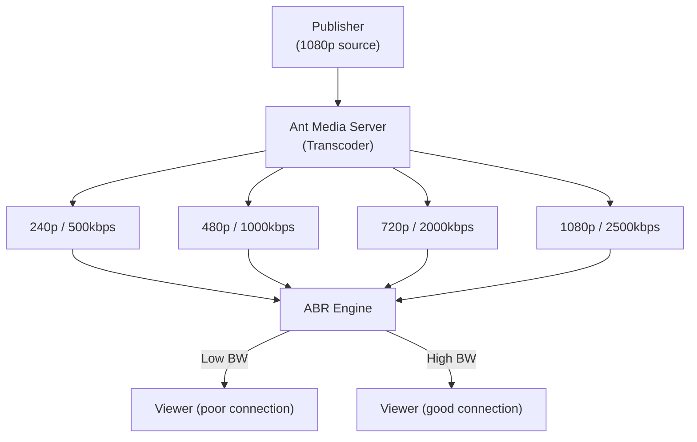

# Adaptive Bitrate Streaming (ABR)

Adaptive Bitrate Streaming (ABR) enables Ant Media Server to automatically adjust video quality based on each viewer's network speed and device performance. By dynamically switching resolutions and bitrates, ABR ensures a seamless streaming experience with minimal buffering — whether your audience is on high-speed fiber or a weak mobile connection.

## Why Adaptive Bitrate Streaming Matters

Internet users have varying connection speeds, from fast broadband to congested mobile networks. Without ABR, viewers with limited bandwidth may suffer from long buffering times, playback interruptions, or the inability to watch your streams at all.

With ABR:
- Viewers get the best possible quality based on available bandwidth.
- Automatic switching happens behind the scenes, improving engagement and reducing viewer drop-off.
- Smooth playback is ensured even during network fluctuations.

## How ABR Works in Ant Media Server

Ant Media Server supports ABR for all playback protocols such as **WebRTC** and **HLS** streaming.

| Protocol | ABR Behavior |
|---|---|
| **WebRTC** | Ant Media Server dynamically monitors viewer bandwidth and selects the optimal stream. |
| **HLS** | The player evaluates available bandwidth and requests the most suitable bitrate from the server. |



## How to Enable Adaptive Bitrate Streaming

You can enable ABR from your Ant Media application settings:

1. Go to **Applications → Settings → Adaptive Bitrate** in the Ant Media Server dashboard.
2. Enable adaptive streaming and add the desired resolutions and bitrates.
3. **Save** the settings.
4. Add new streams or restart the running streams.

## Broadcast-Level ABR Configuration

As of **Ant Media Server 2.8.3**, you can configure ABR settings at the **broadcast level**. This means each stream can have its own customized ABR profiles, offering more granular control.

Use the [Create Broadcast API](https://antmedia.io/rest/#/default/createBroadcast) to add ABRs on the broadcast level.

```bash
curl --location 'https://domainName:5443/live/rest/v2/broadcasts/create' \
--header 'Content-Type: application/json' \
--data '{
  "name": "test",
  "streamId": "test",
  "encoderSettingsList": [
    {"videoBitrate": 500000, "forceEncode": true, "audioBitrate": 32000, "height": 240},
    {"videoBitrate": 2000000, "forceEncode": true, "audioBitrate": 128000, "height": 720},
    {"videoBitrate": 2500000, "forceEncode": true, "audioBitrate": 256000, "height": 1080}
  ]
}'
```

The `encoderSettingsList` array defines each ABR profile. Each profile consists of:

| Field | Description |
|---|---|
| `height` | Vertical resolution (e.g., `240` = 240p) |
| `videoBitrate` | Target video bitrate in bits per second |
| `audioBitrate` | Target audio bitrate in bits per second |
| `forceEncode` | Forces transcoding even when the source matches this profile's resolution |

## Stats-Based Adaptive Bitrate Switching

Starting with **Ant Media Server v2.6.0**, you can enable **Stats-Based ABR Switching** to automatically adjust stream quality based on real-time bandwidth statistics gathered during the session.

By default:
```json
"statsBasedABREnabled": true
```

This means that **WebRTC viewers** will automatically receive the best possible resolution according to their available bandwidth, without the need for manual stream switching.

How it works:
- The server continuously monitors the viewer's network stats.
- Based on this data, it automatically switches between available ABR profiles (e.g., from 720p to 480p) to ensure smooth playback.

## Original Stream Behavior with ABR

These settings control whether the original incoming stream should be included among the ABR renditions:

| Setting | Protocol | Default |
|---|---|---|
| `useOriginalWebRTCEnabled` | WebRTC | `false` (original excluded) |
| `addOriginalMuxerIntoHLSPlaylist` | HLS | `true` (original included) |

```json
"useOriginalWebRTCEnabled": false,
"addOriginalMuxerIntoHLSPlaylist": true
```

- **`true`**: Both the original incoming stream and all transcoded ABR profiles are available for playback.
- **`false`**: Only the ABR transcoded streams are available (original resolution is excluded from playback).

## Best Practices

When using ABR, it is recommended to:

- Offer at least **2-3 ABR profiles** to provide fallback options for unstable networks.
- Consider enabling **GPU acceleration** if you plan to transcode into multiple profiles (to reduce CPU load). See [Using NVIDIA GPU](/guides/advanced-usage/using-nvidia-gpu/).
- Regularly monitor viewer bandwidth stats via Ant Media's monitoring tools to fine-tune ABR settings.
