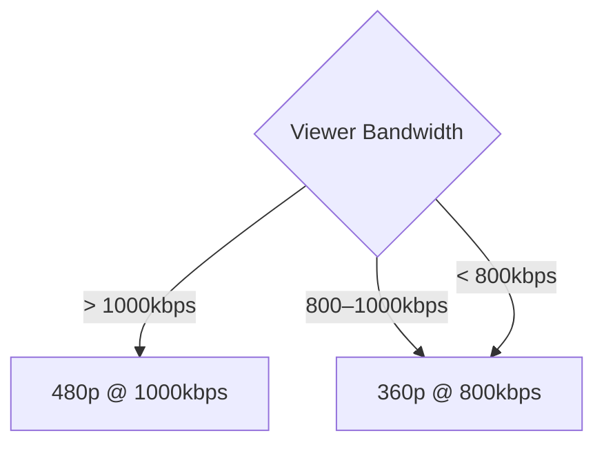

# Enforce Stream Quality

Ant Media Server allows viewers to enforce a specific stream quality/resolution they would like to receive. Keep in mind: if you request a quality with a bitrate higher than the viewer's bandwidth, you might see packet drops or pixelation.

## How Adaptive Bitrate Works

Ant Media Server measures the viewer's internet speed and sends the best quality according to available bandwidth.

**Example:**
- Two bitrates available: **360p at 800kbps** and **480p at 1000kbps**
- Viewer internet speed:
  - Above 1000kbps: 480p is sent
  - Below 800kbps: 360p is sent



## Enforce Quality in WebRTC

Once the stream starts playing, the viewer receives the `play_started` notification.

### Step 1: Request Stream Information

In `WebRTCAdaptor`, call `getStreamInfo` with `webRTCAdaptor.getStreamInfo(streamId)` on `play_started`:

```javascript
else if (info == "play_started") {
    console.log("play started");
    webRTCAdaptor.getStreamInfo(streamId);
}
```

### Step 2: Parse Available Resolutions

The `streamInformation` callback returns stream details including available adaptive resolutions:

```javascript
else if (info == "streamInformation") {
    var streamResolutions = new Array();

    obj["streamInfo"].forEach(function(entry) {
        // Supports both VP8 and H264; resolution entries might appear duplicate.
        if (!streamResolutions.includes(entry["streamHeight"])) {
            streamResolutions.push(entry["streamHeight"]);
        }
    });
}
```

### Step 3: Force a Specific Resolution

After getting stream info, force a specific resolution using:

```javascript
webRTCAdaptor.forceStreamQuality("{your_stream_Id}", {the_resolution_to_be_forced});
```

For more details, see the [player.html code snippet](https://github.com/ant-media/StreamApp/blob/c802e0e60641244935f2a1948f48ecfea1d1b44a/src/main/webapp/player.html#L544).

## Enforce Stream Quality in the AMS Web Player (play.html)

The AMS web player (`play.html`) also allows enforcing quality. Users can select a resolution directly in the player UI.

Adjust the `playOrder` setting to choose among WebRTC, HLS, DASH, or LL-HLS. Users can then select quality via the player controls.

## Enforce Quality via Specific HLS URL

Since some users access HLS by specifying a particular `.m3u8` URL, you can enforce stream quality by requesting the variant URL for that quality.

For example, if your HLS playlist has multiple bitrates (240p, 360p, 480p, 720p), use this URL format:

```
https://domain:5443/AppName/streams/[streamid]_[quality].m3u8
```

**Example:**

```
https://domain:5443/live/streams/stream1_480p1000kbps.m3u8
```

This ensures the player loads only the specified quality instead of relying on adaptive selection.

## Enforce Quality via Specific LL-HLS URL

For Low Latency HLS, use this URL format:

```
https://domain:port/AppName/streams/ll-hls/streamId/resolution/streamId__lowlatency.m3u8
```

**Example:**

```
https://domain:5443/live/streams/ll-hls/stream1/480/stream1__lowlatency.m3u8
```
