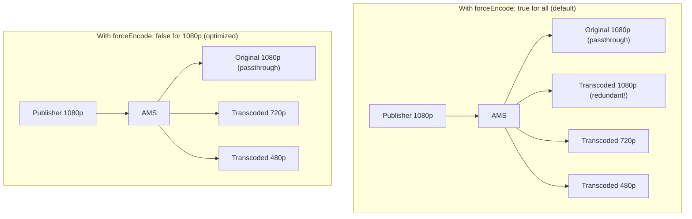

# Force Encode

ForceEncode is an ABR feature that controls whether all resolutions are always transcoded on the server, regardless of whether the incoming stream already matches a configured ABR profile resolution.

## The Problem Without forceEncode Control

By default, if two ABR profiles are enabled — for example, **1080p** and **720p** — and the publisher sends an RTMP stream in 1080p, the HLS playlist will include:
- The original 1080p stream (passthrough)
- A transcoded 1080p stream (wasteful re-encode)
- A transcoded 720p stream

This results in **two 1080p entries** in the HLS playlist, wasting server CPU resources by re-encoding an already matching resolution.



## Configure forceEncode (v2.14.0+)

Starting with **Ant Media Server v2.14.0**, `forceEncode` can be disabled per ABR profile.

### Step 1: Enable ABR Profiles

Enable ABR profiles in application settings: for example, 1080p, 720p, and 480p.

### Step 2: Disable forceEncode for the Matching Profile

Go to **Advanced application settings** and set `forceEncode: false` for the resolution that matches the incoming stream:

```json
"encoderSettings": [
  {
    "height": 1080,
    "videoBitrate": 2500000,
    "audioBitrate": 256000,
    "forceEncode": false
  },
  {
    "height": 720,
    "videoBitrate": 2000000,
    "audioBitrate": 128000,
    "forceEncode": true
  },
  {
    "height": 480,
    "videoBitrate": 1000000,
    "audioBitrate": 96000,
    "forceEncode": true
  }
]
```

### Step 3: Publish and Verify

Publish an RTMP or SRT stream at 1080p and play via HLS.

**Before (forceEncode: true for all)** — HLS playlist contains two 1080p entries:

```
#EXTM3U
#EXT-X-STREAM-INF:PROGRAM-ID=1,BANDWIDTH=1074408,RESOLUTION=854x480,...
test_480p1000kbps.m3u8
#EXT-X-STREAM-INF:PROGRAM-ID=1,BANDWIDTH=2108256,RESOLUTION=1280x720,...
test_720p2000kbps.m3u8
#EXT-X-STREAM-INF:PROGRAM-ID=1,BANDWIDTH=2234496,RESOLUTION=1920x1080,...
test.m3u8
#EXT-X-STREAM-INF:PROGRAM-ID=1,BANDWIDTH=2739616,RESOLUTION=1920x1080,...
test_1080p2500kbps.m3u8
```

**After (forceEncode: false for 1080p)** — HLS playlist contains only one 1080p entry (the original):

```
#EXTM3U
#EXT-X-STREAM-INF:PROGRAM-ID=1,BANDWIDTH=1178152,RESOLUTION=854x480,...
test_480p1000kbps.m3u8
#EXT-X-STREAM-INF:PROGRAM-ID=1,BANDWIDTH=2269472,RESOLUTION=1280x720,...
test_720p2000kbps.m3u8
#EXT-X-STREAM-INF:PROGRAM-ID=1,BANDWIDTH=2419440,RESOLUTION=1920x1080,...
test.m3u8
```

## Important Behaviors

:::info
- If `forceEncode` is `false` for **all** enabled ABRs and the incoming resolution is **higher** than all configured ABR profiles, lower resolutions will still be transcoded to provide multiple ABR renditions — including the original.
- If the incoming resolution is **lower** than the configured ABR profiles (e.g., incoming 480p with ABR profiles at 720p and 1080p):
  - `forceEncode: false` — the server will **not** transcode to higher resolutions.
  - `forceEncode: true` — **all** configured resolutions will be force-transcoded regardless of incoming resolution.
:::

Using this feature allows you to save bandwidth and CPU resources by avoiding redundant re-encoding.
