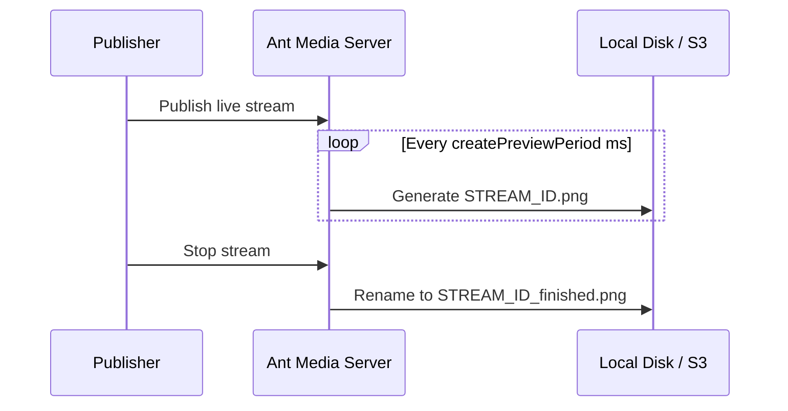

# Thumbnails

Thumbnails are small, lightweight preview images that represent live stream content. They help users quickly browse content while saving bandwidth and loading time — commonly used in stream listings, dashboards, and video platforms.

Ant Media Server can generate thumbnails (previews) of incoming streams on the fly.

## Enable Thumbnails

### Step 1: Add at Least One Adaptive Bitrate

To activate thumbnail generation, add at least one adaptive bitrate in the dashboard:

**Application → live → Settings → Add New Bitrate**

### Step 2: Enable Preview Generation

Enable the thumbnail feature from the web panel settings by checking the **Generate Preview** checkbox.

You can also enable it via Advanced application settings:

Go to **Application → Your App → Settings → Advanced** and search for `generatePreview`:

```json
"generatePreview": true
```

## Configuration Parameters

The following preview-related properties can be configured in the Advanced application settings:

### `previewFormat`

The format of the generated thumbnail image. Supported formats: `png`, `jpg`, `webp`. Default: `png`.

```json
"previewFormat": "png"
```

### `previewQuality`

Specifies the preview quality for JPG and WEBP formats. Not applicable for PNG.

- **JPG**: Range 2–31. Lower value = better quality and larger file size. Recommended: `5`.

  ```json
  "previewQuality": 5
  ```

- **WEBP**: Range 0–100. Higher value = better quality and larger file size. Recommended: `75`.

  ```json
  "previewQuality": 75
  ```

### `previewHeight`

The height (resolution) of the thumbnail image. Default: `480`.

```json
"previewHeight": 480
```

### `createPreviewPeriod`

How often a new thumbnail is generated, in milliseconds. Default: `5000` ms (every 5 seconds).

To generate a thumbnail every second:

```json
"createPreviewPeriod": 1000
```

### `previewOverwrite`

Controls whether a new preview file overwrites the old one when a stream restarts with the same stream ID. Default: `false`.

- `false`: A `_N` suffix (incrementing number) is added to the thumbnail filename.
- `true`: The new preview file overwrites the old one.

```json
"previewOverwrite": false
```

### `addDateTimeToMp4FileName`

If `true`, adds a date-time value to file names. Default: `false`.

```json
"addDateTimeToMp4FileName": false
```

You can also enable this on the web panel: **Application → Your App → Settings → Add Date-Time to Record File Names**.

## Access Preview Thumbnails

Access the generated thumbnails via the following URL template:

```
http://<SERVER_NAME>:5080/live/previews/<STREAM_ID>.png
http://<SERVER_NAME>:5080/live/previews/<STREAM_ID>.jpg
http://<SERVER_NAME>:5080/live/previews/<STREAM_ID>.webp
```

With **v2.4.3** and later, the `_finished` suffix is added to the file after streaming has ended:

```
http://<SERVER_NAME>:5080/live/previews/<STREAM_ID>_finished.png
http://<SERVER_NAME>:5080/live/previews/<STREAM_ID>_finished.jpg
http://<SERVER_NAME>:5080/live/previews/<STREAM_ID>_finished.webp
```

The absolute path of the preview images on the server:

```
/usr/local/antmedia/webapps/live/previews/
```

:::tip
Thumbnail images can also be uploaded to S3 buckets when S3 integration is enabled. See [S3 Recording and Integration](/docs/recording/s3/aws-s3) for details.
:::

## Thumbnail Generation Flow


