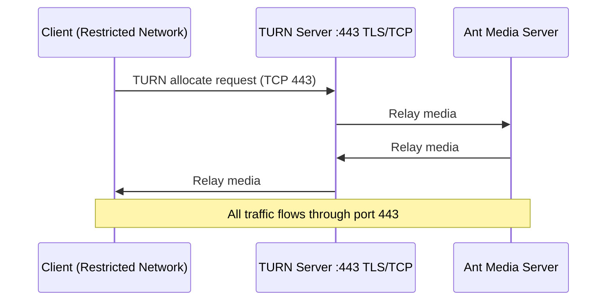

# WebRTC in Restricted Networks

When a network only exposes HTTP/HTTPS ports (80 and 443), standard WebRTC UDP connections cannot traverse the firewall. A TURN server running on port 443 with TCP/TLS relays WebRTC media through the allowed ports.



## Step 1: Install Coturn

```bash
sudo apt update
sudo apt install coturn -y
```

To allow Coturn to bind to ports below 1024 (ports 80/443):

```bash
sed -i -e 's/^User=.*/User=root/' -e 's/^Group=.*/Group=root/' \
  /etc/systemd/system/multi-user.target.wants/coturn.service
systemctl daemon-reload
sudo setcap 'cap_net_bind_service=+ep' /usr/bin/turnserver
```

## Step 2: Obtain a Certificate

Obtain a TLS certificate for your TURN server domain. Let's Encrypt works for HTTP validation, but TLS-ALPN validation has limitations with Coturn — use HTTP-01 challenge or an existing certificate.

## Step 3: Configure Coturn

Edit `/etc/turnserver.conf`:

```
lt-cred-mech
user=your-username:your-password
realm=your-turn-server-hostname
listening-port=80
tls-listening-port=443
alt-listening-port=3478
alt-tls-listening-port=5349
proto=tcp
syslog
cert=/etc/ssl/your-domain.pem
pkey=/etc/ssl/your-domain-key.pem
```

Restart Coturn:

```bash
systemctl restart coturn
```

Verify it is listening:

```bash
lsof -i:80 -i:443
```

Test functionality at: https://webrtc.github.io/samples/src/content/peerconnection/trickle-ice/

## Step 4: Configure AMS

Log in to the AMS dashboard at `https://your-ams:5443`. Go to your application's **Settings → Advanced** and set:

```
stunServerURI=turn:your-turn-server-address:443?transport=tcp
turnServerUsername=your-turn-server-username
turnServerCredential=your-turn-server-password
```

## Step 5: Configure Client-Side ICE

Update the ICE server configuration in your client HTML (e.g., `samples/publish_webrtc.html` and `samples/player.html`):

```javascript
var pc_config = {
    'iceServers': [
        {
            'urls': 'stun:stun1.l.google.com:19302'
        },
        {
            'urls': 'turn:your-turn-server-address:443?transport=tcp',
            'username': 'your-turn-server-username',
            'credential': 'your-turn-server-password'
        }
    ]
};
```

WebRTC streams will now relay through your TURN server on port 443, bypassing the firewall restriction.
