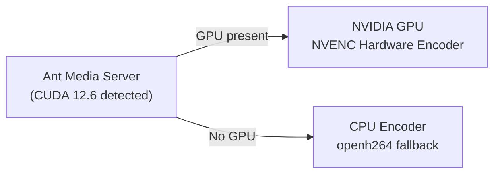

# Using NVIDIA GPUs

Ant Media Server can use NVIDIA GPU hardware encoders (NVENC/NVDEC) for high-performance transcoding. GPU encoding can be up to **5x faster** than CPU-based encoders like `x264` or `openh264`.



## Why Use GPU Encoding?

- **ABR transcoding**: A single 4-core CPU server struggles with one stream at 4 ABR levels (1080p, 720p, 480p, 360p). A 4-core GPU server handles 5–6 streams at the same quality levels effortlessly.
- **Default encoder**: From v2.5.1, AMS uses `openh264` (CPU) by default when no GPU is found.
- **Automatic detection**: When CUDA 12.6 is installed, AMS automatically detects and uses NVENC at startup — no additional configuration needed.

Check if your GPU supports hardware encoding: [Video Encode and Decode GPU Support Matrix](https://developer.nvidia.com/video-encode-decode-gpu-support-matrix)

## Install CUDA Toolkit

### Ubuntu 20.04

```bash
sudo wget https://developer.download.nvidia.com/compute/cuda/repos/ubuntu2004/x86_64/cuda-keyring_1.1-1_all.deb
sudo dpkg -i cuda-keyring_1.1-1_all.deb
sudo apt-get update
sudo apt-get install cuda-runtime-12-6
sudo reboot
```

### Ubuntu 22.04

```bash
sudo wget https://developer.download.nvidia.com/compute/cuda/repos/ubuntu2204/x86_64/cuda-keyring_1.1-1_all.deb
sudo dpkg -i cuda-keyring_1.1-1_all.deb
sudo apt-get update
sudo apt-get install cuda-runtime-12-6
sudo reboot
```

### Ubuntu 24.04

```bash
wget https://developer.download.nvidia.com/compute/cuda/repos/ubuntu2404/x86_64/cuda-keyring_1.1-1_all.deb
sudo dpkg -i cuda-keyring_1.1-1_all.deb
sudo apt-get update
sudo apt-get -y install cuda-toolkit-12-6
sudo apt-get install -y cuda-drivers
sudo reboot
```

### NVIDIA A10 Tensor Core GPU (Azure NV4as_v4 / NV6ads)

These instances require NVIDIA GRID drivers:

```bash
sudo wget https://storage.googleapis.com/nvidia-drivers-us-public/GRID/vGPU15.2/NVIDIA-Linux-x86_64-525.105.17-grid.run
sudo chmod +x NVIDIA-Linux-x86_64-525.105.17-grid.run
sudo ./NVIDIA-Linux-x86_64-525.105.17-grid.run
sudo reboot
```

## Verify GPU Status

After installing CUDA and rebooting:

```bash
nvidia-smi
```

Restart AMS:

```bash
sudo service antmedia restart
```

When AMS is encoding using the GPU, the `nvidia-smi` output will show GPU utilization in the **Enc** column.

## Troubleshooting

If NVENC is not being used after installing CUDA, install compatibility packages:

```bash
sudo apt-get install cuda-cudart-12-6
sudo apt-get install cuda-compat-12-6
sudo reboot
```

For other platforms or architectures, see [NVIDIA CUDA Installation Guide](https://docs.nvidia.com/cuda/cuda-installation-guide-linux/index.html).
