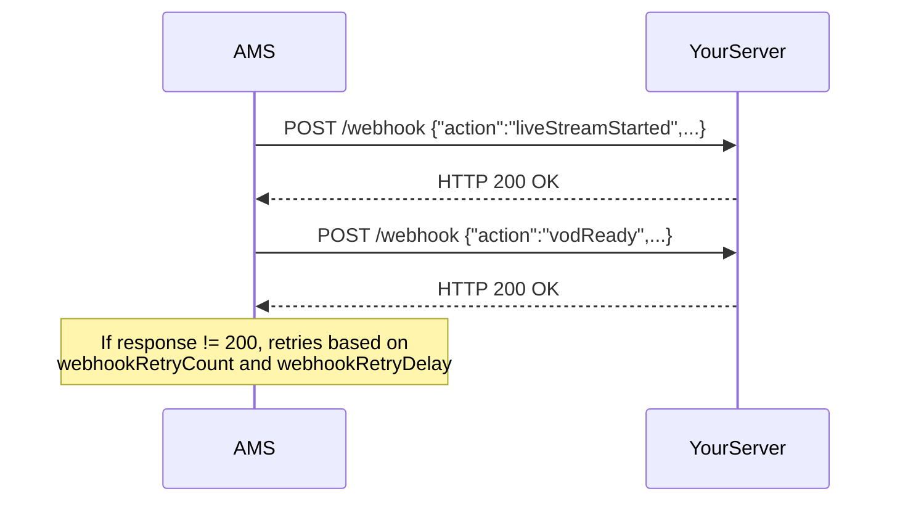

# Using Webhooks

Ant Media Server sends POST requests to your backend when stream events occur — stream start, stream end, recording ready, player join/leave, and more.



## Register Your Webhook URL

### Default Webhook URL

In the AMS management panel, go to your application's **Settings** and set the **Webhook URL** field. This URL will be called for all events on all streams in that application.

### Per-Stream Webhook URL

Use the REST API `createBroadcast` endpoint with the `listenerHookURL` field:

```json
{
  "name": "test_video",
  "listenerHookURL": "http://www.example.com/webhook"
}
```

## Reliable Webhooks (v2.8.3+)

Configure retry behavior in the **Advanced Application Settings** panel:

```json
"webhookRetryCount": 3,
"webhookRetryDelay": 1000
```

- `webhookRetryCount`: Number of retry attempts on failure (non-200 response or timeout)
- `webhookRetryDelay`: Milliseconds to wait between retries

## Webhook Content Type

By default, webhooks use `application/json`. To use form-encoded payloads:

```json
"webhookContentType": "application/x-www-form-urlencoded"
```

## Webhook Events Reference

:::note
Fields wrapped in `{}` are placeholders replaced with actual values at runtime.
:::

### 1. liveStreamStarted

Fired when a new live stream begins publishing.

```json
{
  "id": "{streamId}",
  "action": "liveStreamStarted",
  "streamName": "{streamName}",
  "category": "{category}",
  "metadata": "{metadata}",
  "timestamp": "{timestamp}"
}
```

### 2. liveStreamEnded

Fired when a live stream stops publishing.

```json
{
  "id": "{streamId}",
  "action": "liveStreamEnded",
  "streamName": "{streamName}",
  "category": "{category}",
  "metadata": "{metadata}",
  "timestamp": "{timestamp}"
}
```

### 3. vodReady

Fired when a stream recording (MP4) is complete and ready.

```json
{
  "id": "{stream_id}",
  "app": "{app_name}",
  "duration": "{duration}",
  "action": "vodReady",
  "vodName": "{vod_file_name}",
  "vodId": "{vod_id}",
  "metadata": "{metadata_of_broadcast}",
  "timestamp": "{timestamp}"
}
```

### 4. endpointFailed

Fired when an RTMP re-stream endpoint fails.

```json
{
  "id": "{stream_id}",
  "action": "endpointFailed",
  "streamName": "{stream_name}",
  "category": "{stream_category}",
  "metadata": "{rtmp_url}",
  "timestamp": "{timestamp}"
}
```

### 5. publishTimeoutError

Fired when the server stops receiving frames from a publisher.

```json
{
  "id": "{stream_id}",
  "action": "publishTimeoutError",
  "streamName": "{stream_name}",
  "category": "{stream_category}",
  "metadata": "{subscriberId:'subscriber_id'}",
  "timestamp": "{timestamp}"
}
```

### 6. encoderNotOpenedError

Fired when the media encoder cannot be initialized for a stream.

```json
{
  "id": "{stream_id}",
  "action": "encoderNotOpenedError",
  "streamName": "{stream_name}",
  "category": "{stream_category}",
  "metadata": "{metadata_of_broadcast}",
  "timestamp": "{timestamp}"
}
```

### 7. playStopped

Fired when a WebRTC viewer stops watching.

```json
{
  "id": "{stream_id}",
  "action": "playStopped",
  "streamName": "{stream_name}",
  "category": "{stream_category}",
  "subscriberId": "{subscriber_id}",
  "timestamp": "{timestamp}"
}
```

### 8. playStarted

Fired when a WebRTC viewer starts watching.

```json
{
  "id": "{stream_id}",
  "action": "playStarted",
  "streamName": "{stream_name}",
  "category": "{stream_category}",
  "subscriberId": "{subscriber_id}",
  "timestamp": "{timestamp}"
}
```

### 9. subtrackAddedInTheMainTrack

Fired when a participant joins a conference room (sub-track added to main track).

```json
{
  "id": "{stream_id}",
  "action": "subtrackAddedInTheMainTrack",
  "streamName": "{stream_name}",
  "mainTrackId": "{main_track_id}",
  "subscriberId": "{subscriber_id}",
  "timestamp": "{timestamp}"
}
```

### 10. subtrackLeftTheMainTrack

Fired when a participant leaves a conference room.

```json
{
  "id": "{stream_id}",
  "action": "subtrackLeftTheMainTrack",
  "streamName": "{stream_name}",
  "mainTrackId": "{main_track_id}",
  "subscriberId": "{subscriber_id}",
  "timestamp": "{timestamp}"
}
```

### 11. firstActiveTrackAddedInMainTrack

Fired when the first participant joins a conference room.

```json
{
  "id": "{stream_id}",
  "action": "firstActiveTrackAddedInMainTrack",
  "mainTrackId": "{main_track_id}",
  "timestamp": "{timestamp}"
}
```

### 12. noActiveSubtracksLeftInMainTrack

Fired when the last participant leaves a conference room.

```json
{
  "id": "{stream_id}",
  "action": "noActiveSubtracksLeftInMainTrack",
  "mainTrackId": "{main_track_id}",
  "timestamp": "{timestamp}"
}
```

## Implementation Notes

- Always respond with HTTP **200** to acknowledge receipt. AMS does not wait for complex processing.
- Process webhook requests quickly — they are called within the AMS event loop thread.
- Read the `action` field to determine which event occurred and route to the appropriate handler.
- To secure webhooks with token-based authorization, see the [Webhook Authorization](https://antmedia.io/docs/guides/stream-security/webhook-stream-authorization/) guide.
