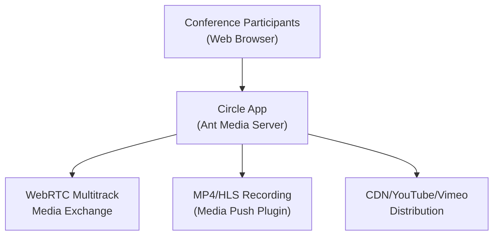

# Circle: Free Video Conferencing Solution

Circle is a ready-to-use, open-source online video conferencing application built on top of Ant Media Server that can be deployed on-premises or on a private/public cloud. If you are concerned about privacy or being behind a network firewall, this is the best solution for you.



## Key Features

- **Unlimited Attendees**: Thanks to the scalability of Ant Media Server, Circle is built to scale the number of attendees.
- **Easy to Use**: Let attendees join the video call with their favorite web browsers — no plugins required.
- **Privacy**: Deploy it into your private/public cloud or on-premises. Your live video conference stays yours.
- **Distribute to a Large Audience**: Distribute your video call to tens of thousands of viewers as a single video through CDN, YouTube, Vimeo, etc.
- **Record**: Record your video conference to watch it later or for archiving.

## Try Circle Now

If you want to try the Circle conference application without installation, visit [meet.antmedia.io/Conference](https://meet.antmedia.io/Conference).

Circle is fully open source on [GitHub](https://github.com/ant-media/conference-call-application).

## Installation of Circle on AMS

Circle is a web application that runs on Ant Media Server. You need a WAR file of the Circle application. You can [download the stable version](https://github.com/ant-media/conference-call-application/releases) or the [latest snapshot](https://oss.sonatype.org/#nexus-search;gav~io.antmedia.webrtc~ConferenceCall~~~~kw,versionexpand).

### Option 1: Build Circle from Source (Optional)

You need `Maven`, `Java 17 SDK`, and `Node` installed on your system.

```bash
# Step 1: Clone the repository
git clone https://github.com/ant-media/conference-call-application.git

# Step 2: Build the WAR file
cd conference-call-application
./createwar.sh
```

After running the script, the `ConferenceCall.war` file will be in the `target` folder.

### Option 2: Install from the Management Panel

1. Log in to the Ant Media Server Management Panel.
2. On the Dashboard page, click the **New Application** button.
3. Click **Choose File** and browse to the downloaded WAR file.
4. Give a name to the application (e.g., `Conference`).
5. Click **Create**. Done.

## Usage

1. Visit `https://antmediaserver-domain:5443/Application_Name`
2. Click the **Create Meeting** button.
3. Enter your name and join the meeting.
4. You are now in the conference room.

## Advanced Topics for Developers

### Customization

You can make any changes to the Circle codebase and customize it for your own applications without restriction.

If you want to change only the look and feel (e.g., button availability), the `.env.production` file provides some configurations to customize the general UI.

### Embedding into a Website

If you want to embed Circle into your website as a component, follow the [Circle component usage guide](https://antmedia.io/docs/guides/developing-antmedia-server/circle-component-usage/).
