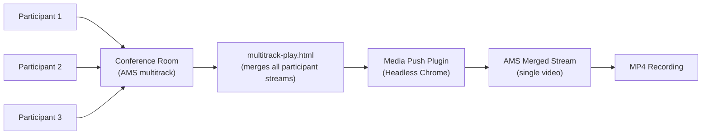

# Conference Call Recording

Unlike regular broadcast streams, conference calls have multiple participants, each with a unique stream ID. The regular single-stream recording mechanism cannot be used directly. Instead of recording each participant's stream individually, we need a solution to merge all streams and record the entire room.

This document explains how to record Ant Media Server conference calls using the [multitrack-play.html](https://github.com/ant-media/StreamApp/blob/master/src/main/webapp/multitrack-play.html) sample page and the [Media Push Plugin](https://antmedia.io/docs/guides/recording-live-streams/media-push-plugin/).

## How It Works



Recording a conference call is a four-step process:
1. Join the conference room.
2. Merge all participants with `multitrack-play.html`.
3. Capture the merged stream with the Media Push Plugin.
4. Record the merged stream as MP4.

## Step 1: Install the Media Push Plugin

```bash
# Download the installation script
wget -O install_media-push-plugin.sh \
  https://raw.githubusercontent.com/ant-media/Plugins/master/MediaPushPlugin/src/main/script/install_media-push-plugin.sh \
  && chmod 755 install_media-push-plugin.sh

# Run the installation script
sudo ./install_media-push-plugin.sh

# Restart the service
sudo service antmedia restart
```

## Step 2: Join the Conference Room

Join the conference room (e.g., `room1` as the `roomId`) from `conference.html` or a mobile SDK.

All participant stream IDs (subtracks) will be visible on the AMS web panel alongside the room broadcast.

## Step 3: Merge the Conference Streams

The [multitrack-play.html](https://github.com/ant-media/StreamApp/blob/master/src/main/webapp/multitrack-play.html) sample page merges all conference participants dynamically. Access it at:

```
https://Server-URL:5443/live/multitrack-play.html?id=roomid
```

Replace:
- `Server-URL` with your Ant Media Server URL/Domain
- `live` with your application name
- `roomid` with the conference room name (main track ID)

:::info
You do not need to open this page in a browser yourself. The Media Push plugin will load it server-side using Headless Chrome.
:::

## Step 4: Start Media Push to Capture Merged Stream

Call the Media Push REST API to capture the merged page and re-stream it to AMS:

```bash
curl -i -X POST \
  -H "Accept: Application/json" \
  -H "Content-Type: application/json" \
  "https://server-url:5443/live/rest/v1/media-push/start" \
  -d '{"url": "https://server-url:5443/live/multitrack-play.html?id=room1", "width": 1280, "height": 720}'
```

The Media Push plugin opens Headless Chrome, loads the `multitrack-play.html` page, captures the merged participant stream, and re-streams it back to AMS as a new broadcast.

## Step 5: Record the Merged Stream

Once you have the merged stream's `streamId` from the Media Push API response, start MP4 recording:

```bash
curl -X PUT \
  -H "Content-Type: application/json" \
  "https://server-url:5443/live/rest/v2/broadcasts/{mergedStreamId}/recording/true"
```

To stop recording:

```bash
curl -X PUT \
  -H "Content-Type: application/json" \
  "https://server-url:5443/live/rest/v2/broadcasts/{mergedStreamId}/recording/false"
```

Alternatively, you can start recording directly when launching the Media Push plugin:

```bash
curl -i -X POST \
  -H "Accept: Application/json" \
  -H "Content-Type: application/json" \
  "https://server-url:5443/live/rest/v1/media-push/start" \
  -d '{"url": "https://server-url:5443/live/multitrack-play.html?id=room1", "width": 1280, "height": 720, "recordType": "mp4"}'
```

## Step 6: Stop the Media Push Broadcast

When the conference ends, stop the Media Push broadcast:

```bash
curl -i -X POST \
  -H "Accept: Application/json" \
  -H "Content-Type: application/json" \
  "https://server-url:5443/live/rest/v1/media-push/stop/{mergedStreamId}"
```

## Recording Conference Calls on Circle

With the [Circle](https://github.com/ant-media/conference-call-application) conference call application, the recording feature is seamlessly integrated:

1. If the Media Push plugin is installed, a **Start Recording** button appears under **More Options** (gear icon) after joining the conference call.
2. Clicking **Start Recording** starts the composite room stream recording using the Media Push plugin.
3. Click **Stop Recording** when done.
4. After recording is stopped, the recorded file will be visible under the **VoD** section of the application.
