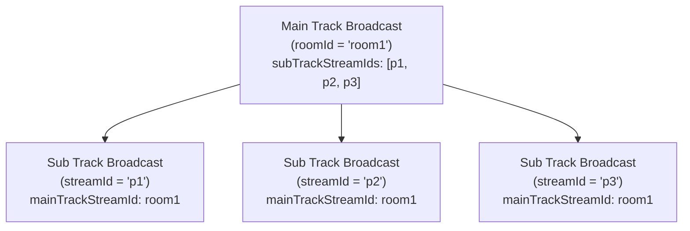
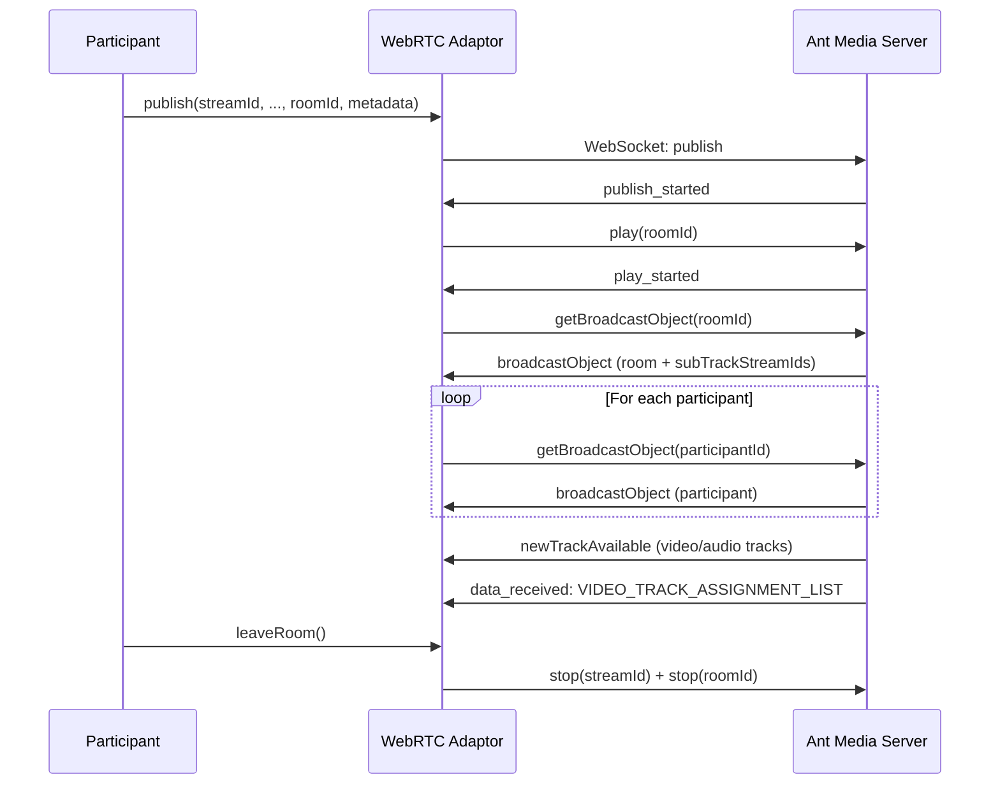

# Ant Media Server Conference Framework

Ant Media Server enables the development of robust WebRTC video conferencing applications across all supported SDK platforms, supporting unlimited conference participants.

## Core Concepts

### Main Track Broadcast (Conference Room)

In Ant Media Server, there is no distinct concept of a conference room separate from a broadcast. Instead, conference rooms and participants are represented by broadcast objects.

A broadcast object that holds the stream IDs of other broadcast objects in its `subTrackStreamIds` field is known as the **main track broadcast**. In a video conferencing context:
- This object represents the **conference room**
- Its `streamId` serves as the **roomId**

### Sub Track Broadcast (Conference Participant)

A broadcast object whose `mainTrackStreamId` field is set to another broadcast object's `streamId` is known as the **sub track broadcast**. In a video conferencing context:
- This object represents the **conference participant**
- Its `streamId` serves as the **participant ID**
- It also exists in the `subTrackStreamIds` field of the main track broadcast



## Sample Video Conference Application

By default, a sample conference application is available in all AMS applications:

```
https://{ams-url}:5443/{appName}/conference.html
```

Example: `https://test.antmedia.io:5443/live/conference.html`

When a participant joins a room, two broadcasts are created on the server:
1. **Room Broadcast** (Main track)
2. **Participant Broadcast** (Sub track of room broadcast)

You can verify the structure via REST API:

```
GET https://{ams-url}:5443/{app-name}/rest/v2/broadcasts/{room-streamId}
```

The response's `subTrackStreamIds` field contains all participant stream IDs.

## Build a Video Conference Application in React

This section walks through building a simple video conference application using the Ant Media Server JavaScript SDK with React.

### Step 1: Create a New React Project

```bash
npx create-react-app antmedia-react-conference-sample
```

### Step 2: Install the Ant Media JavaScript SDK

```bash
npm i @antmedia/webrtc_adaptor
```

### Step 3: Disable Strict Mode

In `index.js`, remove the `<StrictMode>` tags around `<App/>`.

### Step 4: Create a Conference Component

In the `src` directory, create a `components` folder and a new file `ConferenceComponent.js`.

Import the SDK:

```javascript
import { WebRTCAdaptor } from '@antmedia/webrtc_adaptor'
```

### Step 5: Create a WebRTC Adaptor Object

Initialize variables and create the WebRTC adaptor:

```javascript
const [localParticipantStreamId, setLocalParticipantStreamId] = useState('')
const [roomId, setRoomId] = useState('')
const localVideoElement = useRef(null)
const mediaConstraints = useRef({
    video: { width: { min: 176, max: 360 } },
    audio: true,
})
const websocketUrl = useRef('wss://test.antmedia.io:5443/live/websocket')
const localParticipantVideoElementId = useRef('localParticipantVideo')
const webrtcAdaptor = useRef(null)

useEffect(() => {
    webrtcAdaptor.current = new WebRTCAdaptor({
        websocket_url: websocketUrl.current,
        mediaConstraints: mediaConstraints.current,
        localVideoId: localParticipantVideoElementId.current,
        localVideoElement: localVideoElement.current,
        isPlayMode: false,
        onlyDataChannel: false,
        debug: true,
        callback: (info, obj) => {
            if (info === "initialized") {
                console.log("WebRTC adaptor initialized.");
            } else if (info === "broadcastObject") {
                // handle broadcast objects
            } else if (info === "newTrackAvailable") {
                // handle remote participant tracks
            } else if (info === "publish_started") {
                webrtcAdaptor.current.play(roomId);
            } else if (info === "play_started") {
                webrtcAdaptor.current.getBroadcastObject(roomId);
            } else if (info === "data_received") {
                // handle data channel messages
            }
        },
    });
}, [])
```

### Step 6: Join a Room

In Ant Media Server, joining a conference room means publishing to the main track broadcast AND playing it:

```javascript
const joinRoom = () => {
    var userStatusMetaData = { isMicMuted: false, isCameraOff: false };
    // publish(streamId, token, subscriberId, subscriberCode, streamName, mainTrack, metaData)
    webrtcAdaptor.current.publish(
        localParticipantStreamId, null, null, null,
        localParticipantStreamId, roomId, JSON.stringify(userStatusMetaData)
    );
    webrtcAdaptor.current.play(roomId);
}
```

Key arguments for `publish()`:
- 1st: participant `streamId`
- 6th: `roomId` (main track ID)
- 7th: `metadata` (mic/camera state JSON)

### Step 7: Retrieve Main Track Broadcast Object

On `play_started`, request the room broadcast object:

```javascript
else if (info === "play_started") {
    webrtcAdaptor.current.getBroadcastObject(roomId);
}
```

Process the response via the `broadcastObject` callback:

```javascript
else if (info === "broadcastObject") {
    let broadcastObject = JSON.parse(obj.broadcast);
    if (obj.streamId === roomId) {
        handleMainTrackBroadcastObject(broadcastObject);
    } else {
        handleSubTrackBroadcastObject(broadcastObject);
    }
}
```

### Step 8: Handle Main Track Broadcast Object

```javascript
const handleMainTrackBroadcastObject = (broadcastObject) => {
    let participantIds = broadcastObject.subTrackStreamIds;

    // Remove participants no longer in the room
    let currentTracks = Object.keys(allParticipants.current);
    currentTracks.forEach(trackId => {
        if (!participantIds.includes(trackId)) {
            delete allParticipants.current[trackId];
        }
    });

    // Request broadcast objects for new participants
    participantIds.forEach(pid => {
        if (allParticipants.current[pid] === undefined) {
            webrtcAdaptor.current.getBroadcastObject(pid);
        }
    });
}
```

### Step 9: Handle Remote Participant Video Tracks

When a participant joins, AMS emits a `newTrackAvailable` event:

```javascript
else if (info === "newTrackAvailable") {
    onNewTrack(obj);
}

const onNewTrack = (obj) => {
    var incomingTrackId = obj.trackId.substring("ARDAMSx".length);

    if (incomingTrackId === roomId || incomingTrackId === localParticipantStreamId) {
        return;
    }

    var remoteParticipantTrack = {
        trackId: incomingTrackId,
        track: obj.track,
        kind: obj.track.kind
    }

    const trackExists = remoteParticipantTracks.some(
        (t) => t.trackId === remoteParticipantTrack.trackId
    );

    if (!trackExists) {
        setRemoteParticipantTracks((prevTracks) => [...prevTracks, remoteParticipantTrack]);
    }

    obj.stream.onremovetrack = (event) => {
        var removedTrackId = event.track.id.substring("ARDAMSx".length);
        setRemoteParticipantTracks((prevTracks) =>
            prevTracks.filter((t) => t.trackId !== removedTrackId)
        );
    }
}
```

### Step 10: Match Participant Stream IDs with Video Tracks

AMS sends a `VIDEO_TRACK_ASSIGNMENT_LIST` message via data channel to map video track labels to participant stream IDs:

```javascript
// Example VIDEO_TRACK_ASSIGNMENT_LIST payload:
// { "streamId": "room1", "eventType": "VIDEO_TRACK_ASSIGNMENT_LIST",
//   "payload": [{ "videoLabel": "videoTrack0", "trackId": "participant1" }] }

else if (info === "data_received") {
    var notificationEvent = JSON.parse(obj.data);
    if (notificationEvent.eventType === "VIDEO_TRACK_ASSIGNMENT_LIST") {
        videoTrackAssignmentList.current = notificationEvent.payload;
    } else if (notificationEvent.eventType === "TRACK_LIST_UPDATED") {
        webrtcAdaptor.current.getBroadcastObject(roomId);
    }
}
```

Use a periodic interval to match track IDs with participant stream IDs:

```javascript
const streamIdVideoTrackMatcherInterval = useRef(null);

// In useEffect:
streamIdVideoTrackMatcherInterval.current = setInterval(() => matchStreamIdsAndVideoTracks(), 50);

const matchStreamIdsAndVideoTracks = () => {
    const updatedTracks = remoteParticipantTracksRef.current.map((track) => {
        const assignment = videoTrackAssignmentList.current.find(
            (a) => a.videoLabel === track.trackId
        );
        if (assignment) {
            return { ...track, trackId: assignment.trackId };
        }
        return track;
    });
    setRemoteParticipantTracks(updatedTracks);
};
```

### Step 11: Leave the Conference Room

```javascript
const leaveRoom = () => {
    allParticipants.current = {};
    webrtcAdaptor.current.stop(localParticipantStreamId); // stop publishing
    webrtcAdaptor.current.stop(roomId);                   // stop playing
    setRemoteParticipantTracks([]);
}
```

## Data Channel Notification Events

| Event Type | Description |
|---|---|
| `TRACK_LIST_UPDATED` | A participant joined or left — re-fetch room broadcast object |
| `VIDEO_TRACK_ASSIGNMENT_LIST` | Maps video track labels to participant stream IDs |
| `CAM_TURNED_OFF` / `CAM_TURNED_ON` | Camera state changed for a participant |
| `MIC_MUTED` / `MIC_UNMUTED` | Microphone state changed for a participant |
| `CHAT_MESSAGE` | Chat message from a participant |
| `UPDATE_SOUND_LEVEL` | Audio level update |

## Conference Flow



## Full Source Code

You can find the full source code for this React conference tutorial on [GitHub](https://github.com/lastpeony/antmedia-react-conference-sample).

For a production-ready, open-source video conferencing application built with React, visit [Circle](https://github.com/ant-media/conference-call-application).
