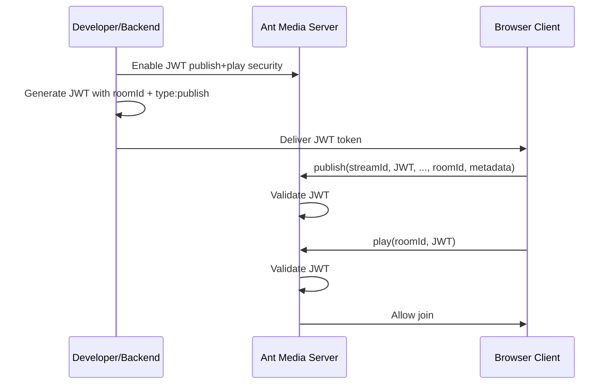

# Conference Room Security

In Ant Media Server, each participant and the conference room itself are treated as individual broadcasts. This means that all [Stream Security](https://antmedia.io/docs/category/stream-security/) features apply to conferencing as well.

## Secure Rooms With Tokens

To secure a conference room:
1. Enable token security settings for both **publishing** and **playing** through the web panel.
2. Generate a publish token using the room's (main track) broadcast ID.
3. Pass the generated publish token to both `.publish()` and `.play()` functions.

Without a valid token, the participant will not be able to join the room.

A generated token can be a [JWT token](https://antmedia.io/docs/guides/stream-security/jwt-stream-security-filter/) or a [One-Time Token](https://antmedia.io/docs/guides/stream-security/one-time-token-control/). This guide uses JWT.

## Security with JSON Web Tokens



### Step 1: Enable JWT Security

Go to the Ant Media Server web panel and enable JWT for both **publish** and **play**. For details, see the [JWT Stream Security documentation](https://antmedia.io/docs/guides/stream-security/jwt-stream-security-filter/).

### Step 2: Generate JWT with Room ID

Generate a JWT with the following payload structure:

```json
{
    "type": "publish",
    "streamId": "roomId",
    "exp": jwt_expire_timestamp
}
```

You can generate the JWT token using the [JWT Debugger UI](https://jwt.io) or via the REST API.

:::info
In conferencing, even though the token type is `publish`, it can be used for both publishing and playing.
:::

### Step 3: Join the Room Using JWT

Pass the generated publish token to both `.publish()` and `.play()` functions:

```javascript
const joinRoom = () => {
    webrtcAdaptor.current.publish(
        localParticipantStreamId,
        publishToken,   // <-- JWT token here
        null, null,
        localParticipantStreamId,
        roomId,
        JSON.stringify(userStatusMetaData)
    );
    webrtcAdaptor.current.play(roomId, publishToken);  // <-- JWT token here
}
```

See the [JavaScript Conference Room Sample](https://github.com/ant-media/StreamApp/blob/master/src/main/webapp/conference.html#L500) for reference.

### Step 4: Test Conference Room Security

Use the conference sample page with the token as a query parameter:

```
https://{ams-url}:5443/{appName}/conference.html?token={YOUR_JWT_TOKEN_HERE}
```

Example:
```
https://test.antmedia.io:5443/live/conference.html?token=eyJhbGciOiJIUzI1NiIsInR5cCI6IkpXVCJ9...
```

The `conference.html` sample reads the token from the query parameter and passes it to `.publish()` and `.play()`.

If you open another tab **without** a valid token and attempt to join the same room, the join request will be rejected.

## Secure the Circle Conference Room

If you are using the Circle Conference application, the token generation steps are the same. Use this URL format:

```
https://ams-domain:5443/Conference/roomId?token={YOUR_JWT_TOKEN_HERE}
```

Example:
```
https://test.antmedia.io:5443/Conference/test?token=eyJhbGciOiJIUzI1NiIsInR5cCI6IkpXVCJ9...
```
