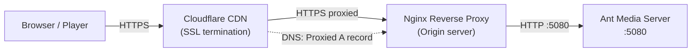

# AMS Cloudflare Integration

You can seamlessly broadcast and play WebRTC, HLS, and DASH using Ant Media Server in conjunction with Cloudflare. Let's walk through the step-by-step process of achieving this:


## Architecture



## Step 1: Cloudflare Configuration

- After logging into Cloudflare, navigate to SSL > TLS > Overview, and set the SSL/TLS encryption mode to "Full (strict)."


- Click on Origin Server in the same menu, go to "Create Certificate," and after configuring the domain settings, click on "Create."


- Origin Certificate and Private Key will be generated; copy these two files to the server where you run Nginx.


- Ensure that the A record in DNS settings is set to "Proxied" (enabled).

## Step 2: Nginx Configuration

- Complete the installation of Nginx by following the instructions provided [in this link](https://antmedia.io/docs/guides/clustering-and-scaling/load-balancing/nginx-load-balancer/#nginx-installation).

- Copy your certificate and private key to the `/etc/nginx/ssl/` directory:

```
mkdir /etc/nginx/ssl
cp -p origin.pem privkey.pem /etc/nginx/ssl/
```

- Create a vhost configuration file:

```
vim /etc/nginx/conf.d/antmedia.conf
```

Edit and save the file with the following lines, customizing them with your information:

```nginx
server {
    listen 443 ssl;
    ssl_certificate /etc/nginx/ssl/origin.pem;
    ssl_certificate_key /etc/nginx/ssl/privkey.pem;
    server_name antmedia.space;

    location / {
        proxy_pass http://127.0.0.1:5080;
        proxy_http_version 1.1;
        proxy_connect_timeout 7d;
        proxy_send_timeout 7d;
        proxy_read_timeout 7d;
        proxy_set_header X-Forwarded-For $proxy_add_x_forwarded_for;
        proxy_set_header Host $host;
        proxy_set_header Upgrade $http_upgrade;
        proxy_set_header Connection "Upgrade";
    }
}
```

- Verify the correctness of the configuration:

```
nginx -t
```

- Restart the Nginx service:

```
systemctl restart nginx
```

Finally, access the control panel.


You've configured Cloudflare, generated and installed your origin certificates, set up Nginx, and verified the proxy settings. With SSL termination handled by Cloudflare and requests passed through to Ant Media Server, your streams are now secured and accessible.

Now you have a seamless Cloudflare integration with Ant Media Server, giving you both performance and protection for your streaming workflows.
