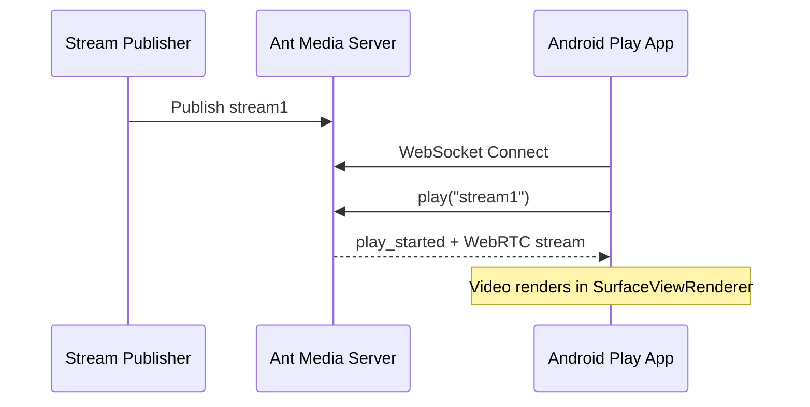

# Play WebRTC Live Stream in Android

Playing a WebRTC live stream in an Android application is straightforward if your project is already set up for streaming. The primary changes involve two lines of code in your `WebRTCStreamingActivity` class:

1. Set the `SurfaceViewRenderer` as a **remote video renderer** instead of a local one.

2. Call the `play` method instead of `publish`.



```
package com.antmedia.mywebrtcstreamingapp;

import android.app.Activity;
import android.os.Bundle;
import io.antmedia.webrtcandroidframework.api.IWebRTCClient;

public class WebRTCStreamingActivity extends Activity {
    @Override
    protected void onCreate(Bundle savedInstanceState) {
        super.onCreate(savedInstanceState);
        setContentView(R.layout.webrtc_streaming);

        IWebRTCClient webRTCClient = IWebRTCClient.builder()
                .setActivity(this)
                //.setLocalVideoRenderer(findViewById(R.id.full_screen_renderer))
                .addRemoteVideoRenderer(findViewById(R.id.full_screen_renderer))
                .setServerUrl("wss://test.antmedia.io:5443/live/websocket")
                .build();

        //webRTCClient.publish("stream1");
        webRTCClient.play("stream1");
    }
}
```

## Test the WebRTC Play Application

1. First, create a stream to play. Go to the [WebRTC Publish page](https://antmedia.io/webrtc-samples/webrtc-publish-webrtc-play/) enter `stream1` in the input box, and click Start Publishing.

2. Once you see the green "Publishing" text, the stream `stream1` is live on the server.

3. Run your Android Play application. If everything is configured correctly, you should see the live video on your device or emulator.

## Troubleshooting

- If you don't see video on your device, double-check the server URL, stream ID, and permissions.

- You can always reach out in [Github Discussions](https://github.com/orgs/ant-media/discussions) for support.

- Access the source code for this project [here](https://github.com/burak-58/AMS_WebRTC_Android)


## Explore More

By following this guide, you have successfully learned how to publish and play WebRTC live streams in your Android application.

For additional features and sample implementations, check out the [WebRTC-Android-SDK-Repository](https://github.com/ant-media/WebRTC-Android-SDK/tree/master/webrtc-android-sample-app/src/main/java/io/antmedia/webrtc_android_sample_app).


## Congratulations!

Your Android app can now both publish and play live WebRTC streams.

- You've learned how to configure the UI, implement publishing, and switch to playback.

- From here, you can explore adding multiple streams, adaptive streaming, or integrating audio/video effects to enhance your live broadcast.

On the next page we will explore our sample applications.
