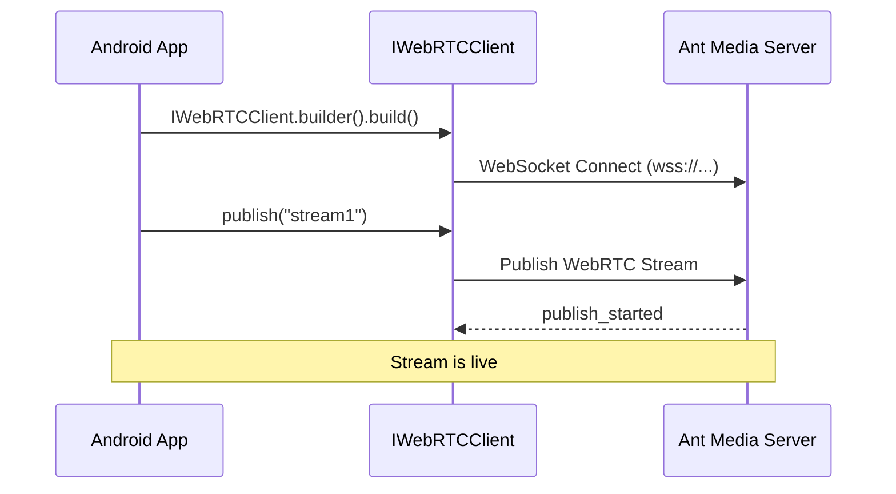

# Publish a WebRTC Live Stream in Android

In this step, we will implement the core functionality of publishing a live WebRTC stream from your Android app. This involves creating the UI, coding an Activity, and updating the manifest file.



## Create the UI

1. Create a `layout` folder under `res` if it does not exist.

2. Create an XML layout file, e.g., `webrtc_streaming.xml`. For this app, a simple UI with a single `SurfaceViewRenderer` is sufficient. This view is provided by the WebRTC Android SDK and will render the camera feed locally.

```
<?xml version="1.0" encoding="utf-8"?>
<RelativeLayout xmlns:android="http://schemas.android.com/apk/res/android"
    android:layout_width="match_parent"
    android:layout_height="match_parent">
    <org.webrtc.SurfaceViewRenderer
        android:id="@+id/full_screen_renderer"
        android:layout_width="match_parent"
        android:layout_height="match_parent" />

</RelativeLayout>
```

You can either use the Android Studio UI Designer or copy the above XML directly.


## Create the Activity

Create a Java class named `WebRTCStreamingActivity` that extends `Activity`. In the `onCreate` method, build an `IWebRTCClient` object and call its publish method.

```
package io.antmedia.mywebrtcstreamingapp;

import android.app.Activity;
import android.os.Bundle;
import io.antmedia.webrtcandroidframework.api.IWebRTCClient;

public class WebRTCStreamingActivity extends Activity {
    @Override
    protected void onCreate(Bundle savedInstanceState) {
        super.onCreate(savedInstanceState);
        setContentView(R.layout.webrtc_streaming);

        IWebRTCClient webRTCClient = IWebRTCClient.builder()
                .setActivity(this)
                .setLocalVideoRenderer(findViewById(R.id.full_screen_renderer))
                .setServerUrl("wss://test.antmedia.io:5443/live/websocket")
                .build();

        webRTCClient.publish("stream1");
    }
}
```

## Edit Android Manifest

Update `AndroidManifest.xml` to:

1. Set `WebRTCStreamingActivity` as the default launcher activity.

2. Add required permissions for camera, audio, and network access.

```
<?xml version="1.0" encoding="utf-8"?>
<manifest xmlns:android="http://schemas.android.com/apk/res/android"
    xmlns:tools="http://schemas.android.com/tools">

    <uses-feature android:name="android.hardware.camera" />
    <uses-feature android:name="android.hardware.camera.autofocus" />
    <uses-feature
        android:glEsVersion="0x00020000"
        android:required="true" />

    <uses-permission android:name="android.permission.ACCESS_NETWORK_STATE" />
    <uses-permission android:name="android.permission.BLUETOOTH" />
    <uses-permission android:name="android.permission.CAMERA" />
    <uses-permission android:name="android.permission.MODIFY_AUDIO_SETTINGS" />
    <uses-permission android:name="android.permission.INTERNET" />
    <uses-permission android:name="android.permission.BLUETOOTH_CONNECT" />

    <application
        android:allowBackup="true"
        android:dataExtractionRules="@xml/data_extraction_rules"
        android:fullBackupContent="@xml/backup_rules"
        android:icon="@mipmap/ic_launcher"
        android:label="@string/app_name"
        android:supportsRtl="true"
        android:theme="@style/Theme.MyWebRTCStreamingApp" >

        <activity android:name=".WebRTCStreamingActivity"
            android:exported="true"
            android:theme="@style/Theme.AppCompat.DayNight">
            <intent-filter>
                <action android:name="android.intent.action.MAIN" />

                <category android:name="android.intent.category.LAUNCHER" />
            </intent-filter>
        </activity>
    </application>
</manifest>
```

## Project Structure and Running the App

Run the app on an Android emulator or a physical device. Grant permissions when prompted. The app will start streaming automatically.

## Verify Stream Playback

To view the live stream from your Android app:

1. Open [Ant Media's Test WebRTC Player](https://antmedia.io/webrtc-samples/webrtc-player)

2. Enter 'stream1' in the input box.

3. Click **Start Playing**

## Congratulations!

Your WebRTC Android Publish Application is now live.

- You successfully created the UI, implemented the publishing logic, and configured your manifest.

- You can now stream live video directly from your Android device to Ant Media Server.

On the next page we will explore playing a WebRTC stream in a bit more detail.
