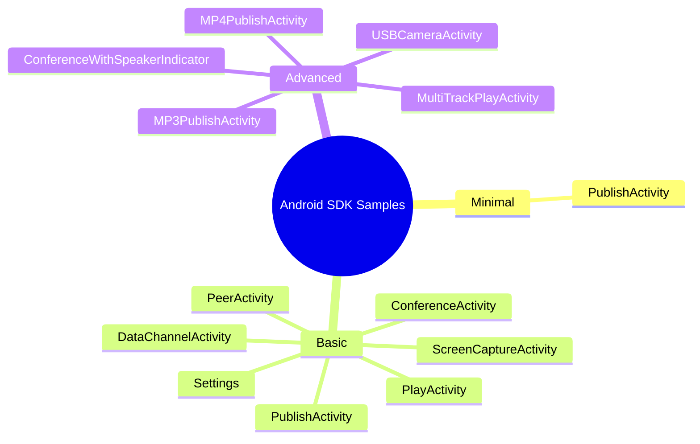

# Android SDK Samples

The Android SDK comes with many ready-to-use samples under the `webrtc_android_sample_app` module. These samples demonstrate different use cases and scenarios for WebRTC streaming.

The `webrtc_android_sample_app` module has three packages:



**1. Minimal**

* Contains the simplest `PublishActivity`, a minimal WebRTC publish sample.

**2. Basic**

* Includes multiple samples: `publish activity`, `play activity`, `screen capture activity`, `conference activity`, `data channel only activity`, `peer activity`, and `settings`.

**3. Advanced**

- Provides samples for more complex use cases: conference activity with speaker indicator, MP3 publish activity, MP4 publish activity, MP4 publish with surface activity, multi-track play activity, publish activity with "Are You Speaking", and USB camera activity.

## Getting the Android SDK

The WebRTC Android SDK is free to download. You can download or clone it from the [**Android SDK Github repository**](https://github.com/ant-media/WebRTC-Android-SDK).

After downloading/cloning:

1. Open the project in Android Studio.

2. Navigate to the samples:

```js
webrtc-android-sample-app > java > io.antmedia.webrtc_android_sample_app
```

3. Connect an Android device to your computer — either an emulator or a physical device. For this guide, a physical device is used.

## Run the WebRTC Android SDK

### Connecting the Android Device
1. Connect your Android device and enable **Developer Mode**.
2. Enable **USB Debugging** in the developer options.
3. In Android Studio, your connected device will appear in the device selector.


### Build and Launch the SDK

1. Click Run to build the project.

2. Once the build completes, the **WebRTC Android Sample App** will launch on your device.

3. On your device, you will see all the available sample activities.


## WebRTC Android SDK Samples Overview

### Settings

* Enter your **Ant Media Server WebSocket URL** and **Room Name** (for conferences).

* All streams published or played by the samples will connect to this server.

### Publish Activity

* Publishes WebRTC streams and includes a **data channel**.

* Verify the stream via the **Ant Media Server web panel** or the [embedded player](https://antmedia.io/docs/guides/playing-live-stream/embedded-web-player/).


### Play Activity

* Plays WebRTC streams and also supports the **data channel**.

### Conference Activity

Supports multi-user video conferences.

Includes **Play Only mode** and allows enabling/disabling audio and video.

### Screen Share Activity

* Demonstrates screen sharing via WebRTC.

* Supports Screen, Front Camera, and Rear Camera sources.


### Data Channel Only Activity

* Sends arbitrary data between clients over WebRTC.

* Useful for **chat**, **control messages**, or **file sharing**.

* Ensure the data channel is enabled in the [application settings](https://antmedia.io/docs/guides/publish-live-stream/webrtc/data-channel/#enabling-the-data-channel).


### Stats Activity

* Displays **audio and video stats** for published streams.

### Conference with Speaking Indicator Activity

* Indicates which participant is currently speaking.

### Publish with "Are You Speaking"

* Shows a warning if the speaker is muted but talking.

### Peer Activity

* Demonstrates peer-to-peer connections.

* Ant Media Server is used only for signaling; audio/video is sent directly between peers.

:::info
Additional samples include USB Camera, MP3, MP4, MP4 with Surface, and Multi-Track activities.
:::

## Android SDK Sample Applications Installation Demo

<iframe width="560" height="315" src="https://www.youtube.com/embed/aqMPGiF6YIw?si=0OWHopmyx1glwIYE" title="YouTube video player" frameborder="0" allow="accelerometer; autoplay; clipboard-write; encrypted-media; gyroscope; picture-in-picture; web-share" referrerpolicy="strict-origin-when-cross-origin" allowfullscreen></iframe>

## Congratulations!

You now have access to the full set of WebRTC Android SDK samples.

* You can explore minimal, basic, and advanced use cases.

* You can publish and play streams, run conferences, share screens, and experiment with data channels.

* With these examples, you can quickly build your own custom streaming Android applications.
