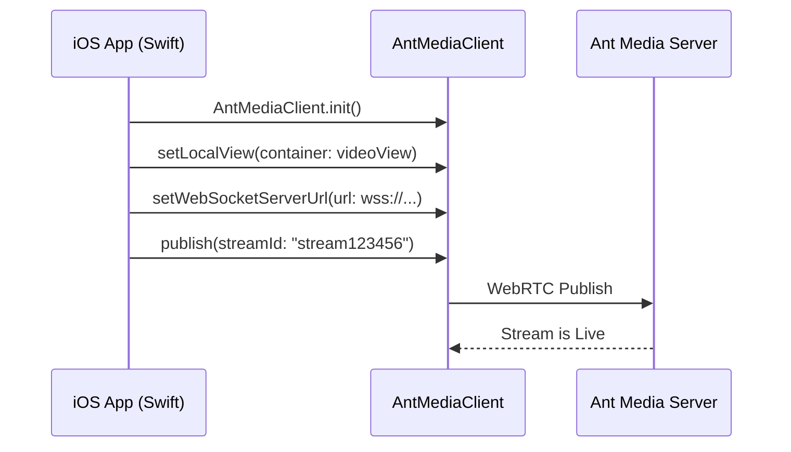

# Step 3: Publish a WebRTC Live Stream in iOS

To publish a WebRTC live stream from your iOS application, follow these steps:



## 1. Add a UIView in Main.storyboard

* Open **Main.storyboard** and go to **View > Show Library**.

* Search for **UIView** in the library search box.

* Drag the **UIView** onto the storyboard and adjust its size as needed.

## 2. Connect UIView to ViewController

* Open two editors: one for **Main.storyboard** and another for **ViewController.swift**.

* Right-click on the UIView in the storyboard, drag it to the ViewController editor, and release the right-click. Name your outlet.

## 3. Add Privacy Descriptions in Info.plist

* Right-click **Info.plist** and select **Add Row**.

* Add descriptions for **Camera Usage** and **Microphone Usage**.

## 4. Edit ViewController.swift

* Initialize the `AntMediaClient`, set the WebSocket URL, and call `publish` with a `streamId`.

```
import UIKit
import WebRTCiOSSDK

class ViewController: UIViewController {

    @IBOutlet weak var videoView: UIView!
    var client:AntMediaClient =  AntMediaClient.init();
    
    override func viewDidLoad() {
        super.viewDidLoad()
        client.setLocalView(container: videoView);
        client.setWebSocketServerUrl(url: "wss://test.antmedia.io:5443/WebRTCAppEE/websocket");
        client.publish(streamId: "stream123456")
    }
}
```

## 5. Run Your Application

* Launch your app on a real iOS device and grant Camera and Microphone permissions.

## 6. Congratulations!

* You are now publishing a live WebRTC stream from your iOS device.

## 7. Play the Stream

To verify the stream, visit **Ant Media's Test WebRTC Player**, enter the `streamId` "**stream123456**", and click **Start Playing**.

You now have a fully working iOS app capable of publishing WebRTC streams. You can continue exploring features like playing streams and screen sharing using our SDK.
