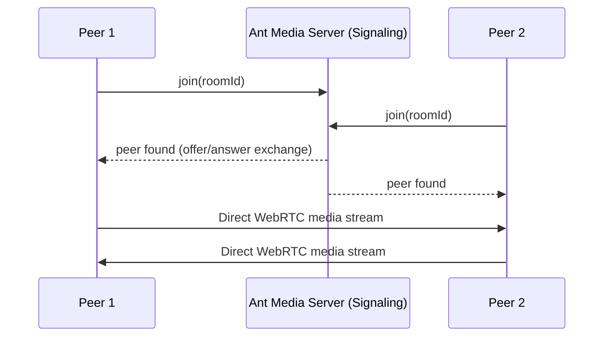

# WebRTC Peer-To-Peer

In Peer-to-Peer (P2P) mode, two or more peers can connect with each other directly, without relaying audio or video through the server. Instead, there will be a direct WebRTC connection from one peer to another.

In this setup, Ant Media Server only acts as a signaling server. Its role is to help peers exchange the necessary information (signaling messages) to establish the connection, after which all media flows directly between peers.

This greatly reduces latency and server load, making it ideal for real-time communication scenarios like video calls or group chats.



## WebRTC P2P Live Sample

1. Navigate to the P2P sample page [here](https://codepen.io/USAMAWIZARD/embed/azoMqdq?default-tab=js&editable=true) at Code Pen.

2. Comment out the import from the local directory and uncomment the import from the URL:

  ```js
  import  {WebRTCAdaptor} from  "https://esm.sh/@antmedia/webrtc_adaptor";
  //import { WebRTCAdaptor } from './node_modules/@antmedia/webrtc_adaptor/src/main/js/webrtc_adaptor.js';
  ```

3. Click the **Join** button.

4. Open the same page in a new browser tab and join again — now you should see the peer-to-peer connection in action.


## Create P2P Sample For Deployment

1. Create a new file called `peer.html`

2. Start a local HTTP server in the same directory:

  ```
  python3 -m http.server
  ```

3. Copy the example code into peer.html.

```html
<!DOCTYPE html>
<html lang="en">
<head>
</head>
<body>

<video id="localVideo" autoplay controls width=480px height=360px></video>
<video id="remoteVideo" controls autoplay playsinline width="480" height="360"></video>
<br/>
<input type=text placeholder="p2p room id" id="roomid">
<button id="joinroom">join</button>
<br/>

</body>

<script type="module">
import { WebRTCAdaptor } from './node_modules/@antmedia/webrtc_adaptor/src/main/js/webrtc_adaptor.js';

var webRTCAdaptor = new WebRTCAdaptor({
  websocket_url: "wss://test.antmedia.io:5443/live/websocket",
	remoteVideoElement: document.getElementById("remoteVideo"),
 	localVideoElement: document.getElementById("localVideo"),

  callback: (info, obj) => {
     console.log("callback info: " + info);
     if (info == "play_started") {
        console.log("publish started");
        statusInfo.innerHTML = "Playing - Stream Id:" + streamId; 
     }
     else if (info == "play_finished") {
        console.log("publish finished")
        statusInfo.innerHTML = "Offline"
     }
  },
  
});

document.getElementById("joinroom").addEventListener("click",()=> {
  var roomid = document.getElementById("roomid").value;
  var status = document.getElementById("joinroom");
  
  if(status.innerHTML =="join"){
    status.innerHTML  = "leave";
    webRTCAdaptor.join(roomid);
  }
  else{
    status.innerHTML  = "join";
    webRTCAdaptor.stop(roomid);
  }
})

</script>
</html>
```

4. Open the file in your browser: `http://localhost:8000/peer.html`.

5. Accept microphone and camera permissions.

6. Enter a room ID and click **Join**.

7. Open the same page in another tab and join with the same room ID.

## WebRTCAdaptor Methods

- Join a room (waits for peers and establishes P2P connections):

```
webRTCAdaptor.join(streamid)
```

- Stop playing/publishing streams:

```
webRTCAdaptor.stop(streamid)
```

## Congratulations!

You've now learned how to establish a peer-to-peer WebRTC connection using the Ant Media JavaScript SDK.

In this mode, Ant Media Server works only as a signaling server, while all the actual audio and video traffic flows directly between peers — delivering ultra-low latency communication.
