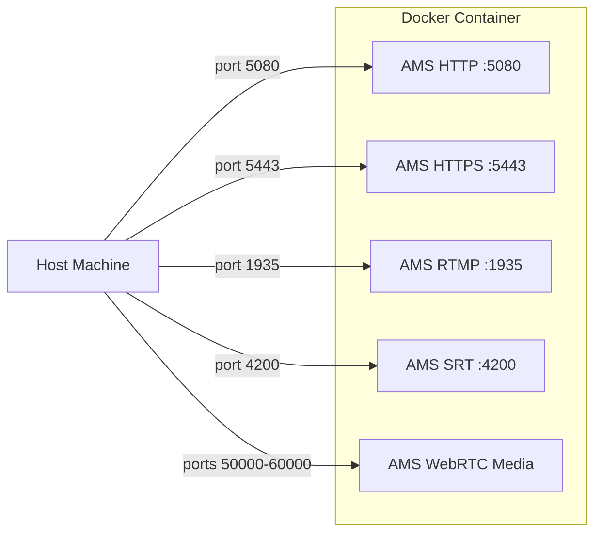

# Install with Docker

Docker provides an easy and portable way to run Ant Media Server without installing it directly on your host system. Using the official Docker images, you can quickly spin up a containerized AMS instance, test it on different environments, and manage upgrades or custom builds with minimal effort.

## Quick Start with Official Image

To use the Ant Media Server Enterprise Edition [official Docker Hub image](https://hub.docker.com/r/antmedia/enterprise/tags), you can execute the following command, which will pull the latest version directly from Docker Hub and run the container.

```bash
docker run --restart=always -d --name antmedia --network=host -it antmedia/enterprise:latest
```

OR

```bash
docker run --restart=always -d --name antmedia -p 5080:5080 -it antmedia/enterprise:latest
```

Once the container is running, reach out to the AMS dashboard and start streaming as explained below.

## Docker Container Networking



## Build Your Own AMS Docker Image

For those who prefer creating their own AMS Docker image, here's the process to follow:

### 1. Download Dockerfile

```bash
wget https://raw.githubusercontent.com/ant-media/Scripts/master/docker/Dockerfile_Process -O Dockerfile
```

### 2. Build Docker Image

You can perform the build process by entering your license key or having the zip file.

1. Enter a license key as an argument as follows, and then the build process will start.

:::info
The license key is required in the case of Ant Media Server Enterprise Edition only.

By default, it will directly fetch the current latest version image.
:::

```bash
docker build --network=host -t antmediaserver --build-arg LicenseKey=<Your_License_Key> .
```

2. Download and save the Ant Media Server ZIP file in the same directory as the Dockerfile. Then run the docker build command from the command line.

#### Enterprise Edition:

The AMS Enterprise Edition Zip file can be downloaded from your [Ant Media account](https://antmedia.io) after license purchase.

Example: **ant-media-server-enterprise-2.14.0-20250513_1544.zip.**

```bash
docker build --network=host -t antmediaserver --build-arg AntMediaServer=ant-media-server-enterprise-2.14.0-20250513_1544.zip .
```

#### Community Edition:

The AMS Community Edition Zip file can be downloaded from the Ant Media Server [GitHub release page](https://github.com/ant-media/Ant-Media-Server/releases).

Example: **ant-media-server-community-2.14.0.zip**

```bash
docker build --network=host -t antmediaserver --build-arg AntMediaServer=ant-media-server-community-2.14.0.zip .
```

### 3. Run Docker Container

Now we have a Docker image with Ant Media Server. Run the Docker container with the below command:

```bash
docker run --restart=always -d --name antmedia --network=host -it antmediaserver
```

:::info
By default, Docker uses the host network ports. However, on macOS, the `--network=host` option is not supported. In such cases, you'll need to explicitly define the ports as shown below.
:::

```bash
docker run --restart=always -d --name antmedia -p 5080:5080 -it antmediaserver
```
In this example, only port 5080 is mapped for HTTP access. However, protocols like RTMP require additional ports (e.g., 1935), so they must be specified as well.

```bash
docker run --restart=always -d --name antmedia -p 5080:5080 -p 1935:1935 -it antmediaserver
```
You can map more ports as needed, depending on your use case.

### 4. Volume (Optional)

If you would like to use persistent volume, you can use it as follows. In this way, volume keeps even if your container is destroyed.

```bash
docker volume create antmedia_volume
docker run -d --name antmedia --mount source=antmedia_volume,target=/usr/local/antmedia/ --network=host -it antmediaserver
```

## AMS Dashboard

After the Docker container starts, reach out to `http://localhost:5080` or `http://host-IP:5080` to access the Ant Media Server dashboard.


Check out [here](https://antmedia.io/docs/guides/publish-live-stream/webrtc/) to publish a WebRTC stream for testing.
