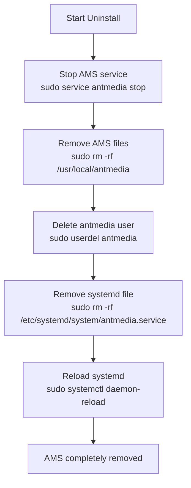

# Uninstall Ant Media Server on Linux

This guide provides step-by-step instructions for uninstalling Ant Media Server from a Linux system. Follow the commands listed below to ensure the complete removal of the application.

## Uninstall Steps



### Stop the Ant Media Server Service

Before uninstalling, stop the Ant Media Server service to ensure there are no running processes.

```bash
sudo service antmedia stop
```

### Remove Ant Media Server Files

Delete the directory where Ant Media Server is installed. This removes all application files and data.

**Note** — Ensure you have a backup if you want any data or config preserved, because this is destructive.

```bash
sudo rm -rf /usr/local/antmedia
```

### Delete the Ant Media Server User

The specific user was created to run Ant Media Server, delete this user.

```bash
sudo userdel antmedia
```

### Delete systemd file

```bash
sudo rm -rf /etc/systemd/system/antmedia.service
sudo systemctl daemon-reload
```

:::tip
Before uninstalling, consider making a backup of your configuration files and recorded streams if you may need them later:

```bash
# Backup streams and config
sudo cp -r /usr/local/antmedia/webapps /tmp/antmedia-backup/
sudo cp /usr/local/antmedia/conf/ /tmp/antmedia-conf-backup/ -r
```
:::
