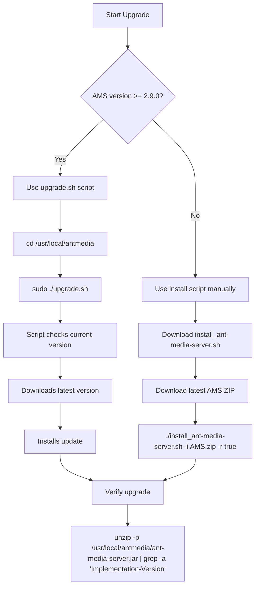

# Upgrade Ant Media Server

This guide explains how to upgrade the Ant Media Server from an earlier version to the latest version.

There are two ways to upgrade your Ant Media Server to the latest version:

1. Using the `upgrade.sh` script that automatically gets the latest version of the Ant Media Server and makes the upgrade. This script is available under the `usr/local/antmedia` directory by default for Ant Media Server version 2.9.0 and above.

2. Using the `install_ant-media-server.sh` script and manually passing the Ant Media Server installation zip file.

## Upgrade Process



## Upgrading with the `upgrade.sh` Script

:::info
This script is available under the installation directory for Ant Media Server version 2.9.0 and above. If you want to use the script with an older version, kindly get the script from [here](https://github.com/ant-media/Ant-Media-Server/blob/master/src/main/server/upgrade.sh)
:::

**1. SSH into your Ant Media Server instance.**

**2. Navigate to the installation directory.**

```
cd /usr/local/antmedia
```

**3. Run the upgrade script to start the upgrade process.**

```
sudo ./upgrade.sh
```

**4. The script will guide you through the process. It will:**

- Check the current version of Ant Media Server.

- Compare it with the latest available version.

- Download and install the new version if an update is needed.

- After the script completes, verify that the Ant Media Server has been updated successfully.

```
unzip -p /usr/local/antmedia/ant-media-server.jar | grep -a "Implementation-Version"
```

This command will show the version of the installed Ant Media Server.

- The script automatically determines whether you are using the Community or Enterprise edition of the Ant Media Server and makes the upgrade according to it. Therefore, the script can be used for both Community and Enterprise editions.

- To learn more about the `upgrade.sh` script, please check [here](https://github.com/ant-media/Ant-Media-Server/blob/master/src/main/server/upgrade.sh).

## Upgrade with the Installation Script

Another way to upgrade the Ant Media Server is by using the `install_ant-media-server.sh`

To use this approach, it is important to have the Ant Media Server installation zip file.

- If you have purchased a license from Ant Media, then in the downloads section of your [antmedia.io](https://antmedia.io/my-account/downloads/) account, you can download the most recent version zip file.

- In the case of Ant Media Server's Marketplace image on AWS, Azure, GCP, and Oracle Cloud, you can send an email to [contact@antmedia.io] and ask for the new version zip file.

- In the case of Ant Media Server Community Edition, you can download the latest version zip file from [here](https://github.com/ant-media/Ant-Media-Server/releases).

After downloading the zip file, kindly follow the below steps:

**1. SSH into your Ant Media Server instance.**

**2. Download the installation script**

Download the `install_ant-media-server.sh` shell script with the latest changes.

```shell
wget -O install_ant-media-server.sh https://raw.githubusercontent.com/ant-media/Scripts/master/install_ant-media-server.sh && sudo chmod 755 install_ant-media-server.sh
```

**3. Run the installation script to upgrade the server**

If you want to keep the settings from the previous installation, you must add the **-r true** flag at the end of the command.

```shell
sudo ./install_ant-media-server.sh -i <ANT_MEDIA_SERVER_ZIP_FILE> -r true
```

For change/release logs of the new version, please check [here](https://github.com/ant-media/Ant-Media-Server/releases).

## How do I Restore the Ant Media Server if Needed?

Finally, whenever you perform a fresh installation or upgrade over an existing version, Ant Media Server automatically creates a backup of the previous installation in the `/usr/local` directory. You can find it in a timestamped folder — for example, **antmedia-backup-2022-11-18_15-42-54**

To restore the previous installation, kindly follow the below commands:

```shell
sudo systemctl stop antmedia
sudo rm -rf /usr/local/antmedia
sudo cp -p -R /usr/local/antmedia-backup_folder/ /usr/local/antmedia
sudo chown -R antmedia:antmedia /usr/local/antmedia/
sudo systemctl start antmedia
```

## What Happens to Previously Installed Plugins After Upgrade?

During the upgrade, all previously installed plugins — along with their configurations and license files — are removed. To continue using them, you'll need to either copy the files from your backup or reinstall the plugins. Our team is actively working on improving this process for future releases.
