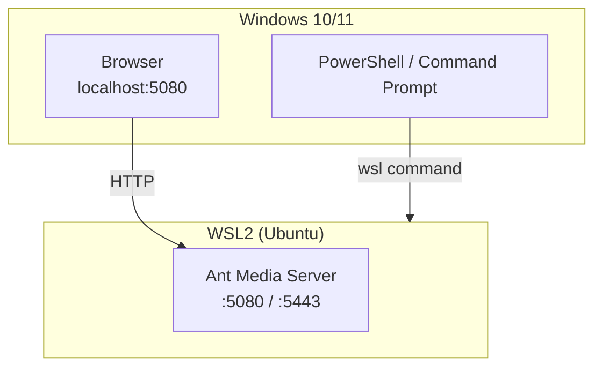

# Install AMS on WSL (Windows Subsystem for Linux)

Windows Subsystem for Linux (WSL) provides a lightweight virtualized environment to run Linux distributions directly on Windows. This guide shows you how to install Ant Media Server (AMS) on WSL, which can be useful for local development, testing, and demos.

:::info **Important:** This guide assumes you are using **WSL2** and Ubuntu (>20.04) as your Linux distribution. For production setups, we strongly recommend using a dedicated Linux server or virtual machine.

We also **do not cover** every installation step of AMS here — please follow our [Installing Ant Media Server on Linux](/installation/linux) documentation for the complete process. This guide supplements that with WSL-specific steps.
:::

## WSL Architecture



## 1. Install WSL and Ubuntu

:::info
Before proceeding with the WSL installation, run the below commands to enable the Windows feature for virtualization and WSL.

Run **PowerShell as Administrator** and execute:

```
dism.exe /online /enable-feature /featurename:Microsoft-Windows-Subsystem-Linux /all /norestart

dism.exe /online /enable-feature /featurename:VirtualMachinePlatform /all /norestart
```

After that, reboot the system.
:::

You can now install WSL and Ubuntu using a single command in PowerShell (run as Administrator):

```bash
wsl --install
```

Once the installation completes and the system reboots, you'll be greeted with a Linux shell asking you to create a username and password.


---

## 2. Update the Ubuntu Environment

After setting up Ubuntu, update the package lists and install system updates:

```bash
sudo apt update && sudo apt upgrade -y
```


---

## 3. Install Ant Media Server

Follow our official [Linux installation guide](/installation/linux) to install Ant Media Server inside the WSL environment.

Once AMS is installed, check its status:

```bash
sudo service antmedia status
```

---

## 4. Access the Web Dashboard

If you're running AMS on WSL2, it will typically be available at:

```bash
http://localhost:5080
```

You can access this from any browser on your Windows machine.


---

## 5. Publish a Test Stream

We can now test publishing a WebRTC stream from the browser with this URL:

```bash
http://localhost:5080/live/
```

And play it with the following:

```bash
http://localhost:5080/live/play.html?id=test
```


To publish and play WebRTC in a production environment, you need to enable SSL. For more info, check out the SSL document [**here**](/installation/ssl).

---

## Notes and Considerations

- AMS performance on WSL may be limited compared to a native Linux server.
- Hardware-accelerated encoding might not be available in WSL.
- WSL is best suited for **development and testing**, not production.

---

## Troubleshooting

- If you can't access AMS at `http://localhost:5080`, check if the WSL instance is running and that AMS is started.
- Make sure ports are not blocked by your firewall or antivirus.
