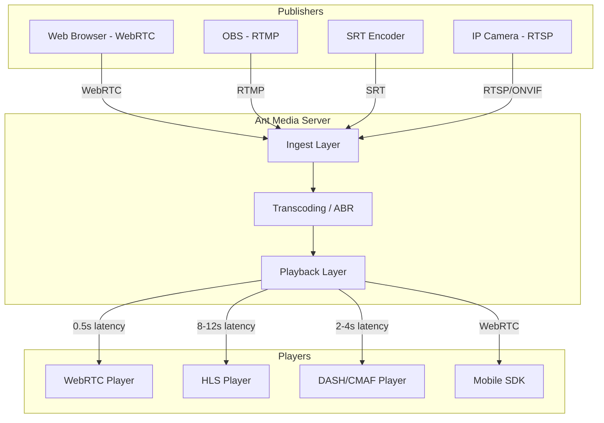
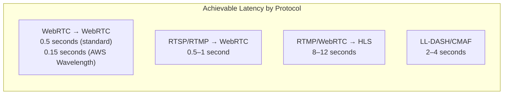
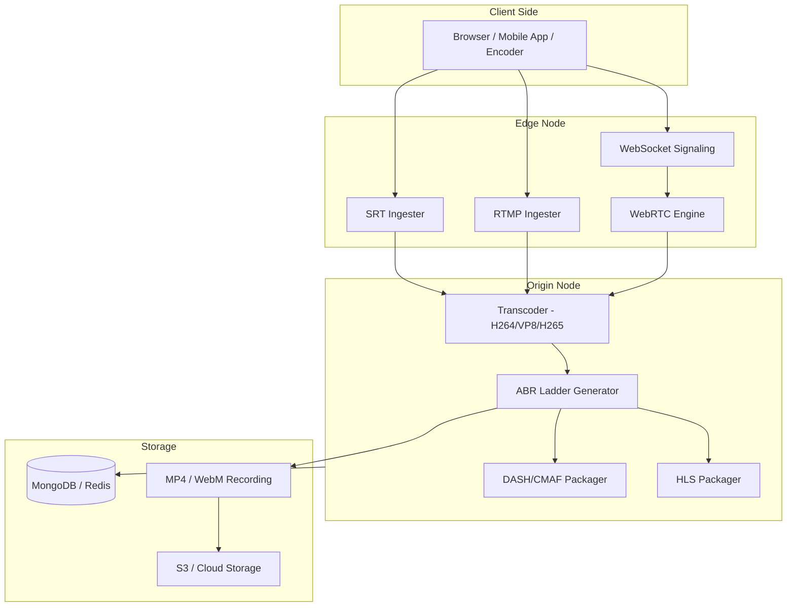

# Introduction to Ant Media Server

Ant Media Server is a ready-to-use, highly scalable, real-time video streaming solution. It supports Ultra-Low Latency (WebRTC), Low Latency (LL-DASH/CMAF and LL-HLS) and standard latency (HLS) for live streaming.

Ant Media Server (AMS) can be easily and quickly deployed on-premises or on public cloud networks like AWS, Azure, Google Cloud, Digital Ocean, Oracle, and Linode/Akamai.

Ant Media Server is available in two versions: **Community Edition** and **Enterprise Edition**. A table of comparisons is provided below.

There are two installation options for Ant Media Server: standalone (a single server) and cluster (many connected servers).
When set up in cluster mode, Ant Media Server can dynamically scale both horizontally and vertically to support thousands of viewers and broadcasters at once in an automated and controlled manner.

In addition to supporting live stream playback in any web browser, the SDKs for iOS, Android, Flutter, React Native, Unity, and JavaScript are also freely available for users to increase their audience reach.

## Architecture Overview

## Usage Scenarios

### Education

Ant Media can provide virtual classrooms to teachers using ultra-low latency technology, enabling teachers to connect with the audience using 1-1 or 1-many connection types.

### IP Camera Streaming

Watch and Monitor IP cameras with ultra-low latency on a web browser with Ant Media Server. You can embed ONVIF IP camera streams into your websites and mobile applications. [Read more](https://antmedia.io/solutions/ip-camera-streaming/)

### Webinars

Ant Media Server supports N-N live video/audio conferencing by using WebRTC, allowing you to achieve ultra-low latency (~ 0.5 sec). Ant Media Server also provides scalability, which can help you scale up your solution dynamically. [Read more](https://antmedia.io/solutions/webinar-e-learning-virtual-classroom/)

### Mobile Streaming Application

Using our SDKs, you can integrate your mobile application solutions with Ant Media Server and build a fast, reliable, and stable streaming platform with AMS APIs and SDKs. [Read more](https://antmedia.io/docs/category/sdk-integration/)

### Live Game Shows

Live video experience has a significant role in live game show success, with the strong requirement of being scalable and having low latency. [Read more](https://antmedia.io/solutions/media-entertainment/)

### E-sports & Betting Streaming

Due to the ever-growing e-sports domain, there is a tremendous demand for video streaming with ultra-low latency. [Read more](https://antmedia.io/solutions/video-game-streaming/)

### Auctions and Bidding

Live auctions should be streamed with ultra-sub-second latency in order to get bids on time. [Read more](https://antmedia.io/solutions/auction-bidding/)

### Video Game Streaming

Ant Media Server resolves interactivity and scalability issues by providing ultra-low-latency streaming via WebRTC. [Read more](https://antmedia.io/solutions/video-game-streaming/)

### Telehealth

Build your own telehealth application with Ant Media Server to create a seamless interaction between doctors and patients. [Read more](https://antmedia.io/solutions/telehealth/)

## Community and Enterprise Edition Comparison

| **Feature** | **Community Edition** | **Enterprise Edition** |
| :---: | :---: | :---: |
| One-to-Many WebRTC Streaming | No | Yes |
| End-to-End Latency | 8-12 Seconds | 0.5 Seconds (500ms) |
| LL-DASH(CMAF) | No | Yes |
| Auto Scaling | No | Yes |
| Kubernetes Support | No | Yes |
| RTMP(Ingesting) to WebRTC (Playing) | No | Yes |
| Hardware Encoding(Nvidia GPU, QuickSync) | No | Yes |
| WebRTC Data Channel | No | Yes |
| Adaptive Bitrate | No | Yes |
| Secure Streaming | No | Yes |
| SRT ingest support | No | Yes |
| iOS & Android WebRTC SDK | No | Yes |
| VP8 and H.265 Support | No | Yes |
| iOS & Android SDK | Yes | Yes |
| JavaScript SDK | Yes | Yes |
| RTMP, RTSP, MP4 and HLS Support | Yes | Yes |
| LL-HLS (Paid plugin) | Yes | Yes |
| WebRTC to RTMP Adapter | Yes | Yes |
| 360 Degree Live & VoD Streams | Yes | Yes |
| Web Management Dashboard | Yes | Yes |
| IP Camera Support | Yes | Yes |
| Re-stream to End Points | Yes | Yes |
| WHIP | Yes | Yes |
| Open Source | Yes | Yes |
| Linear Live Streaming (Playlist) | Yes | Yes |
| Simulcast to all Social Media via RTMP | Yes | Yes |
| Recording (MP4, WebM, HLS) | No | Yes |
| Support | Community | E-mail, Slack |
| Price | Free | Paid |

## Latency Comparison

## Community Edition and Enterprise Edition Releases

- You can download the Ant Media Server Community Edition from [Github](https://github.com/ant-media/Ant-Media-Server/releases/) directly.
- You can download the Ant Media Server Enterprise Edition package from your [antmedia account](https://antmedia.io/my-account/) after purchasing the license.

## Licensing

Ant Media Server has two types of licenses.

- Ant Media Server Community Edition is free to use with Apache license.
- Ant Media Server Enterprise Edition requires a paid license per instance/server. Paid license options include monthly, annual, and perpetual licenses, which can be purchased directly from [antmedia.io](https://antmedia.io).

### Enterprise Edition Cluster License

The Enterprise Edition cluster license has similar features to the standard Enterprise Edition license. The only difference is that the Enterprise Cluster license supports many instances running simultaneously with the same license key. The standard Enterprise Edition license only supports one instance at a time.

If you're planning to have a large deployment for your Enterprise Cluster, please contact Sales at [contact@antmedia.io](mailto:contact@antmedia.io) to discuss discount options.

### Free Enterprise Edition License for Educational and Tech Communities

Ant Media provides **free Enterprise Edition licenses** for students, academics, and communities. To take advantage of this opportunity, just send an email from your institution or community e-mail address to [contact@antmedia.io](mailto:contact@antmedia.io)

## Functional Architecture

## Supported Environments

Ant Media can be installed on Linux, specifically Ubuntu (18.04, 20.04, 22.04 and 24.04), CentOS (8 and 9), Rocky Linux (8 and 9), and Alma Linux (8 and 9). It is compatible with both the x86-64 and Arm64 architectures.

To run AMS on a single instance, you'll need at least 4 vCPU dedicated compute optimized servers with 8 GB of RAM. In terms of smooth read-write performance, SSD disks are highly recommended.

There are several installation methods available, including deployment to a full VM, Docker, or Kubernetes.

## Ant Media Community Discussion

There is a user community available. You can ask or answer questions by joining the community at [GitHub Discussions](https://github.com/orgs/ant-media/discussions)

You can also ask your questions in [Discussions Q&A](https://github.com/orgs/ant-media/discussions/categories/q-a)

## Contact

For more information and to read our latest [blog posts](https://antmedia.io/blog/) visit [antmedia.io](https://antmedia.io/). If you have any questions, please send an email to [contact@antmedia.io](mailto:contact@antmedia.io). Support inquiries should go to [support@antmedia.io](mailto:support@antmedia.io).
