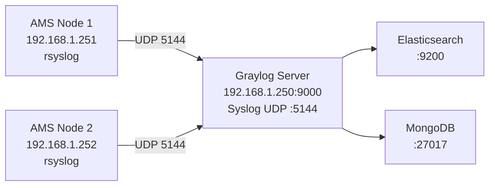
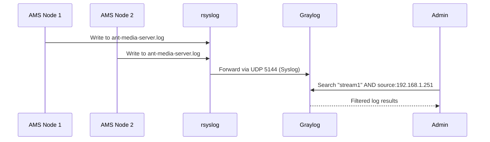

# Collecting Logs from AMS Cluster

Graylog is an open-source centralized log collection and analysis platform built on Elasticsearch and MongoDB. This guide covers installing Graylog and configuring all AMS nodes in your cluster to forward their logs to a single Graylog server.



**Test environment:**

| Role | IP Address |
|---|---|
| Graylog Server | 192.168.1.250 |
| Ant Media Server 1 | 192.168.1.251 |
| Ant Media Server 2 | 192.168.1.252 |

Minimum server spec for Graylog: **4 GB RAM**, Ubuntu.

## Prerequisites

Install Java (required for Elasticsearch) on the Graylog server:

```bash
sudo apt-get update
sudo apt-get install apt-transport-https openjdk-11-jre openjdk-11-jre-headless uuid-runtime pwgen
```

## Step 1: Install MongoDB

MongoDB stores Graylog's configuration and meta information:

```bash
sudo apt-get install gnupg
wget -qO - https://www.mongodb.org/static/pgp/server-4.4.asc | sudo apt-key add -
echo "deb [ arch=amd64,arm64 ] https://repo.mongodb.org/apt/ubuntu $(lsb_release -cs)/mongodb-org/4.4 multiverse" | sudo tee /etc/apt/sources.list.d/mongodb-org-4.4.list
sudo apt-get update && sudo apt-get install -y mongodb-org
sudo systemctl enable mongod.service && sudo systemctl restart mongod.service
sudo systemctl status mongod.service
```

## Step 2: Install Elasticsearch

Graylog requires Elasticsearch 7.x as its search backend:

```bash
wget -O - https://artifacts.elastic.co/GPG-KEY-elasticsearch | sudo apt-key add
echo "deb https://artifacts.elastic.co/packages/oss-7.x/apt stable main" | sudo tee -a /etc/apt/sources.list.d/elastic-7.x.list
sudo apt-get update && sudo apt-get install elasticsearch-oss
```

Edit `/etc/elasticsearch/elasticsearch.yml` and add:

```yaml
cluster.name: graylog
action.auto_create_index: false
```

Enable and start Elasticsearch:

```bash
sudo systemctl enable elasticsearch.service
sudo systemctl restart elasticsearch.service
```

Verify it is running:

```bash
curl -X GET http://localhost:9200
curl -XGET 'http://localhost:9200/_cluster/health?pretty=true'
```

The cluster health status should report `"status" : "green"`.

## Step 3: Install Graylog

```bash
wget https://packages.graylog2.org/repo/packages/graylog-4.3-repository_latest.deb
sudo dpkg -i graylog-4.3-repository_latest.deb
sudo apt-get update && sudo apt-get install graylog-server -y
```

Generate the required secrets:

```bash
# Generate root_password_sha2 (SHA-256 hash of your admin password)
echo -n "Enter Password: " && head -1 </dev/stdin | tr -d '\n' | sha256sum | cut -d" " -f1

# Generate password_secret (96-char random string)
pwgen -N 1 -s 96
```

Edit `/etc/graylog/server/server.conf` and set:

```
password_secret = <output from pwgen>
root_password_sha2 = <output from sha256sum>
```

To make the web interface accessible without a reverse proxy, set:

```
http_bind_address = your_server_public_ip:9000
```

Enable and start Graylog:

```bash
sudo systemctl enable graylog-server.service
sudo systemctl restart graylog-server.service
sudo systemctl status graylog-server.service
```

### Optional: Nginx Reverse Proxy with SSL

Install Nginx and certbot:

```bash
sudo apt install curl ca-certificates lsb-release -y
sudo apt-get install nginx certbot python-certbot-nginx -y
certbot --nginx -d yourdomain.com
```

Create `/etc/nginx/conf.d/graylog.conf`:

```nginx
server {
    listen 443 ssl;
    server_name yourdomain.com;
    ssl_certificate /etc/letsencrypt/live/yourdomain.com/fullchain.pem;
    ssl_certificate_key /etc/letsencrypt/live/yourdomain.com/privkey.pem;

    location / {
        proxy_set_header HOST $host;
        proxy_set_header X-Forwarded-Proto $scheme;
        proxy_set_header X-Real-IP $remote_addr;
        proxy_set_header X-Forwarded-For $proxy_add_x_forwarded_for;
        proxy_pass http://127.0.0.1:9000;
    }
}
```

## Step 4: Access Graylog Web Interface

```
http://serverip_or_hostname:9000
```

or (if using SSL):

```
https://yourdomain.com
```

Log in with username `admin` and the password whose SHA-256 you configured.

## Step 5: Configure AMS Nodes to Forward Logs

On **each AMS server**, create `/etc/rsyslog.d/25-antmedia.conf`:

```
$ModLoad imfile
$InputFileName /usr/local/antmedia/log/ant-media-server.log
$InputFileTag antmedia
$InputFileStateFile stat-antmedia
$InputRunFileMonitor
*.* @192.168.1.250:5144;RSYSLOG_SyslogProtocol23Format
```

Replace `192.168.1.250` with your Graylog server's IP. Restart rsyslog:

```bash
sudo systemctl restart rsyslog
```

## Step 6: Configure Graylog Input

In the Graylog web interface:

1. Go to **System → Inputs**.
2. Select **Syslog UDP** from the dropdown and click **Launch New Input**.
3. Set the port to **5144** and bind to `0.0.0.0`.
4. Click **Save**.

Once the input is running, AMS log lines will appear in real time in the Graylog **Search** view.

## Search Query Examples

```
"stream1"
(stream1 OR stream2)
"stream1" AND NOT source:192.168.1.251
source:192.168.1.252
"stream*" NOT source:192.168.1.2
```



## Next Steps

After centralized logging is working, you can:

- Create Graylog **dashboards** to visualize stream activity across nodes.
- Set up **alerts** (e.g., trigger when error count exceeds threshold).
- Build **saved searches** for common queries like publish failures or viewer drops.
