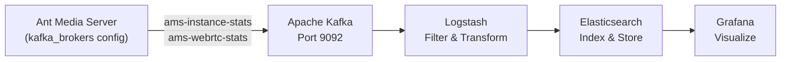
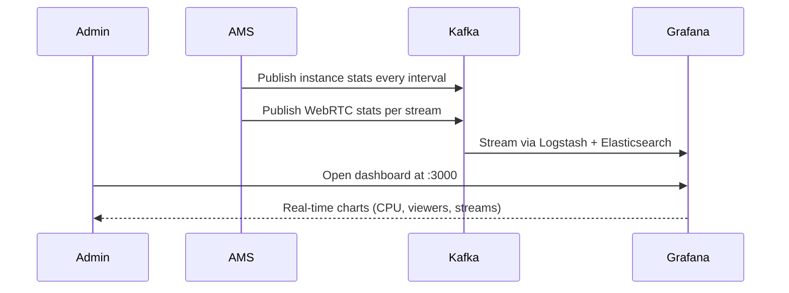

# Monitoring AMS with Grafana

Ant Media Server integrates with a Kafka → Logstash → Elasticsearch → Grafana pipeline to provide real-time infrastructure dashboards for your streaming cluster.



## Available Statistics

The following metrics are published by AMS to Kafka topics:

| Metric | Description |
|---|---|
| `instanceId` | Unique AMS server identifier |
| `cpuUsage` | Server CPU usage percentage |
| `jvmMemoryUsage` | JVM heap memory usage |
| `localWebRTCLiveStreams` | Active WebRTC publishers on this node |
| `localWebRTCViewers` | Active WebRTC viewers on this node |
| `localHLSViewers` | Active HLS viewers on this node |

## Automated Installation

The quickest way to set up the monitoring stack is with the provided install script. Run it on the server designated for monitoring:

```bash
wget -O install-monitoring-tools.sh https://raw.githubusercontent.com/ant-media/Scripts/master/install-monitoring-tools.sh
chmod +x install-monitoring-tools.sh
sudo ./install-monitoring-tools.sh
```

The script installs and configures:
- Apache Kafka (message broker)
- Logstash (data pipeline)
- Elasticsearch (data store)
- Grafana (dashboard)

## Configure AMS to Send Stats to Kafka

After the monitoring stack is running, configure each AMS instance to publish its stats. Edit `conf/red5.properties`:

```properties
server.kafka_brokers=192.168.1.230:9092
```

Replace `192.168.1.230` with your Kafka broker's IP address. Restart AMS for the change to take effect:

```bash
sudo service antmedia restart
```

## Access Grafana Dashboard

Open Grafana in your browser:

```
http://your_ip_address:3000/
```

Default credentials: **admin / admin** (you will be prompted to change on first login).



## Kafka Topic Structure

AMS publishes to two Kafka topics:

- `ams-instance-stats` — server-level metrics (CPU, memory, viewer counts)
- `ams-webrtc-stats` — per-stream WebRTC quality metrics

Each message is a JSON payload that Logstash parses and indexes into Elasticsearch for Grafana to query.

## Troubleshooting

- Verify Kafka is reachable from AMS: `telnet <kafka-ip> 9092`
- Check AMS logs for Kafka connection errors: `tail -f /usr/local/antmedia/log/ant-media-server.log`
- Confirm Elasticsearch is healthy: `curl -X GET http://localhost:9200/_cluster/health?pretty`
- Grafana data source must point to your Elasticsearch instance on port `9200`
