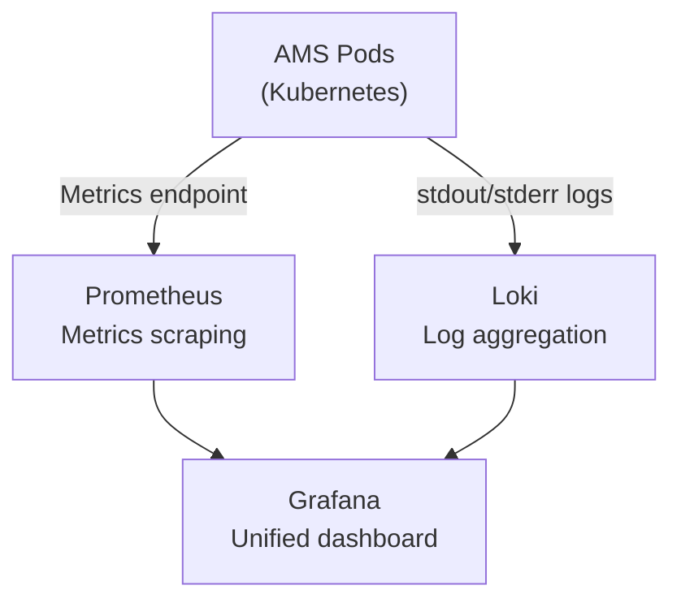
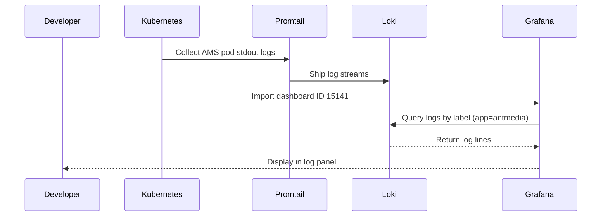

# Loki and Prometheus Setup for Kubernetes

For Kubernetes-based Ant Media Server deployments, Loki (log aggregation) and Prometheus (metrics collection) can be installed via Helm and visualized in Grafana.



## Prerequisites

- A running Kubernetes cluster with `kubectl` configured
- Helm 3 installed
- Ant Media Server deployed on Kubernetes

## Install Loki

Add the Grafana Helm repository and install Loki with the log shipping stack:

```bash
helm repo add grafana https://grafana.github.io/helm-charts
helm repo update
helm install loki grafana/loki-stack \
  --namespace monitoring \
  --create-namespace
```

This installs Loki along with Promtail (log collector agent) configured to ship pod logs from all namespaces.

## Install Prometheus

Add the Prometheus community Helm repository and install the kube-prometheus-stack (which includes Grafana):

```bash
helm repo add prometheus-community https://prometheus-community.github.io/helm-charts
helm repo update
helm install prometheus prometheus-community/kube-prometheus-stack \
  --namespace monitoring
```

## Retrieve Grafana Admin Password

```bash
kubectl --namespace monitoring get secrets prometheus-grafana \
  -o jsonpath="{.data.admin-password}" | base64 -d; echo
```

## Access Grafana

Forward the Grafana port to your local machine:

```bash
kubectl port-forward -n monitoring svc/prometheus-grafana 3000:80
```

Open `http://localhost:3000` and log in with username `admin` and the password retrieved above.

## Import the AMS Dashboard

In Grafana, go to **Dashboards → Import** and enter dashboard ID **15141**. This dashboard provides pre-built panels for AMS pod logs, error rates, and stream activity.



## Add Loki as a Data Source

If Loki is not automatically added as a Grafana data source:

1. In Grafana, go to **Configuration → Data Sources → Add data source**.
2. Select **Loki**.
3. Set the URL to `http://loki:3100` (within the `monitoring` namespace).
4. Click **Save & Test**.

## Key Labels for AMS Log Queries

When querying AMS logs in Grafana's Explore view, filter by:

```logql
{namespace="default", app="ant-media-server"}
```

Adjust `namespace` and `app` to match your AMS deployment labels.

## Summary

| Component | Role | Helm Chart |
|---|---|---|
| Loki | Log aggregation | `grafana/loki-stack` |
| Promtail | Log collection agent | Bundled with loki-stack |
| Prometheus | Metrics collection | `prometheus-community/kube-prometheus-stack` |
| Grafana | Visualization | Bundled with kube-prometheus-stack |
| Dashboard ID 15141 | AMS log panels | Import from Grafana.com |
