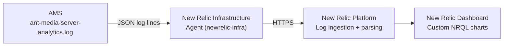
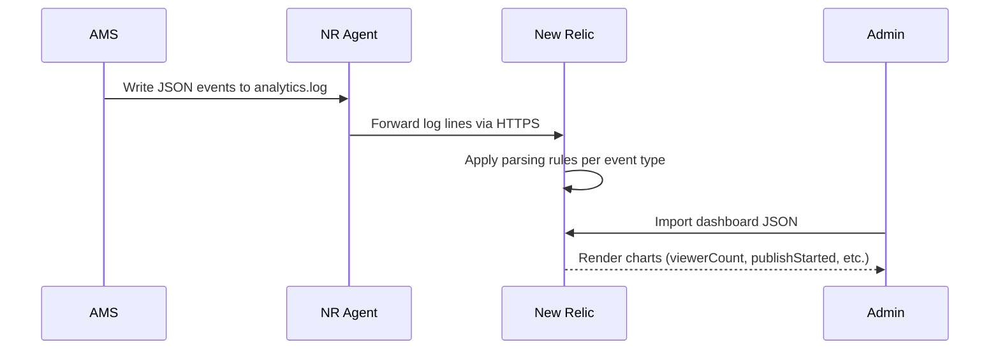

# Monitor AMS Statistics with New Relic

Starting with **v2.10.0**, Ant Media Server writes analytics logs in JSON format to `ant-media-server-analytics.log`. These logs can be forwarded to New Relic for visualization and alerting.



## Available Analytics Metrics

| Metric | Description |
|---|---|
| Total data transfer per user | Bytes transferred per subscriber |
| Publisher statistics | `streamId`, app, codecs, height, width, resolution |
| Viewer counts | WebRTC, HLS, and DASH viewer counts per stream |
| Publish/play timestamps | Start and end times for each session |
| Subscriber IDs | Per-viewer identifiers and stats |
| Tokens | Security tokens used per session |
| Stream duration | Total duration in milliseconds |
| Key frame interval | Per-stream keyframe timing |

## Step 1: Install the New Relic Agent

In your New Relic account:

1. Go to **All Entities → Add Data → Linux Logs → Create a new key**.
2. Copy the install command and run it on the AMS server:

```bash
curl -Ls https://download.newrelic.com/install/newrelic-cli/scripts/install.sh | bash && \
  sudo NEW_RELIC_API_KEY=NRAK-************YI91R \
       NEW_RELIC_ACCOUNT_ID=44799 \
       NEW_RELIC_REGION=EU \
       /usr/local/bin/newrelic install -y
```

Replace `NRAK-...`, account ID, and region with your actual values.

## Step 2: Configure the Analytics Log File

Delete the default YAML files under `/etc/newrelic-infra/logging.d/` and create a new file `/etc/newrelic-infra/logging.d/antmedia.yaml`:

```yaml
logs:
  - name: antmedia
    file: /var/log/antmedia/ant-media-server-analytics.log
    attributes:
      logtype: custom
```

Restart the New Relic infrastructure service:

```bash
sudo systemctl restart newrelic-infra.service
```

Your analytics logs will now be forwarded to New Relic.

## Step 3: Create Log Parsing Rules

Go to **Logs → Parsing Logs → Create parsing rule** in New Relic. Create one rule per event type. Ensure there are no blank spaces in rule fields.

```
Name: keyFrameStats
Field to parse: messages
Filter: filePath = '/var/log/antmedia/ant-media-server-analytics.log'
Parsing rule: \{"keyFramesInLastMinute":%{NUMBER:keyFramesInLastMinute},"keyFrameIntervalMs":%{NUMBER:keyFrameIntervalMs},"event":"%{DATA:event}","timeMs":%{NUMBER:timeMs},"app":"%{DATA:app}","streamId":"%{DATA:streamId}","logSource":"%{DATA:logSource}"\}

Name: publishEnded
Field to parse: messages
Filter: filePath = '/var/log/antmedia/ant-media-server-analytics.log'
Parsing rule: \{"durationMs":%{NUMBER:durationMs},"event":"%{DATA:event}","timeMs":%{NUMBER:timeMs},"app":"%{DATA:app}","streamId":"%{DATA:streamId}","logSource":"%{DATA:logSource}"\}

Name: viewerCount
Field to parse: messages
Filter: filePath = '/var/log/antmedia/ant-media-server-analytics.log'
Parsing rule: \{"dashViewerCount":%{NUMBER:dashViewerCount},"hlsViewerCount":%{NUMBER:hlsViewerCount},"webRTCViewerCount":%{NUMBER:webRTCViewerCount},"event":"%{DATA:event}","timeMs":%{NUMBER:timeMs},"app":"%{DATA:app}","streamId":"%{DATA:streamId}","logSource":"%{DATA:logSource}"\}

Name: publishStarted
Field to parse: messages
Filter: filePath = '/var/log/antmedia/ant-media-server-analytics.log'
Parsing rule: \{"height":%{NUMBER:height},"width":%{NUMBER:width},"videoCodec":"%{DATA:videoCodec}","audioCodec":"%{DATA:audioCodec}","protocol":"%{WORD:protocol}","event":"%{DATA:event}","timeMs":%{NUMBER:timeMs},"app":"%{DATA:app}","streamId":"%{DATA:streamId}","logSource":"%{DATA:logSource}"\}

Name: playStartedFirstTime
Field to parse: messages
Filter: filePath = '/var/log/antmedia/ant-media-server-analytics.log'
Parsing rule: \{"protocol":"%{WORD:protocol}","clientIP":"%{IP:clientIP}","subscriberId":"%{DATA:subscriberId}","event":"%{DATA:event}","timeMs":%{NUMBER:timeMs},"app":"%{DATA:app}","streamId":"%{DATA:streamId}","logSource":"%{DATA:logSource}"\}

Name: playStarted
Field to parse: messages
Filter: filePath = '/var/log/antmedia/ant-media-server-analytics.log'
Parsing rule: \{"protocol":"%{WORD:protocol}","clientIP":"%{IP:clientIP}","subscriberId":"%{DATA:subscriberId}","event":"%{DATA:event}","timeMs":%{NUMBER:timeMs},"app":"%{DATA:app}","streamId":"%{DATA:streamId}","logSource":"%{DATA:logSource}"\}

Name: playEnded
Field to parse: messages
Filter: filePath = '/var/log/antmedia/ant-media-server-analytics.log'
Parsing rule: \{"protocol":"%{WORD:protocol}","subscriberId":"%{DATA:subscriberId}","event":"%{DATA:event}","timeMs":%{NUMBER:timeMs},"app":"%{DATA:app}","streamId":"%{DATA:streamId}","logSource":"%{DATA:logSource}"\}

Name: watchTime
Field to parse: messages
Filter: filePath = '/var/log/antmedia/ant-media-server-analytics.log'
Parsing rule: \{"watchTimeMs":%{NUMBER:watchTimeMs},"startTimeMs":%{NUMBER:startTimeMs},"protocol":"%{WORD:protocol}","clientIP":"%{IP:clientIP}","subscriberId":"%{DATA:subscriberId}","event":"%{DATA:event}","timeMs":%{NUMBER:timeMs},"app":"%{DATA:app}","streamId":"%{DATA:streamId}","logSource":"%{DATA:logSource}"\}

Name: playerStats
Field to parse: messages
Filter: filePath = '/var/log/antmedia/ant-media-server-analytics.log'
Parsing rule: \{"subscriberId":"%{USERNAME:subscriberId}","totalBytesTransferred":%{INT:totalBytesTransferred},"byteTransferred":%{INT:byteTransferred},"event":"%{WORD:event}","timeMs":%{NUMBER:timeMs},"app":"%{WORD:app}","streamId":"%{USERNAME:streamId}","logSource":"%{WORD:logSource}"\}
```

:::info
- Do not leave blank spaces in any field when creating parsing rules.
- You can create additional rules and dashboard charts to match other analytics log entry types.
- The parsing rule pattern must exactly match the JSON format of each log entry.
:::

## Step 4: Import the AMS Dashboard

In New Relic, go to **Dashboard → Import dashboard** and paste the contents from:

```
https://raw.githubusercontent.com/ant-media/Scripts/master/monitor/ams-new-relic-dashboard.json
```

Before importing, replace the placeholder account ID in the JSON:

```json
"accountIds": [
  0000000    // replace with your New Relic account ID throughout the file
],
```



## Customizing with NRQL

Use [NRQL](https://docs.newrelic.com/docs/nrql/get-started/introduction-nrql-new-relics-query-language/) to build custom queries. Examples:

```sql
-- Total WebRTC viewers over time
SELECT sum(webRTCViewerCount) FROM Log TIMESERIES

-- Average watch time per stream
SELECT average(watchTimeMs) FROM Log FACET streamId

-- Publish duration by app
SELECT sum(durationMs) FROM Log WHERE event = 'publishEnded' FACET app
```

## Summary

| Step | Action |
|---|---|
| 1 | Install New Relic Infrastructure agent on AMS server |
| 2 | Configure `/etc/newrelic-infra/logging.d/antmedia.yaml` |
| 3 | Restart `newrelic-infra` service |
| 4 | Create parsing rules for each event type in New Relic UI |
| 5 | Import AMS dashboard JSON |
| 6 | Customize with NRQL queries |
