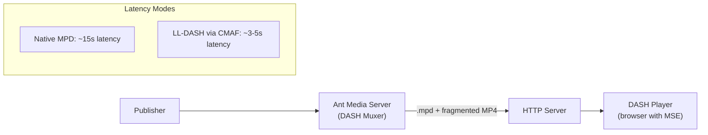

# DASH/CMAF Playback

## What Is CMAF (Common Media Application Format)?

The Common Media Application Format (CMAF) is a standard designed to reduce HTTP delivery latency, typically to around 3-5 seconds. It aims to lower the cost, complexity, and latency of streaming. CMAF can be utilized with both DASH (Dynamic Adaptive Streaming over HTTP) and HLS (HTTP Live Streaming).

Ant Media Server fully supports LL-DASH (Low Latency DASH) through CMAF and LL-HLS (Low Latency HLS).


## DASH Architecture



## Enable DASH & CMAF Streaming

DASH playback is turned off by default, so you must enable it before playing a stream over the DASH protocol.

- Navigate to your application (live or any other).
- Go to `Settings` and under `Dash & CMAF Streaming` check `Create DASH Streaming` to enable it.

## Play CMAF (DASH) with Embedded Player

Use the embedded player `play.html` to play the streams with DASH.

- Make sure that your stream is publishing on the server.
- To play a stream with DASH, provide `streamId` as the id and `dash` as the playOrder parameter:

  ```
  https://AMS-domain-name:5443/live/play.html?id=test&playOrder=dash
  ```

The dash playback will start automatically when the stream is live.

## Play MPEG-DASH Stream Directly via MPD

The default MPEG-DASH (.mpd) URL:

```
https://AMS-domain-name:5443/live/streams/streamId/streamId.mpd
```

:::info
If you play the `.mpd` file directly, the stream latency will be native to MPEG-DASH, which is about 15 seconds.
:::

## DASH Configuration Options

There are a few more options for CMAF and their default values. You can assume that the following values are in use if they are not specified in the properties file:

| Setting | Default | Description |
|---------|---------|-------------|
| `settings.dashSegDuration` | 6 | Duration of segments in MPD files (seconds) |
| `settings.dashFragmentDuration` | 0.5 | Fragment duration. A fragment consists of `moof + mdat`. |
| `settings.dashTargetLatency` | 3.5 | Target latency for LL-DASH (seconds) |
| `settings.dashWindowSize` | 5 | DASH window size. Number of files in the manifest. |
| `settings.dashExtraWindowSize` | 5 | Number of segments kept outside of the manifest before being removed from disk |

:::info
If you're using DASH streaming with ABR enabled, make sure the following property is enabled in your application's advanced settings:

```json
"forceAspectRatioInTranscoding": true
```

The value is `false` by default. Check [here](https://antmedia.io/javadoc/io/antmedia/AppSettings.html#forceAspectRatioInTranscoding) for more information.
:::
