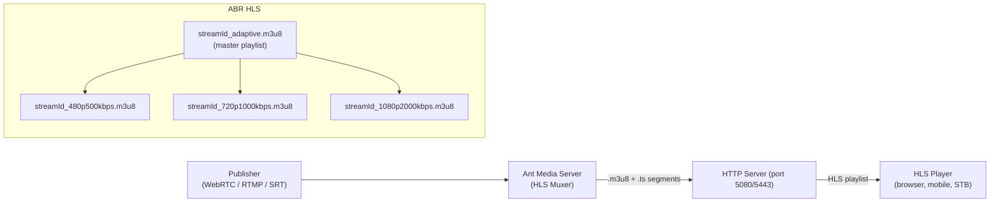

# HLS Playing

HLS playback is available in both the Community and Enterprise Editions of Ant Media Server. Prior to initiating playback of a stream, ensure that the stream is actively broadcasting on the server.

> Quick Link: [Learn How to Publish Live Streams](/docs/category/publish-live-stream/)

## HLS Architecture



## Enable HLS

Ensure that HLS muxing is enabled in your application settings. You can verify this by selecting the `Create HLS Streaming` checkbox within the application's settings on the web management panel.

HLS is enabled by default.


### Enable HLS at the Broadcast Level

To enhance the HLS feature, you can pass HLS parameters (`hlsTime`, `hlsListSize`, `hlsPlayListType`) while creating a live stream:

- `hlsTime`: Sets the target duration of each segment in seconds.
- `hlsListSize`: Defines the number of segments in the playlist.
- `hlsPlayListType`: Specifies the playlist type (`event` or `vod`).

Example:

```bash
curl -X POST -H "Accept: Application/json" -H "Content-Type: application/json" \
  http://<Your-Ant-Media-Server>:5080/<App-Name>/rest/v2/broadcasts/create \
  -d '{"streamId":"test1","name":"test1s","type":"liveStream","hlsParameters":{"hlsTime":"4","hlsListSize":"7","hlsPlayListType":"event"}}'
```

## Play HLS Streams

### With Embedded Player (play.html)

Use the embedded player in `play.html` to play the streams with HLS:

```
https://AMS-domain-name:5443/live/play.html?id=test&playOrder=hls
```

If you have Ant Media Server installed on your local machine:

```
http://localhost:5080/live/play.html
```

The HLS playback will start automatically when the stream is live.


### With React Player

To play HLS streams with [React Player](https://github.com/cookpete/react-player) in React:

```jsx
<ReactPlayer
  url="https://{AMS-URL}:5443/{APP-NAME}/streams/{STREAM-ID}.m3u8"
  config={{
    file: {
      hlsOptions: {
        xhrSetup: function(xhr) {
          xhr.withCredentials = true // send cookies
        }
      }
    }
  }}
/>
```

:::info
Enabling `xhr.withCredentials` to send cookies is essential for accurate HLS viewer counts. Without this configuration, the viewer count may not be correctly determined by Ant Media Server.
:::

### Playing HLS Stream Directly via M3U8

The default HLS (.m3u8) URL:

```
https://AMS-domain-or-IP:5443/AppName/streams/StreamId.m3u8
```

If adaptive bit rates are enabled (Enterprise Edition), the HLS adaptive URL:

```
https://AMS-domain-or-IP:5443/AppName/streams/StreamId_adaptive.m3u8
```

:::info
Beginning with version 2.4.1, the filename structure includes the bitrate in the name. For example, 480p ABR is `stream1_480p1000kbps.m3u8` (not `stream1_480p.m3u8`).
:::

## Playing Streams from SubFolders

When creating a stream with a subfolder, HLS files will be generated in that designated folder within `/usr/local/antmedia/webapps/{appName}/streams`.

Create a broadcast with subfolder:

```bash
curl -X 'POST' 'https://domain:5443/live/rest/v2/broadcasts/create' \
  -H 'accept: application/json' \
  -H 'Content-Type: application/json' \
  -d '{"streamId":"teststream","subFolder":"mySubFolder"}'
```

Play a stream with subfolder using:
```
https://domain:5443/live/play.html?id=mySubFolder/teststream&playOrder=hls
```

## Interactive HLS Streaming with ID3 Timed Metadata

Using `ID3` tags in HLS, you can insert any kind of timed metadata, such as overlaying some text or images in specific moments to show comments, emojis, ads, markers, etc.

The feature to use `ID3` tags was introduced in Ant Media Server version 2.7.0.

### Enable ID3 Tags

Enable `ID3` tags from the `Advanced` settings by making `"id3TagEnabled": true` located under the application settings.


### Add ID3 Text

To insert an ID3 tag into any stream, call the [REST method](https://antmedia.io/rest/#/default/addID3Data) with your metadata:

```bash
curl -X 'POST' 'https://domain:5443/AppName/rest/v2/broadcasts/streamId/id3' \
  -H 'accept: application/json' \
  -H 'Content-Type: application/json' \
  -d '"string"'
```

:::info
Currently, ID3 Tags does not work with Ant Media Server default player (play.html). You can use this [Codepen sample](https://codepen.io/Burak-Kekec/pen/PoXYMyG) for testing.
:::

## HLS Play for a Given Time Interval

:::info
The HLS modifier feature is included by default on the server side, starting with version 2.9.0.
:::

Include `startTime` and `endTime` parameters in the query string of the m3u8 request to play the stream during that specific time frame:

```
https://domain:5443/live/streams/streamId.m3u8?start=1668454888&end=1668454999
```

### Configuration for HLS Manifest Modifier

Set the below settings from application settings → advanced settings:

```json
"hlsflags": "+program_date_time"
```
```json
"hlsPlayListType": "event"
```
```json
"deleteHLSFilesOnEnded": false
```

You can get the timestamp for `start` and `end` via [Epoch Converter](https://www.epochconverter.com/).

## Autoplay Notes

Autoplay is enabled by default in the player, but it may be disabled for certain policies in Chrome and Firefox:

- [Chrome autoplay policy](https://developers.google.com/web/updates/2017/09/autoplay-policy-changes)
- [Firefox autoplay policy](https://hacks.mozilla.org/2019/02/firefox-66-to-block-automatically-playing-audible-video-and-audio/)
