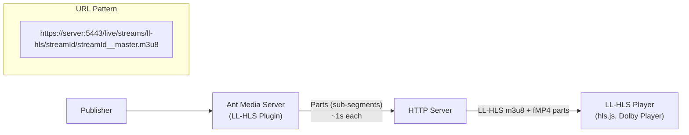

# LL-HLS Playback (Low Latency HLS)

A low-latency HLS (LL-HLS) playback feature has been introduced in Ant Media Server version 2.11 and above. It reduces traditional HLS latency from 8–12 seconds to approximately 2–5 seconds, making it ideal for near-real-time streaming applications.

## What is LL-HLS?

**Low Latency HLS (LL-HLS)** is a streaming protocol designed to minimize latency in live streaming. LL-HLS achieves lower latency by using smaller video segments (called **parts**) that allow the video player to start playback before an entire segment is completed.

## Latency Comparison

| Standard HLS | Low Latency HLS (LL-HLS) |
|---|---|
| Latency: 8-12 seconds | Latency: 2-5 seconds |
| Segment-based | Part-based (smaller chunks) |
| Larger file sizes | Smaller, more frequent parts |

## LL-HLS Architecture



### Prerequisites

- **Ant Media Server Enterprise Edition v2.12 or later**: LL-HLS plugin compatible from this version.
- **LL-HLS Plugin**: Purchase the plugin by emailing `contact@antmedia.io` or via the [Ant Media website](https://antmedia.io/product/low-latency-hls-plugin/).
- **Supported Player**: Use a player that supports LL-HLS. Recommended: **[hls.js](https://hlsjs.video-dev.org/demo/)** or **[Dolby Player](https://optiview.dolby.com/resources/demos/test-stream/)**.

## Step 1: Install the LL-HLS Plugin

Upload/copy the plugin file to your instance running Ant Media Server, then run:

```bash
sudo unzip low-latency-hls-plugin.zip
cd low-latency-hls-plugin
sudo ./install_low-latency-hls-plugin.sh
sudo service antmedia restart
```

## Step 2: Publish a Stream

Ant Media Server provides LL-HLS endpoints for all ingested streams. Check the [publish live streams](https://antmedia.io/docs/category/publish-live-stream/) section. For this example, [publish with WebRTC](https://antmedia.io/docs/guides/publish-live-stream/webrtc/).

### Stream Configuration Requirements

For LL-HLS to function correctly, your stream configuration must meet these criteria:

1. **Adaptive Bitrate (ABR):** ABR must be enabled.
2. **GOP Size:** The Group of Pictures (GOP) size must be set to 1 or 2 seconds maximum.
   - Example: If the framerate is 30 fps, set the GOP size to 30 or 60.

**Hardware Encoding Settings (e.g., h264_nvenc):**

```json
"encoderParameters": {
  "h264_nvenc": {
    "rc": "cbr",
    "gop_size": "60",
    "no-scenecut": "1"
  }
}
```

## Step 3: Play the Stream with LL-HLS

Open a video player (hls.js demo or Dolby Player for initial testing) and enter the LL-HLS URL:

```
https://yourserver.com:5443/live/streams/ll-hls/stream1/stream1__master.m3u8
```

:::info
Ensure two underscores (`__`) exist between the stream ID and `master.m3u8`.
:::

**URL Pattern:**
```
https://{YOUR_SERVER}:{5443}/{APP}/streams/ll-hls/{STREAM_ID}/{STREAM_ID}__master.m3u8
```

**With AMS Embedded Player:**
```
https://{YOUR_SERVER}:5443/{AppName}/play.html?name={streamId}&playOrder=ll-hls
```

From AMS v2.12 onwards, the LL-HLS playback is supported via the AMS Embedded Player as well.

## Customize LL-HLS Settings

Apply the following settings in the **customSettings** section of the Ant Media Server application's Advanced settings:

```json
"customSettings": {
  "plugin.ll-hls": {
    "partTargetDurationMs": 1000,
    "targetDuration": 4,
    "slidingWindowEntries": 5,
    "deleteFiles": true,
    "program": false,
    "addDateTime": true,
    "receiveDataTimeout": 10,
    "exitOnReceiveDataTimeout": false,
    "fileCompleteCommand": "/path/to/script %P %F",
    "fileDeleteCommand": "/path/to/delete_script %P %F",
    "quiet": false,
    "abrDirectMuxing": true,
    "noFloatingPointDuration": true,
    "partsHoldback": 3,
    "deleteFilesOnStreamEnd": false
  }
}
```

### Customization Parameters Reference

| Parameter | Default | Description |
|-----------|---------|-------------|
| `partTargetDurationMs` | 1000 | Max duration of partial segments (ms). Try 1002ms if issues occur. |
| `targetDuration` | 8 | Target duration for media files |
| `slidingWindowEntries` | 5 | Number of media segments retained in playlist |
| `deleteFiles` | true | Delete old media files after removed from playlist |
| `program` | false | VOD-style capture (retains all segments in playlist) |
| `addDateTime` | true | Add date/time to media file names |
| `receiveDataTimeout` | 10 | Seconds to wait before pausing if no data received (0 = never) |
| `exitOnReceiveDataTimeout` | false | Exit segmenter on timeout instead of just pausing |
| `abrDirectMuxing` | true | Direct re-mux original stream to LL-HLS alongside ABR |
| `noFloatingPointDuration` | true | Split segments into round numbers (recommended for player compatibility) |
| `partsHoldback` | 3 | Parts behind live edge for smooth playback |
| `deleteFilesOnStreamEnd` | false | Delete LL-HLS files when stream completes |
