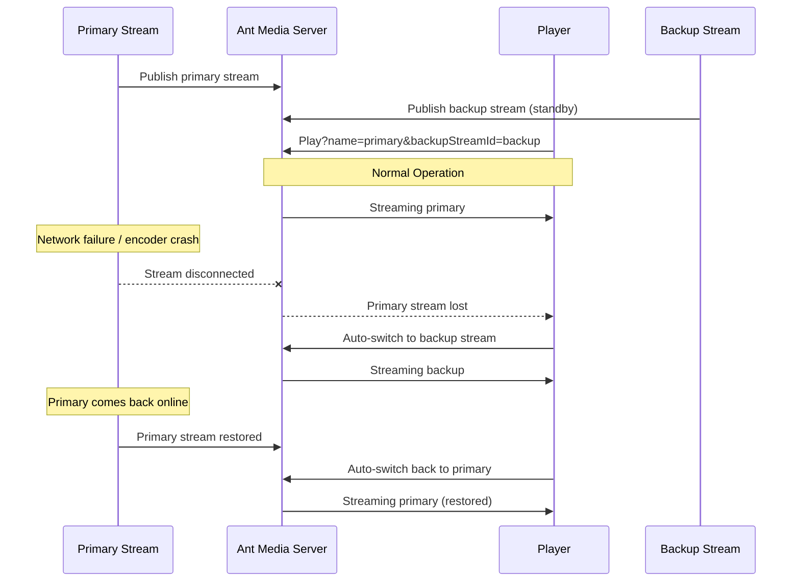

# Stream Failover Playback

Ant Media Server introduces the concept of primary and backup streams to enhance the reliability and continuity of live streaming.

:::info
Starting with version 2.13, the Ant Media Server supports the concept of primary and backup stream playback.
:::

## Failover Architecture



The **Primary-Backup Stream** concept involves using two streams:

- **Primary Stream (Main Stream)**: The main video/audio stream sent to the server. Viewers watch this stream under normal conditions.
- **Backup Stream (Failover Stream)**: A secondary stream sent simultaneously to the server, but it remains idle unless the primary stream fails. The backup stream could be encoded at the same quality or slightly lower to reduce bandwidth usage.
- **Automatic Failover**: If the primary stream disconnects (e.g., due to network failure or encoder crash), the AMS web player **automatically switches** to the backup stream.

## Step 1: Publish the Primary Stream

Publish the main stream using WebRTC, RTMP, or any other protocol.

Example using FFmpeg:

```bash
ffmpeg -re -i test.mp4 -c copy -f flv rtmp://IP-address/live/primary
```

## Step 2: Publish the Backup Stream

Publish the backup stream using WebRTC, RTMP, or any other protocol.

Example using FFmpeg:

```bash
ffmpeg -re -i test.mp4 -c copy -f flv rtmp://IP-address/live/backup
```

## Step 3: Play with Failover Enabled

Without failover (primary stream only):

```
https://domain:5443/live/play.html?name=primary&playOrder=webrtc
```

With failover (add `&backupStreamId` parameter):

```
https://domain:5443/live/play.html?name=primary&backupStreamId=backup&playOrder=webrtc
```

Now you can stop publishing the primary stream and the player will switch to the backup stream within a few seconds.

:::info
Failover works in **reverse mode** as well. If the backup goes down after some time and primary is up, then the player will switch back to the primary stream automatically.
:::

To learn more about the Web Player, check [this document](https://antmedia.io/docs/guides/playing-live-stream/embedded-web-player/).
