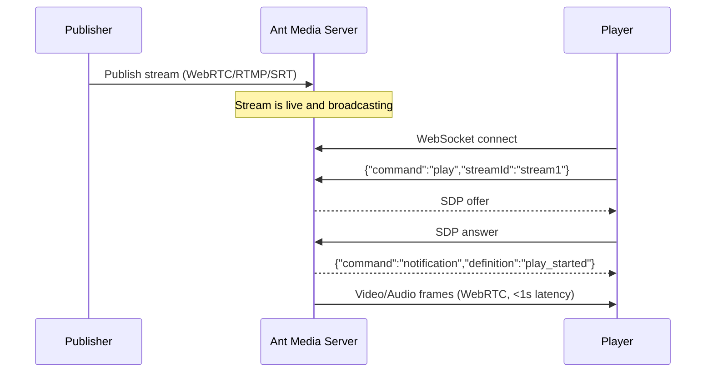

# WebRTC Playback

Ant Media Server (AMS) offers ultra-low latency WebRTC playback, enabling real-time streaming experiences.

## WebRTC Playback Flow



### Prerequisites

- **Ant Media Server Enterprise Edition (EE):** WebRTC playback is supported only in the Enterprise Edition.
- **Open UDP Ports:** Ensure that UDP ports 50000–60000 are open on your server's firewall to facilitate WebRTC traffic.
- **Active Stream:** Verify that the stream is actively broadcasting on the server before attempting playback. Quick Link: [Learn How to Publish with WebRTC](https://antmedia.io/docs/guides/publish-live-stream/webrtc/)
- **TURN Server (Optional):** If viewers are behind corporate firewalls or experience restricted network conditions, consider routing WebRTC traffic through a TURN server. See the [TURN server guide](https://antmedia.io/docs/guides/advanced-usage/turn-instalation/coturn-quick-installation/).

## Playing a WebRTC Stream

1. Visit `https://AMS_domain_name:5443/live/player.html`.
2. If you're running Ant Media Server on your local computer, you can also visit `http://localhost:5080/live/player.html`.
3. Write the stream ID in the text box (`stream1` by default).

   

4. Press `Start Playing` button. After you press the button, the WebRTC stream starts playing.

You can also use the URL format listed below to play the WebRTC stream using the Ant Media Server Embedded web player, `play.html`:

```
https://AMS_domain_name:5443/live/play.html?id=streamId
```

Check [Embedded Web Player](https://antmedia.io/docs/guides/playing-live-stream/embedded-web-player/) document for more information.

## Latency Comparison

| Protocol | Typical Latency | Use Case |
|----------|----------------|----------|
| WebRTC | < 1 second | Interactive real-time applications |
| LL-HLS | 2–5 seconds | Near-real-time with broad device support |
| HLS | 8–12 seconds | Broad compatibility, VOD-like experience |
| DASH/CMAF | 3–5 seconds | Adaptive streaming |

Congrats. You're playing your stream with WebRTC having ultra-low latency.
