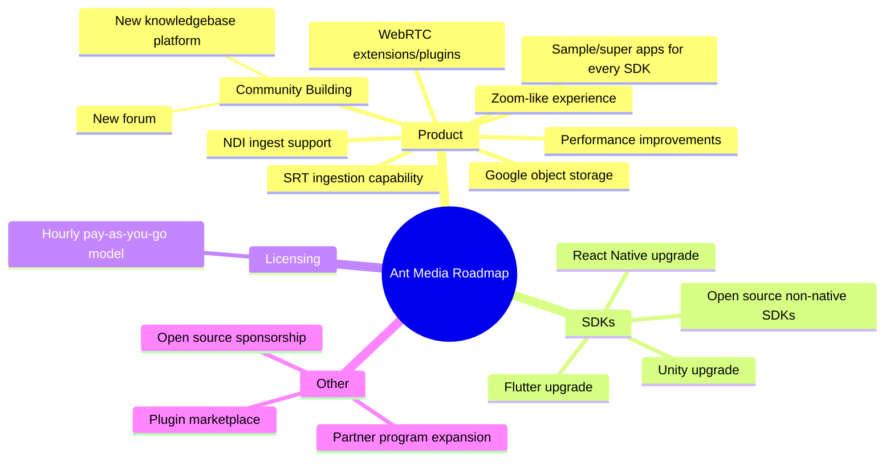

# Product Roadmap

As Ant Media, we always share our vision, direction, priorities and progress of our Ant Media Server and related SDKs development over time. On this page, you'll find the most important areas we are working on, and expect to be completed.

## Roadmap Overview

## Product

*   SRT ingestion capability
*   NDI ingest support
*   Building a community around Ant Media
    *   New knowledgebase platform which will replace Github wiki
    *   A new forum which will replace our Google Forums
*   WebRTC extensions/plugins for open source web and mobile players
*   Providing Zoom-like experience (both backend for frontend implementation)
*   Improvements with performance
*   Extending the functionality of the live demo
*   Development of sample/super apps for every SDK
*   Google object storage support

## SDKs

*   Upgrading React Native, Flutter and Unity SDKs to make them on par with web SDK
*   Opening up the source code of non-native SDKs on Github

## Licensing

*   Implementation of the hourly licensing (pay-as-you-go) model

## Other

*   Building a plugin/services/consultancy marketplace for Ant Media
*   Leverage partner program and increase partner engagement
*   Sponsoring open source projects
