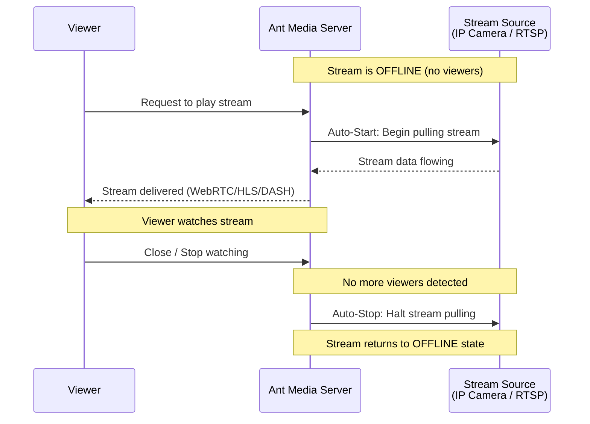

# Dynamic Stream Pulling

:::info
The Dynamic Stream Pulling feature is available in versions 2.8.3 and up.
:::

Dynamic Stream Pulling offers an efficient bandwidth optimization solution by automatically starting and stopping stream pulling based on user demand.

## How It Works



- **Auto-Start**: When a user attempts to view an offline stream, Ant Media Server automatically initiates stream pulling, bringing the broadcast online.
- **Auto-Stop**: When there are no viewers, the server halts stream pulling, returning the broadcast to an offline state.

This feature is beneficial for bandwidth optimization, especially when continuous stream recording isn't necessary. It ensures that stream pulling occurs only when someone tries to watch the stream and ceases when there are no viewers. Auto-stopping the stream with no viewer is valid for all play types **(WebRTC, HLS, DASH, and LL-HLS)**.

## Enabling Dynamic Stream Pulling

### Via Dashboard

1. Go to the Ant Media web panel and create a broadcast with the type **Stream Source** or **IP Camera**.

2. To enable the feature for the stream, check the `Auto Start/Stop Streaming` checkbox as shown below:

   

3. After creation, Ant Media Server will start pulling the stream automatically and broadcast status will turn to `Broadcasting`.

### Via REST API

You can also activate Auto Start/Stop Streaming for an existing broadcast by modifying its settings using the REST API. Send a `PUT` request using [Update Broadcast REST API](https://antmedia.io/rest/#/default/updateBroadcast):

```bash
curl --location --request PUT \
  'https://AMS_DOMAIN:5443/AppName/rest/v2/broadcasts/streamId' \
  --header 'Content-Type: application/json' \
  --data '{"autoStartStopEnabled": true}'
```

Replace `AMS_DOMAIN`, `Port`, and `streamId` with your server's domain, port, and the specific stream ID, respectively.

## Testing Dynamic Stream Pulling

1. Open a new tab and start watching the live stream using the below URL:

   ```
   https://AMS_DOMAIN:5443/AppName/play.html?id=streamId&playOrder=webrtc
   ```

   The server will start fetching the stream automatically.

2. Close the player tab. Since there are no viewers anymore, the Ant Media Server will stop pulling the stream within a few seconds, and the broadcast status will change to `Offline`.
