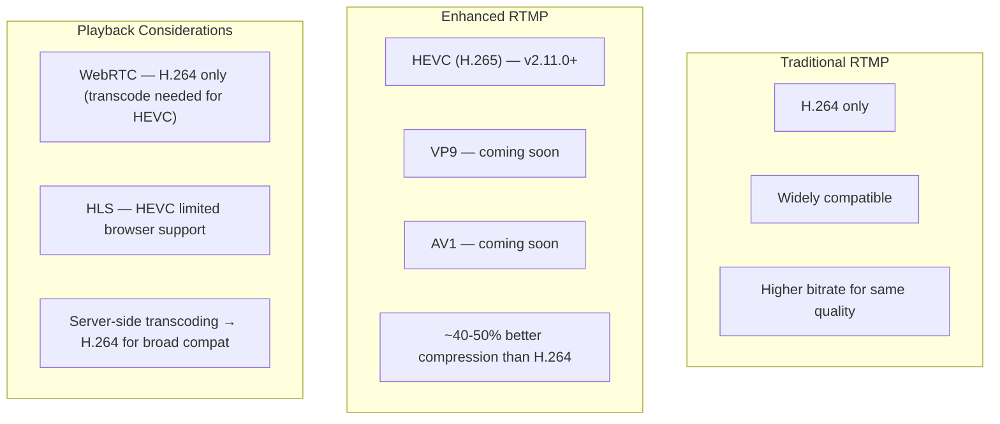

# Enhanced RTMP (HEVC/H.265 Support)

Enhanced RTMP significantly advances video streaming by supporting modern video encoders like HEVC (H.265), VP9, and AV1, unlike traditional RTMP, which is limited to the older H.264 codec. These newer codecs offer far more efficient compression, allowing for higher-quality streams at lower bitrates.

## RTMP vs Enhanced RTMP Codec Support

For example, using Enhanced RTMP with Ant Media Server enables streaming with HEVC, which delivers better video quality than H.264 at the same bitrate, greatly reducing bandwidth consumption without sacrificing clarity. This is ideal for bandwidth-constrained scenarios like mobile streaming or large-scale broadcasting, making Enhanced RTMP a more adaptable and future-proof solution for modern streaming needs.

:::info
**AV1 & VP9** support will be introduced in future releases of Ant Media Server.
:::

## How to Use Enhanced RTMP with Ant Media Server

Starting with version 2.11.0, Ant Media Server includes Enhanced RTMP support by default, enabling you to stream using modern encoders like HEVC (H.265) without any additional server configuration. By simply broadcasting HEVC-encoded content through your **preferred encoder**, you can benefit from significantly improved video quality at lower bitrates, reducing bandwidth usage and costs.

### Configure OBS for HEVC (Enhanced RTMP)

To use HEVC encoder with **OBS**, set your settings as below:

:::note
This screenshot is from a Windows system with an NVIDIA graphics card, so the `NVIDIA NVENC HEVC` encoder was used. You can use the HEVC encoder as per your system's encoder support.
:::

After the encoder is set, you can publish as you do in standard RTMP — the server will automatically detect and handle the Enhanced RTMP stream.

## Limitations of HEVC (H.265)

HEVC (H.265) offers better compression and video quality, but it has some limitations as well.

- **WebRTC**: WebRTC doesn't yet support H.265, making it unsuitable for some live streaming or interactive video use cases without transcoding.
- **Browser HLS**: Not all browsers, including Chrome, fully support HEVC playback, leading to compatibility issues.
- **Transcoding solution**: [Server-side transcoding](https://antmedia.io/docs/guides/adaptive-bitrate/adaptive-bitrate-streaming/) can convert H.265 streams to H.264, ensuring broader compatibility.

If you are not using WebRTC or HLS playback on your browser, you do not need to worry about this. Make sure that your player and device support the H265 playback.

For HEVC support on different platforms, refer to [this page](https://caniuse.com/hevc).

## Codec Comparison

| Codec | Enhanced RTMP | WebRTC Support | Browser HLS | Compression vs H.264 |
|-------|--------------|----------------|-------------|----------------------|
| H.264 | Standard RTMP | Full support | Full support | Baseline |
| H.265/HEVC | v2.11.0+ | Not supported (transcode needed) | Limited | ~40-50% better |
| VP9 | Coming soon | Supported (Chrome, Firefox) | Limited | ~30-40% better |
| AV1 | Coming soon | Emerging | Limited | ~50% better |
