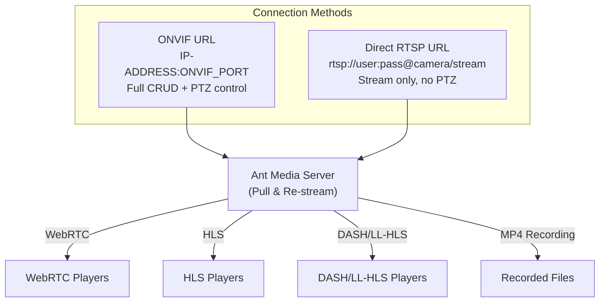

# IP Camera Streaming

Ant Media Server users can pull IP camera streams easily from the management panel. In other words, you don't need to write any commands or use a terminal to be able to re-stream external sources.

For IP camera re-streaming, the camera should support the ONVIF standard. ONVIF makes it easy to manage IP cameras. All CRUD and PTZ operations are based on well-defined SOAP messages.


## IP Camera Integration Flow



There are two ways to pull the IP camera stream on AMS:

1. Using the ONVIF URL
2. Using the direct RTSP URL

## Add IP Camera - ONVIF URL

- Go to the management panel, select **live** from applications, then click on **New Live Stream** and select **IP Camera**.

  

- Fill in the **Stream Name**, **Camera Username**, **Camera Password** and any custom **StreamId**.

- You should add the ONVIF URL of the IP camera. Generally, it is in the following format: `IP-ADDRESS-OF-IPCAMERA:ONVIF PORT`.

- If you don't know the ONVIF URL, you can use the **Auto Discover** feature. If the IP camera and the server are on the same network, the Ant Media Server can discover them automatically.

  

:::info
If you want to use a secured domain instead of an IP address, make sure to prepend with `http(s)`, e.g.:

`https://dynamic.dns.net:443`
:::

## Add IP Camera - RTSP URL

If the IP camera does not support ONVIF, a direct RTSP URL can also be used to pull the stream directly on Ant Media Server.

:::info
If the IP Camera is added directly using the RTSP URL, then the CRUD and PTZ operations cannot be performed on it using the AMS APIs.
:::

To add an IP camera with an RTSP URL, follow these steps:

- First, log in to the management panel. Select **live** from applications, and click on **New Live Stream** > **Stream Source**. Define stream name, RTSP URL, and stream ID.
- AMS starts to pull the camera stream automatically.
- As the stream starts to pull, you can watch it from the AMS panel.


### RTSP Transport Type

In some cases, the RTSP camera does not start and shows the status as `preparing` on the dashboard. By default, the [**RTSP pull transport type**](https://antmedia.io/javadoc/io/antmedia/AppSettings.html#rtspPullTransportType) is set to pull the stream with both `TCP` and `UDP` but sometimes the camera only supports TCP or UDP at a time. You can change it with the application settings.

Under the application's Advanced settings, there is the below property:

```json
"rtspPullTransportType": "3"
```

| Value | Behavior |
|-------|----------|
| 1 | Pull with TCP only |
| 2 | Pull with UDP only |
| 3 | Pull with both UDP and TCP (default) |

:::info
If the camera is accessible via FFMPEG or VLC but still does not start pulling on the AMS, try changing this parameter.
:::

## IP Camera Playback

If IP cameras are accessible and properly configured, Ant Media Server adds their streams as a live stream and begins to pull streams from them. The management panel displays its current status. To watch the stream, click the **Play button**.


The IP camera stream can be monitored with any output protocol, like `WebRTC`, `HLS`, `DASH`, and `LL-HLS`. Check out the [playback section](https://antmedia.io/docs/category/playing-live-streams/) for more details.

Check out the [recording documentation](https://antmedia.io/docs/category/recording-live-streams/) to record the IP camera streams.

## REST API to Add IP Camera Stream

This [REST API](https://antmedia.io/rest/#/default/createBroadcast) can be used to create the live stream:

```bash
curl -X POST -H "Content-Type: application/json" \
  "https://IP-address-or-domain:5443/App-Name/rest/v2/broadcasts/create?autoStart=false" \
  -d '{
    "type": "ipCamera",
    "name": "test",
    "streamId": "test",
    "ipAddr": "127.0.0.1:8080",
    "username": "camera-username",
    "password": "camera-password"
  }'
```
