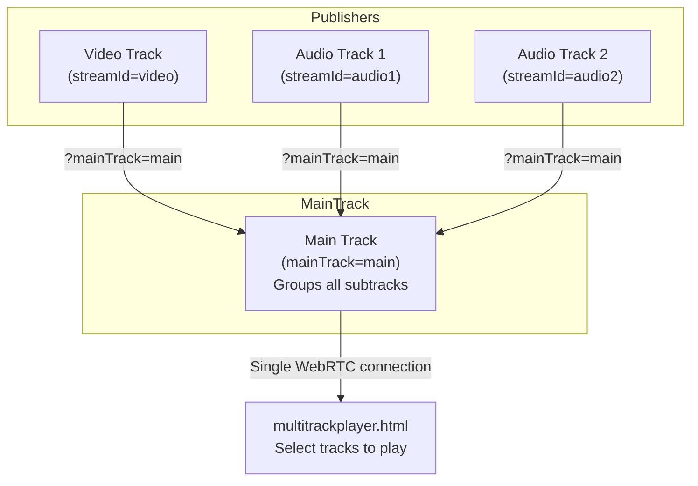

# Multitrack Publish and Play with AMS

Ant Media Server (AMS) supports WebRTC multitrack streaming, enabling the transmission of multiple audio and video tracks through a single WebRTC connection. This feature is particularly useful for applications like video conferencing and live events, where multiple streams need to be managed efficiently.

## Multitrack Architecture



### Prerequisites

- **AMS Version**: Ensure you're using **AMS version 2.4.3 or above**, as the Unified Plan SDP semantic is set by default in these versions.
- **Unified Plan**: The Unified Plan SDP semantic must be used for multitrack support.

With multitrack streams, you can play different groups of streams with a single broadcast ID. Then, you can start playing those groups of streams with one play request and most importantly, through a single WebRTC connection, which decreases resource usage as well.

### Terminologies Related to Multitrack

- **Main track**: Stream ID of a group is referred to as the main track.
- **Sub track**: The streams in a group with different stream IDs are referred to as subtracks.

## Publishing Multitrack Streams

To combine broadcasts into a single broadcast (main track), publish the streams as shown below.

- When calling the publish method of the webrtcAdaptor in the SDK, pass the group ID as `mainTrack`. The URL for the WebRTC sample page will be as follows:

  ```
  https://AMS-domain:5443/live/?mainTrack=groupID
  ```

- You must use the following URL for RTMP streams:

  ```
  rtmp://AMS-domain:1935/live/streamId?mainTrack=groupID
  ```

### Example: Publishing a Multitrack Stream

Publish a stream to the sample live application with `streamId=video` and group ID (mainTrack) as `main`:

```
rtmp://AMS-domain:1935/live/video?mainTrack=main
```

Now, publish streams with different audio subtracks as needed. Assume you have two audio tracks with the stream IDs `audio1` and `audio2`:


## Playing Multitrack Streams

Ant Media Server supports two distinct methods for playing multitrack streams:

### Method 1: multitrackplayer.html (Individual Track Control)

The `multitrackplayer.html` page is designed for scenarios where multiple streams are published as individual tracks, allowing precise control over each track.

```
https://AMS-domain:5443/live/multitrackplayer.html
```

.png)

1. Write the group ID in the text box.
2. Request the sub-tracks by clicking the `Tracks` button.
3. Select the tracks you want to play and click the `Start Playing` button.
4. If a new subtrack is added to the group, it will be played automatically.

You can enable or disable the video/audio feed for a sub-track with the `enableTrack(mainTrackId, trackId, enabled)` methods in the webrtc-adaptor SDK.

.png)

### Method 2: multitrack-play.html (Unified Playback)

For a simpler experience, the `multitrack-play.html` page consolidates multiple subtracks under one main track ID, providing a unified stream for playback. This is ideal for users who prefer not to manage individual subtracks but want all streams merged automatically.

```
https://your-server-domain:5443/application-name/multitrack-play.html?id=main-stream-id
```

## Multitrack Conference

`conference.html` is a sample conference page that is compatible with multitrack playback.

The `mainTrack` (group ID) will be the same as the room ID. For example, in the above-described case, the mainTrack is `main`, so it will be the room ID.

```
https://AMS-domain:5443/live/conference.html
```

You can also join the room in `playOnly` mode using the following URL:

```
https://AMS-domain:5443/live/conference.html?playOnly=true
```

The play request for the room ID is only called once in a Multitrack conference.

### Limiting Audio/Video Tracks

By default, there is no limit on audio and video tracks, so each participant can play other participants' videos, which increases CPU load on the server side. In order to optimize the performance, you can limit the audio and video tracks by adding the below settings to the `/usr/local/antmedia/webapps/App-Name/WEB-INF/red5-web.properties` file:

```properties
settings.maxAudioTrackCount=-1
settings.maxVideoTrackCount=-1
```

Please change the values as per your requirements and restart the server after making changes. In version 2.6.2 and above, all settings can be changed from the dashboard itself.

## Media Pull

The Media Pull feature empowers users to add any external stream present on AMS to an ongoing conference room. With this capability, users can dynamically add or remove streams during a conference using the REST API.

For instance, you can add an IP camera pull stream to your conference and then remove it as desired. Media pull functionality is versatile and applicable to any type of live broadcast on AMS.

### Adding an External Stream to a Conference Room

1. Create a conference room and join it as a participant via the conference sample page:

   ```
   https://AMS-domain:5443/live/conference.html
   ```

2. Type a room name and note it because we will use it while adding/removing external streams. Click the join room button.

   

3. After joining a room, 2 broadcasts will be created on the server:
   - Room Broadcast (Main track)
   - Participant Broadcast (Sub track of room broadcast)

   

4. Go to the WebRTC publish sample page to publish the individual stream that you want to add:

   ```
   https://AMS-domain:5443/live
   ```

   

5. Now add the external stream to the conference room using the [add SubTrack REST API](https://antmedia.io/rest/#/default/addSubTrack):

   ```bash
   curl -X 'POST' 'https://AMS-domain:5443/AppName/rest/v2/broadcasts/RoomName/subtrack?id=external-streamId' -H 'accept: application/json'
   ```

   

### Removing an External Stream from a Conference Room

Use the [remove SubTrack REST API](https://antmedia.io/rest/#/default/removeSubTrack):

```bash
curl -X 'DELETE' 'https://AMS-domain:5443/AppName/rest/v2/broadcasts/RoomName/subtrack?id=external-streamId' -H 'accept: application/json'
```
