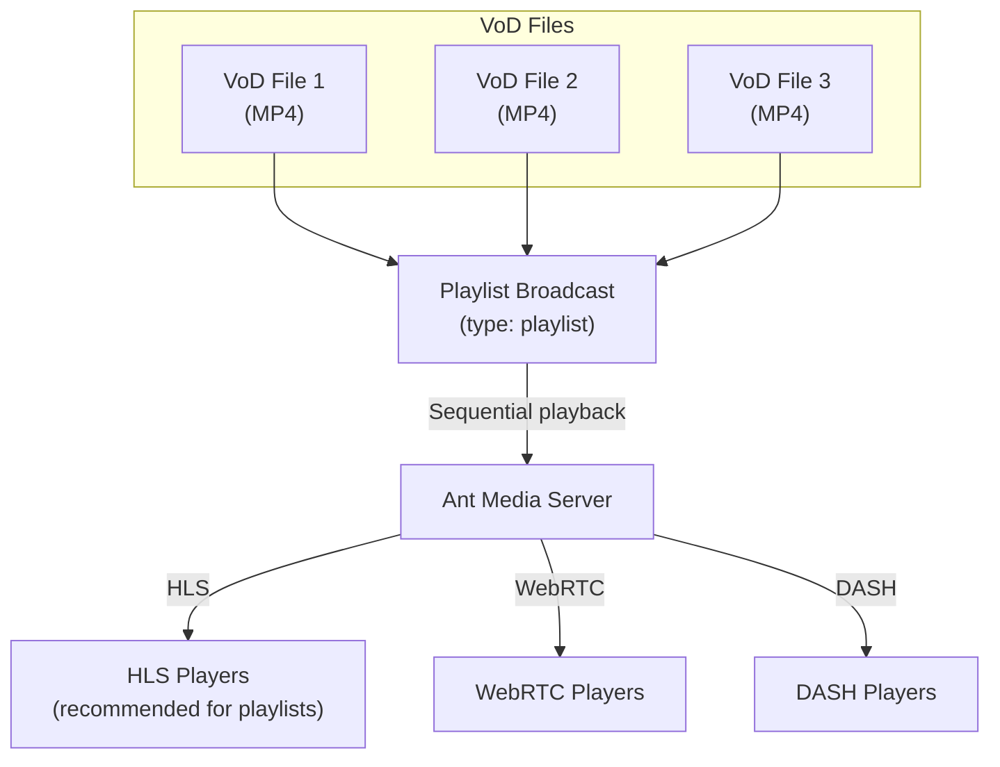

# Playlist (Linear Live Streaming)

A video playlist is a curated collection of videos arranged in a specific order for sequential playback. It functions similarly to a music playlist but consists of video content instead. Video playlists are commonly used on platforms like YouTube and other video streaming services.

The playlist feature is available in both the Community Edition and the Enterprise Edition of Ant Media Server.

.png)

## What is Linear Live Streaming?

Linear live streaming, also known as pre-recorded live streaming or VoD streaming, is a method where a prerecorded video is broadcasted to give the illusion of a live stream.

This technique is widely employed, involving the recording of a video that mimics a live event. The recorded video is then scheduled for broadcast, creating the appearance of real-time streaming.

It's often utilized to maintain a continuous 24/7 live presence on various social platforms, such as [YouTube, Facebook, and other social media channels](https://antmedia.io/docs/guides/publish-live-stream/simulcasting/).

Linear live streams consist of scheduled programs with specific start and end times. They offer synchronized viewing experiences where all viewers watch the same content simultaneously, ensuring viewers avoid spoilers before watching.

## Playlist Architecture



## Step 1: Upload VoD Files

### Login to Ant Media Server Dashboard

Login to your Ant Media Server Web Panel/dashboard. The URL is like this: `https://YOUR_ANT_MEDIA_SERVER:5443/`


### Accessing the Application

- Navigate to your preferred application from the left side. For this demonstration, we are using the live application.
- Once you are in the live application, go to the VoD section.


### Uploading VoD Files

#### Using Web Panel

- Click on the `Upload VoD` tab and then click on `Choose File` to select the files you want to upload.


:::info
Uploading MP4 files to your Ant Media Server is optional. Ant Media Server can retrieve MP4 files from any location. You simply need to ensure that the file URL is accessible to AMS.
:::

#### Using REST API

Upload MP4 files to Ant Media Server using the REST API:

```bash
curl -X POST -F "file=@<YOUR-FILE-PATH>;type=video/*" \
  https://AMS_URL:5443/live/rest/v2/vods/create?name=YOUR-FILE-NAME.mp4
```

The uploaded file will be located in `antmedia/webapps/live/streams` directory. The MP4 file name will be changed to a random VOD ID, which you can find in the VOD section of the web panel.

Access an uploaded VOD file through:
```
https://domain_or_IP:5443/AppName/streams/VOD-ID.mp4
```

## Step 2: Create the Playlist

- Go to the `Live Streams` section, click `New Live Stream`, and then select `Playlist` from the drop-down menu.


- Name your playlist, and click on `Add Playlist Item`. Under the dropdown menu, there are two options:
  1. **Add URL Directly**
  2. **Add From VODs**

### Option A: Add URL Directly

If you have the VoD URL handy or are adding external VoDs, use this option.

- Get the VoD URL by clicking on the hamburger icon on the right side of the VoD and selecting `Copy VoD URL`.
- Add all the playlist items and then click `Create`.
- The `stream Id` field is not mandatory but you can put your own streamId.
- The playlist is created and it is offline by default.
- Click on the `Start Broadcast` to start streaming the playlist.

### Option B: Add From VODs

This option is more useful if all the VoD files you want to stream are on your Ant Media Server itself under the VoD section.

- You can search for the uploaded VoD items with their name or VOD Id and click on the `Add` option.
- After you have added all the VoD files, click `Create`.
- The playlist is created and it is offline by default.
- Playlist length shows the overall duration of the playlist with the added items.
- You can edit the playlist and the items as needed.
- Click on the `Start Broadcast` to start streaming the playlist.

## Scheduling a Playlist

Starting from Ant Media Server version 2.10.0, you can schedule your playlist to start at any time in advance with the `Schedule to Start Automatically` option.

- This can be set at both times: When creating the playlist as well as after the playlist is created.
- Click `Schedule to Start Automatically`, and choose the date from the calendar.
- Set the exact time when you want the playlist to be started and save.

:::important
Please make sure that your server time is in sync with the NTP.
:::

## Optimizing Playlist for Better Playback Experience

After creating a playlist, make some configurations to optimize it:

1. Go to the `Settings` section of the application and scroll down.

   

2. Uncheck the `Delete HLS files after the stream is finished` — this setting will preserve the HLS files after the stream has ended.

   

3. Scroll to the bottom and Click the `Save` button to save the changes.

4. Scroll to the top and choose the settings mode from `Basic` to `Advanced`.

   

5. Find `hls flags` and change its value to `delete_segments+append_list+omit_endlist`.

   

6. Save the changes and start/restart the playlist to apply the changes.

## Managing Playlists Programmatically (REST API)

### Enable REST API Access

By default, Ant Media Server only allows REST API calls from `localhost`. To enable access from other IP addresses, add the desired IPs in the application settings under `REST API Security`.

:::important
For production environments, restrict access ONLY to trusted IPs. You should only open the REST calls to trusted IPs by [securing the REST APIs](https://antmedia.io/docs/guides/developer-sdk-and-api/rest-api-guide/securing-rest-apis/).
:::

### Setting Variables

```bash
export MY_ANT_MEDIA_SERVER=localhost
export MY_PLAYLIST_ID=myPlaylistId
export ITEM1=http://your-server:5080/live/streams/vod1.mp4
export ITEM2=http://your-server:5080/live/streams/vod2.mp4
export ITEM3=http://your-server:5080/live/streams/vod3.mp4
```

### Create a Playlist

```bash
curl -X 'POST' \
  "http://${MY_ANT_MEDIA_SERVER}:5080/live/rest/v2/broadcasts/create" \
  -H 'Content-Type: application/json' \
  -d '{
    "streamId": "'"${MY_PLAYLIST_ID}"'",
    "type": "playlist",
    "playListItemList": [
      {
        "streamUrl": "'"${ITEM1}"'",
        "type": "VoD"
      },
      {
        "streamUrl": "'"${ITEM2}"'",
        "type": "VoD"
      },
      {
        "streamUrl": "'"${ITEM3}"'",
        "type": "VoD"
      }
    ]
  }'
```

Ant Media Server responds with a generated broadcast JSON object. If you don't give `streamId` in the request, AMS will generate a random `streamId`.

### Start the Playlist

```bash
curl -X 'POST' "http://${MY_ANT_MEDIA_SERVER}:5080/live/rest/v2/broadcasts/${MY_PLAYLIST_ID}/start"
```

### Watch the Playlist

Open a browser and visit:
```
http://MY_ANT_MEDIA_SERVER:5080/live/play.html?id=MY_PLAYLIST_ID&playOrder=hls
```

:::info
HLS is recommended for playlist playback because it provides a better experience for sequential VoD content and there is no need for ultra-low latency.
:::

### Skip to Next Playlist Item

```bash
curl -X 'POST' "http://${MY_ANT_MEDIA_SERVER}:5080/live/rest/v2/broadcasts/playlists/${MY_PLAYLIST_ID}/next"
```

To skip to a specific item by index:

```bash
curl -X 'POST' "http://${MY_ANT_MEDIA_SERVER}:5080/live/rest/v2/broadcasts/playlists/${MY_PLAYLIST_ID}/next?index=0"
```

Note: It may take about 10-15 seconds to see the effect with HLS playback.

### Stop the Playlist

```bash
curl -X 'POST' "http://${MY_ANT_MEDIA_SERVER}:5080/live/rest/v2/broadcasts/${MY_PLAYLIST_ID}/stop"
```
