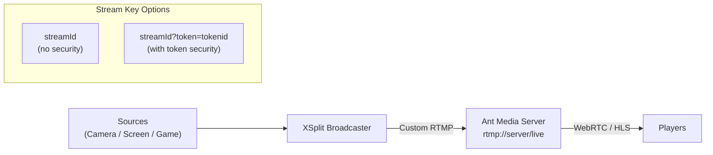

# Publish RTMP Stream Using XSplit

XSplit is a free and open source software for live streaming and video recording. It is easy to use and provides a great canvas with a screen share option for different purposes (PC gaming, talk shows or presentations). Embedded or external cameras and audio sources can be used with XSplit.

## XSplit to AMS Flow



## Install XSplit

Download XSplit from [xsplit.com](https://www.xsplit.com/) and install it.

## Provide Sources

When you open XSplit, it will ask for the canvas option for different purposes. They are easy to manipulate with drag and drop. It has some useful features for streaming, for further information you can google about [XSplit tutorial](https://www.google.com/search?q=XSplit+tutorial).

## Configure XSplit

We're assuming that your Ant Media Server accepts all streams (There is no any security option enabled.)

- Click `Broadcast` in the XSplit window and then click `Set up a new output`
- Choose `Custom RTMP` in the dropdown menu as shown below.

  

- You can write any name and description you want.
- In the RTMP URL box, type your RTMP URL without stream id. It's like `rtmp://your-server-IP-or-domain/live`
- In the stream key, you can write any `stream Id` because we assume that no security option is enabled.


When you're using any token type for stream security, you need to generate a publish token and use it in this format inside the stream key: `streamId?token=tokenid`

## Start Streaming

Close the `Settings` window and simply click the `Stream` button in the main XSplit window. It will begin streaming.

You can view the stream in your browser by entering the following URL:

```
http(s)://IP-address:5080(5443)/live/play.html?name=streamId
```

Check [here](https://antmedia.io/docs/category/playing-live-streams/) for more information on playback.
