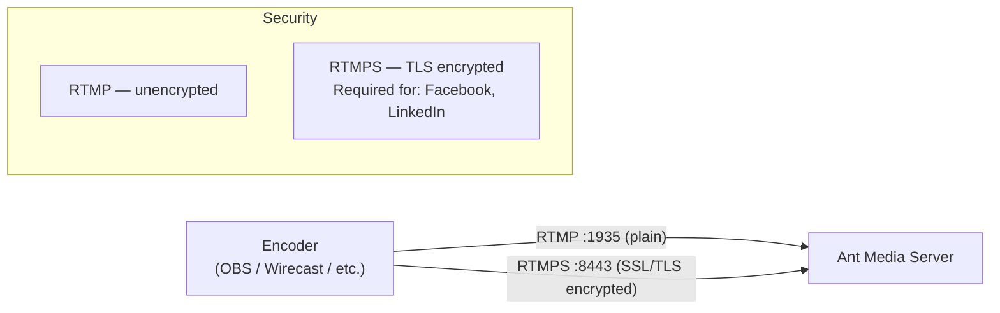

# Publish with RTMPS (Secure RTMP)

RTMPS is RTMP transmitted over a TLS/SSL connection, encrypting the stream data in transit. This provides security and trust especially for platforms and partners that require encrypted ingest (e.g., Facebook Live, LinkedIn Live, and other social platforms).

## RTMP vs RTMPS



## Enable RTMPS

:::info
Starting in v2.14, you can enable or disable RTMPS via server settings rather than editing XML files. This allows for easy and hassle-free configuration. It also restores even after a server upgrade, whereas previously it did not restore in XML files.
:::

Follow the below steps to enable/disable RTMPS:

1. Go to the conf folder under antmedia folder:

   ```bash
   cd /usr/local/antmedia/conf/
   ```

2. Edit the red5.properties file.

   **Note** — If you're upgrading from an older version where RTMPS settings were in XML, the red5.properties approach takes precedence in v2.14+.

   ```bash
   sudo nano red5.properties
   ```

3. Enable/Disable the RTMPS:

   ```properties
   rtmps.enabled=true
   ```

   **By default it is enabled now and works on TCP port 8443. Ensure port 8443 is open in your server's firewall.**

4. After changing the settings, restart the server:

   ```bash
   sudo service antmedia restart
   ```

## Publish RTMPS Stream

To publish the RTMPS stream, follow this [OBS tutorial](https://antmedia.io/docs/guides/publish-live-stream/rtmp/publish-with-obs/) for reference and instead of using the simple RTMP endpoint, use the below RTMPS endpoint.

```
rtmps://domain-name:8443/live/streamId
```

Check out the [playback guide](https://antmedia.io/docs/category/playing-live-streams/) to play your RTMPS stream with WebRTC, HLS, etc.

## Firewall Reference

| Protocol | Port | Purpose |
|----------|------|---------|
| TCP | 1935 | Standard RTMP (unencrypted) |
| TCP | 8443 | RTMPS (TLS-encrypted RTMP) |

Ensure port 8443 is open in your server firewall and any cloud security group rules.
