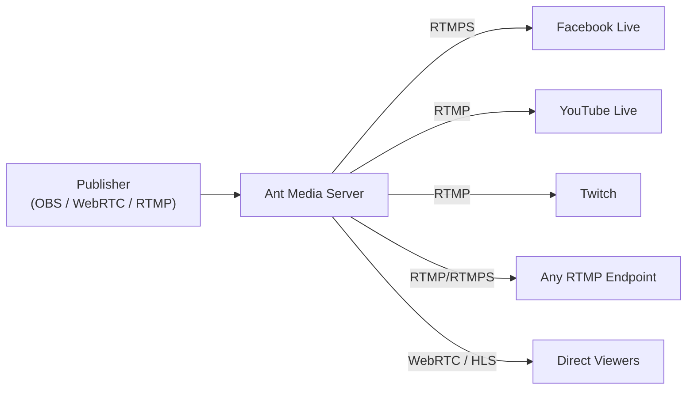

# Simulcasting to Social Media Channels

This guide will show you how to use Ant Media Server to push your live stream to social media channels like Facebook, YouTube, Twitch, and other third-party RTMP endpoints.

## Simulcasting Architecture



## How to Publish Live Stream on Facebook

### Obtain the RTMPs Endpoint from Facebook

1. Login to your Facebook account and on the homepage there's a **Live Video** section in the center, click on it.

   

2. Click on **Go live**.

   

3. Choose **Streaming software** and note the **Stream key**. The stream key will be used while adding the RTMP endpoint.

   

4. Copy the **Server URL** listed under Advanced Settings. The server URL will also be used while adding the RTMP endpoint.

   

:::info
If you want to use a persistent stream key, you just need to enable **Persistent Stream key** in the Advanced settings option.
:::

The Facebook RTMPs Endpoint URL that will be used in Ant Media Server will be of the format: `server-URL/stream-key`

Example:
```
rtmps://live-api-s.facebook.com:443/rtmp/FB-7359771564075190-0-AbwqSZYF2WgvXCVc
```

### Add the RTMPs Endpoint to the Stream

1. Go to the Live Stream section of your application on the Ant Media Server then to New Live Streams and create the stream as per your need.

2. Go to the stream you want to restream and click on the hamburger icon located at the extreme right of the screen.

3. Click on **Edit RTMP Endpoint**.

   

4. Add the Facebook RTMPs endpoint and click **Add RTMP endpoint**.

   

Congratulations! The stream is live on Facebook.

## How to Publish Live Stream on YouTube

:::info
- YouTube does not accept streams without audio, thus your stream needs to include audio.
- [This link](https://support.google.com/youtube/answer/1722171?hl=en#zippy=) provides suggested upload encoding settings for YouTube streaming.
:::

### Obtain the RTMP Endpoint from YouTube

1. Go to [YouTube](https://www.youtube.com/) and locate the **Create** button on the top right side and select **Go Live**.

   

2. It will open the YouTube Studio page where there's **Stream URL** and **Stream key**. Copy both.

   

The YouTube RTMP Endpoint URL that will be used in Ant Media Server will be of the format: `stream-URL/stream-key`

Example:
```
rtmp://a.rtmp.youtube.com/live2/dq1j-waph-e322-waxd-dxzd
```

### Add the RTMP Endpoint to the Stream

1. Go to the Live Stream section of your application on the Ant Media Server, then to New Live Streams and create the stream as per your need.

2. Go to the stream you want to restream and click on the hamburger icon located at the extreme right of the screen.

3. Click on **Edit RTMP Endpoint**.

   

4. Add the YouTube RTMP endpoint and click **Add RTMP endpoint**.

   

Congratulations! The stream is live on YouTube.

## How to Publish Live Stream on Twitch

### Obtain the RTMP Endpoint from Twitch

1. Login to your [Twitch](https://www.twitch.tv/) account.

2. Navigate to the profile icon on the top right and go to **Creator Dashboard**.

   

3. Go to **Settings** > **Stream** and copy the primary **Stream Key**.

   

4. To get the Twitch RTMP **ingest endpoint**, please go to [Twitch Ingest Server](https://help.twitch.tv/s/twitch-ingest-recommendation?language=en_US) and copy the endpoint nearest to you.

   

Twitch RTMP Endpoint URL that will be used in Ant Media Server will be of the format: `ingest-endpoint/stream-key`

Example:
```
rtmp://del01.contribute.live-video.net/app/live_1019144780_gAWcIi9n8WTjQY5WvxHCarrltIXj3M
```

### Add the RTMP Endpoint to the Stream

1. Go to the Live Stream section of your application on the Ant Media Server then to New Live Streams and create the stream as per your need.

2. Go to the stream you want to restream and click on the hamburger icon located at the extreme right of the screen.

3. Click on **Edit RTMP Endpoint**.

   

4. Add your Twitch RTMP endpoint and click **Add RTMP endpoint**.

   

Congratulations! The stream is live on Twitch.


## How to Add/Remove RTMP Endpoints

There are two options for adding/removing RTMP endpoints.

**Option 1:** Add/Remove RTMP Endpoint with Dashboard, as shown in the examples above. This is intended for general purpose.

**Option 2:** Use the REST API to Add/Remove RTMP Endpoints.

### REST API to Add/Remove RTMP Endpoint

#### Add an RTMP Endpoint

```bash
curl -X 'POST' \
  'https://AMS-domain:5443/App-Name/rest/v2/broadcasts/streamId/rtmp-endpoint' \
  -H 'accept: application/json' \
  -H 'Content-Type: application/json' \
  -d '{
  "rtmpUrl": "rtmp://endpoint-URL/StreamKey"
      }'
```

After adding the endpoint, you will receive one random `dataId` that will be used to remove the added endpoint.

```json
{
  "success": true,
  "message": null,
  "dataId": "customqfjJGd",
  "errorId": 0
}
```

You can get more information in the following [REST API](https://antmedia.io/rest/#/BroadcastRestService/addEndpointV3).

#### Remove an RTMP Endpoint

Use the `dataId` from the add endpoint response to remove the RTMP endpoint:

```bash
curl -X 'DELETE' \
  'https://AMS-domain:5443/App-Name/rest/v2/broadcasts/streamId/rtmp-endpoint?endpointServiceId=dataId-from-add-endpoint-response' \
  -H 'accept: application/json'
```

You can get more information in the following [REST API](https://antmedia.io/rest/#/BroadcastRestService/removeEndpointV2).

Click for more detail about [REST API Guide](https://antmedia.io/docs/category/rest-api-guide/).

:::info
To use the REST APIs, please add your IP address to the `Enable IP Filter for RESTful API` option in the application Settings.
:::
