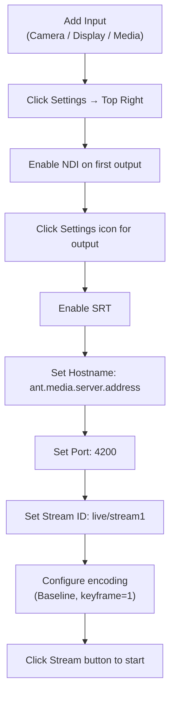

# SRT Ingest with vMix

`vMix` is a software vision mixer available for the Windows operating system. The software is developed by StudioCoast PTY LTD. Like most vision mixing software, it allows users to switch inputs, mix audio, record outputs and live stream cameras, videos files, audio, and more in resolutions of up to 4K. It can stream up to three destinations at one time.

In this tutorial, we assume that you have installed vMix on your personal computer.

## vMix SRT Setup Flow

## Provide Sources

Click the add input button and add an input for the broadcast. As an example, add a display input.

As you can see, the input has been added successfully, and its preview can be seen:

## Configure vMix

- Click the **Settings** button in the top right corner.
- In the first output, enable **NDI**.
- Click the **Settings** icon for the first output.
- Enable **SRT** in the settings panel.
- In the **Hostname** field, enter your Ant Media Server URL **without the port**, for example: `ant.media.server.address`
- In the **Port** field, enter your Ant Media Server SRT port number, for example: `4200`.
- In the **Stream ID** field, enter your App name and stream ID, for example: `live/stream1`.

## Tuning

You can use predefined settings but if you click on the gear button next to the quality options, you can select one of the options.

- Profile should be `baseline` and `keyframe latency` should be `1`.
- You can set your `level` and your `preset` according to your configuration but `3.1` and `medium preset` is good enough to have a good quality stream.
- You can enable the `hardware encoder` for using your `GPU` in the `encoding process`.

## Start Streaming

After configuring according to your needs and setting the server address, you can start the streaming by clicking the stream button at the bottom of the dashboard.

Now you are publishing with vMix via SRT to Ant Media Server!
