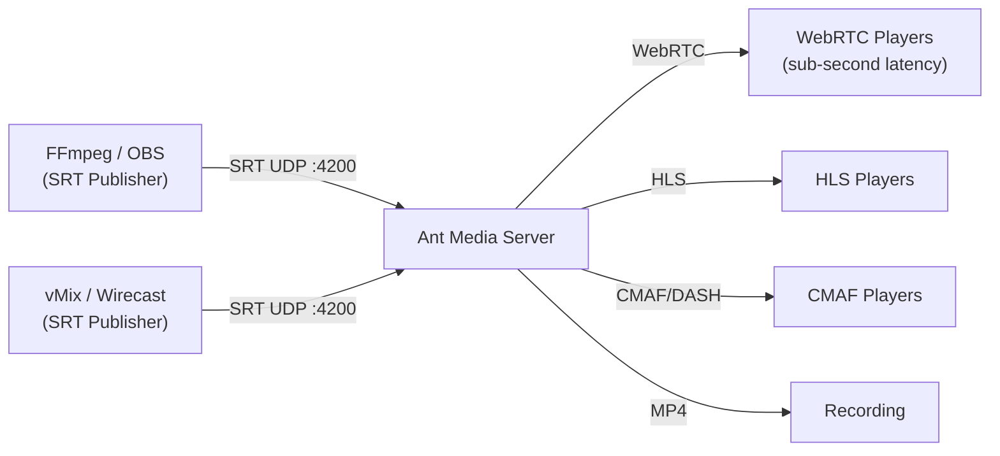

# SRT Ingest Guide

SRT (Secure Reliable Transport) allows you to push streams to Ant Media Server and play them using various formats, including WebRTC, HLS, and CMAF, and record them as MP4. The SRT ingest feature, which also supports adaptive streaming, is available from version 2.4.3 EE onwards.

To enable this feature, Ant Media Server utilizes Haivision's official [SRT library](https://github.com/Haivision/srt) and a custom SRT preset for [JavaCPP-Presets](https://github.com/bytedeco/javacpp-presets).

## SRT Architecture



:::info
SRT support is available for both x86_64 and ARM architectures, starting with Ant Media Server version 2.6.0. For versions below 2.6.0 (till v2.5.3), SRT support is available for the x86_64 architecture only.
:::

## Pushing SRT Streams with FFmpeg

Assuming you have installed and launched Ant Media Server v2.4.3 or later, you can use FFmpeg to push the SRT stream.

```bash
ffmpeg -re -i {INPUT} -vcodec libx264 -profile:v baseline -g 60 -acodec aac -f mpegts srt://ant.media.server.address:4200?streamid=live/stream1
```

Once the command is executed, the stream will be available in the `live` application with the `streamId` stream1.

:::info
If you encounter a "**Protocol not found**" error, it means FFmpeg needs to be compiled with the [--enable-libsrt](https://srtlab.github.io/srt-cookbook/apps/ffmpeg/) flag to support the SRT protocol.

```
srt://ant.media.server.address:4200?streamid=live/stream1: Protocol not found
```
:::

You can verify if FFmpeg has SRT protocol support by running:

```bash
ffmpeg -protocols
```

## Publishing SRT Streams with OBS

If you don't have command-line experience and prefer a graphical interface, you can use OBS (Open Broadcaster Software) to push an SRT stream to Ant Media Server.

Just enter the SRT URL to the stream window as shown in the image below:


### SRT URL with Token Security

If the publish type token is enabled, the SRT publishing URL will be in the following format:

```
srt://ant.media.server.address:4200?streamid=live/streamId,token=tokenId
```

In order to generate the token, check out the stream security [documentation](https://antmedia.io/docs/category/stream-security/).

### Publishing SRT Stream with OBS Without streamId

:::info
Starting from version 2.8.0 and above, Ant Media Server supports SRT publishing without the explicit need for streamId.
:::


In such cases, the system IP address is used as the streamId and it is published to the LiveApp application by default.


## Play SRT with Ant Media Server

Once the SRT stream has been published, it can be viewed using WebRTC, HLS, or CMAF (Dash). Please see the [playback document](https://antmedia.io/docs/category/playing-live-streams/) for more information.

## Configure SRT Ingest Port Number

SRT is enabled by default in Ant Media Server and communicates via **UDP port 4200**. If you need to change the port number, follow these steps:

1. Open the configuration file:

   ```bash
   sudo nano /usr/local/antmedia/conf/red5.properties
   ```

2. Add or replace the following property:

   ```properties
   server.srt_port={WRITE_YOUR_PORT_NUMBER}
   ```

3. After this, restart the server, and it will use the newly configured port number for SRT ingest:

   ```bash
   sudo service antmedia restart
   ```

## Quick Reference

| Setting | Value |
|---------|-------|
| Protocol | SRT (UDP) |
| Default Port | 4200 |
| URL Format | `srt://server:4200?streamid=live/streamId` |
| With Token | `srt://server:4200?streamid=live/streamId,token=tokenId` |
| Without streamId (v2.8.0+) | IP address used as streamId, published to LiveApp |
| Architecture Support | x86_64 + ARM (v2.6.0+) |
| Min Version (EE) | v2.4.3 |
