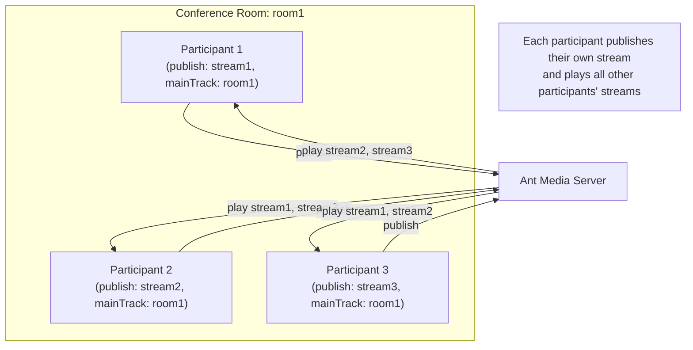

# WebRTC Conference Call

Ant Media Server offers robust support for conference calls. In this tutorial, we will see how to use the Basic Conference sample page.

If you are looking for a ready-to-use conference solution, please check out our in-house [Circle Conference tool](https://antmedia.io/marketplace/circle-video-conferencing-tool) with all necessary features.

## Conference Architecture



## Conference Call Sample Page

Go to `https://your-domain-name:5443/live/conference.html` for conference call sample page.

The WebRTC conference feature is only available in the Enterprise Edition of Ant Media Server.

If you have Ant Media Server installed on your local machine, you can also go to `http://localhost:5080/live/conference.html`.

Click the `Join Room` button, then open the same page in multiple tabs or on different devices to join from there. You'll immediately start receiving streams from the other participants.


## Join Conference Room

When WebRTCAdaptor is initialized successfully, it creates a websocket connection. After a successful connection, the client gets the `initialized` notification from the server. After receiving `initialized` notification, we can start publishing and playing to the conference room.

**Think of the conference room this way:** you publish your video stream while simultaneously playing the streams of remote participants. In practice, you're still using the same publish and play functions as in regular streaming.

Just call the publish method as follows:

```js
publish(streamId, token, subscriberId, subscriberCode, streamName, mainTrack, metaData, role)
```

* `streamId` (mandatory): ID of the stream.
* `mainTrack` (mandatory): ID of the room that the stream will be published to.

For example, if we are joining the `room1` conference room, then room1 is the mainTrack.

## Play Conference Room Stream

In order to play remote streams from the room, call the play method.

In a conference call, the correct place to call the method is when `joinedTheRoom` and `roomInformation` notifications are received. Play Method should be called with the correct roomId that needs to be played.

```js
play(streamId, token, roomId);
```

* `streamId` (mandatory): ID of the stream that needs to play.
* `roomId` (mandatory): ID of the room that needs to play.

## Turn Camera On/Off

- To turn off the camera, call the `turnOffLocalCamera` method.

  ```js
  webRTCAdaptor.turnOffLocalCamera(streamId);
  ```

- If your camera is turned off, call `turnOnLocalCamera` to turn it on.

  ```js
  webRTCAdaptor.turnOnLocalCamera(streamId);
  ```

## Mute and Unmute Microphone

- Call `muteLocalMic` to mute the microphone.

  ```js
  webRTCAdaptor.muteLocalMic();
  ```

- To unmute, call `unmuteLocalMic`.

  ```js
  webRTCAdaptor.unmuteLocalMic();
  ```

These methods don't take any parameters.

## Server Notifications

Here are the conference-related notifications that callback is invoked for. Please check the [conference.html](https://github.com/ant-media/StreamApp/blob/master/src/main/webapp/conference.html) for proper usage.

* `newStreamAvailable`: Called when a previously joined stream is ready to play.
* `publish_started`: Called when stream is published to the room.
* `play_started`: Called when starting to play the remote streams.

To learn more about the Ant Media Server Conference, visit [**here**](https://antmedia.io/docs/category/conference-room/).
