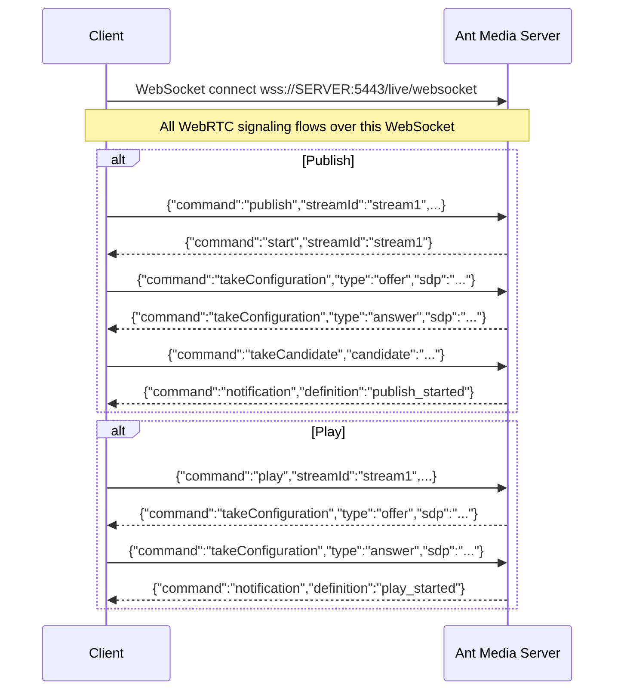

# WebRTC WebSocket Messaging Reference

This documentation is for developers who need to implement signaling between Ant Media Server and clients for publishing & playing streams.

## WebSocket Connection



## Publish WebRTC Stream

1. To connect to the Ant Media Server, client can use WebSocket with a URL in the format:

   ```
   wss://SERVER_NAME:5443/live/websocket
   ```

- `wss` indicates that it's a secure WebSocket connection using SSL/TLS.

- `/live/websocket` specifies the endpoint for the WebSocket connection in Ant Media Server.

2. To publish a stream, clients first send the `publish` command to the server to start the stream.

   ```js
   {
   command : "publish",
   streamId : "stream1",
   streamName : "streamName",
   token : "token",
   mainTrack : "mainTrack",
   metaData : "metaData",
   subscriberCode : "subscriberCode",
   subscriberId : "subscriberId",
   enablevideo : "true",
   enableaudio : "true",
   }
   ```

- **`token`:** The `token` field is required if any stream security (token control) is enabled.

  If the user has enabled [stream-security](https://antmedia.io/docs/guides/advanced-usage/stream-security/), they need to fill in the `token` field with the correct token.

- **`subscriberId` and `subscriberCode`:** These are the values for the Time-based One-time Password (TOTP). If the user is using the TOTP mechanism, they need to pass the `subscriberId` and `subscriberCode`.

- **`streamName`:** Zombie streams are streams that don't have entries in the AMS database. Therefore, users can give these "on the fly" streams a `streamName`.

- **`mainTrack`:** `mainTrack` is related to multitrack streaming and is required if the user wants to start the stream as a `subtrack` for this `mainTrack`. For multitrack conferences, `mainTrack` is set as the room ID.

- **`metaData`:** The `metaData` is free text information for the stream to server.

- **`enableVideo` and `enableAudio`:** These parameters define whether to enable video and audio for the stream.

If `enableVideo` is true, then the video will be sent to the server. If `enableAudio` is true, then audio will be sent to the server.
If `enableVideo` is false and `enableAudio` is true, then it means it's an audio-only stream.

- Only `command` and `streamId` are mandatory. Audio and video are enabled by default.

3. If the Server accepts the stream, it replies with the `start` command
```json
{
  command : "start",
  streamId : "stream1",
  subscriberId : "",
}
```

4. The client initiates peer connections, creates offer SDP, and sends the SDP configuration to the server with `takeConfiguration` command
```json
{
  command : "takeConfiguration",
  streamId : "stream1",
  type : "offer",  
  sdp : "${SDP_PARAMETER}"
}
```

5. The server creates answers SDP and sends the SDP configuration to the client with `takeConfiguration` command
```json
{
  command : "takeConfiguration",
  streamId : "stream1",
  type : "answer",  
  sdp : "${SDP_PARAMETER}"
}
```

6. Client and Server get ice candidates several times and send them to each other with `takeCandidate` command
```json
{
  command : "takeCandidate",
  streamId : "stream1",
  label : "${CANDIDATE.SDP_MLINE_INDEX}",
  id : "${CANDIDATE.SDP_MID}",
  candidate : "${CANDIDATE.CANDIDATE}"
}
```

7. After a stream has started, the server sends a `publish_started` command
```json
{
  command : "notification",
  definition : "publish_started",
  streamId : "stream1",
}
```

8. Clients send stop JSON command to stop publishing
```json
{
  command : "stop",
  streamId: "stream1",
}
```

9. The server responds with a publish_finished message to indicate that the stream has stopped

```json
{
  command : "notification",
  definition : "publish_finished",
  streamId : "stream1",
  subscriberId : "subscriberId",
}
```

## Play WebRTC Stream

1. To connect to the Ant Media Server, client can use WebSocket with a URL in the format:

   ```
   wss://SERVER_NAME:5443/live/websocket
   ```

2. Client sends play `command` to the server with `streamId` parameter.

```json
{
  command : "play",
  streamId : "stream1",
  token : "token",
  subscriberCode : "subscriberCode",
  subscriberId : "subscriberId",
  trackList : [enabledtracksarray],
  viewerInfo : "viwerInfo",
}
```

- Only `command` and `streamId` is mandatory, rest are situational, such as `subscriberId`, `subscriberCode`, `token` and `enabled tracks`.

- If a stream has sub-tracks, `trackList` is enabled by default. If there are 2 tracks on the stream, the user can specify both and both tracks will be played. To get all tracks in a stream you can take a look in `getTrackList` command that is in the [miscellaneous](#miscellaneous-websocket-methods) part.

- `viewerInfo` is a kind of `metaData` used to collect informations.

3. If the Server accepts the stream, it replies with the offer command.

```json
{
  command : "takeConfiguration",
  streamId : "stream1",
  type : "offer",  
  sdp : "${SDP_PARAMETER}"
}
```

4. The client creates an answer SDP and sends the SDP configuration to the server with `takeConfiguration` command.

```json
{
  command : "takeConfiguration",
  streamId : "stream1",
  type : "answer",  
  sdp : "${SDP_PARAMETER}"
}
```

5. Client and Server get ice candidates several times and send them to each other with `takeCandidate` command.

```json
{
  command : "takeCandidate",
  streamId : "stream1",
  label : "${CANDIDATE.SDP_MLINE_INDEX}",
  id : "${CANDIDATE.SDP_MID}",
  candidate : "${CANDIDATE.CANDIDATE}"
}
```

6. Server notifies with `play_started` once the stream starts to play.

```json
{
  command : "notification",
  definition : "play_started",
  streamId : "stream1",
  subscriberId : "subscriberId",
}
```

7. Client sends toggle video to stop/start incoming video packets from a video track ( streamId = trackId for single track use ) Enabled is `true` as default. `trackId` and `streamId` is mandatory.

```json
{
  command : "toggleVideo",
  streamId: "stream1",
  trackId: "track1",
  enabled: boolean
}
```

8. Client sends toggle audio to stop/start incoming audio packets from an audio track ( streamId = trackId for single track use ) Enabled is `true` as default. `trackId` and `streamId` is mandatory.

```json
{
  command : "toggleAudio",
  streamId: "stream1",
  trackId: "track1",
  enabled: boolean
}
```

- If there are multiple sub-tracks, the user can enable/disable any track using `toggle` so that the server does not send audio/video packets for that track.

9. Clients sends `stop` JSON command to stop playing.

```json
{
  command : "stop",
  streamId: "stream1",
}
```

10. Server notifies with `play_finished` to notify that play has stopped.

```json
{
  command : "notification",
  definition : "play_finished",
  streamId : "stream1",
  subscriberId : "subscriberId",
}
```

## Conference WebRTC Stream

Think of Conference room as this way, we will publish our video streams and we will play the videos of the remote participants, so essentially we will be using same publish and play functions, we normally use for publishing and playing streams.

1. Participants connect to the Ant Media Server through WebSocket.

   ```
   wss://SERVER_NAME:5443/live/websocket
   ```

2. The client publishes his stream with the `publish` command as we discussed in the publishing section above and these will be the same. mainTrack is the room name that client is publishing his stream to.

```json
{
  command : "publish",
  streamId : "streamId",
  streamName : "streamName",
  mainTrack : "room1",
  metaData : "metaData",
  subscriberCode : "subscriberCode",
  subscriberId : "subscriberId",
  video : "true",
  audio : "true",
}
```

3. The client sends the `play` command to the server with `streamId` as the `roomId`

```json
{
  command : "play",
  room : "room1",
  streamId : "room1",
  token : "token",
  subscriberCode : "subscriberCode",
  subscriberId : "subscriberId",
  trackList : [enabledtracksarray],
  viewerInfo : "viwerInfo",
}
```
- We only play the `roomId` as this `mainTrack` has all the `subTracks` in the room and therefore it is not required to play each `streamId` separately.

- all the remote video tracks will be received in "newTrackAvailable" callback in WebRTCAdapter callback. Once the tracks are received they can then be played by application logic.

4. When a client wants to leave the room they send the `stop` command to the server for both publish and play.

stop publish our stream
```json
{
  command : "stop",
  streamId : "stream1",
}
```

stop playing from room.
```json
{
  command : "stop",
  streamId : "room1",
}
```

5. The server responds with a `play_finished` or `publish_finished` message.

```json
{
  command : "notification",
  definition : "publish_finished",
}
```

```json
{
  command : "notification",
  definition : "play_finished",
}
```

- The JavaScript SDK/SDKs handle the background processing of multitrack streaming for conferences on their own. If you are implementing your code using WebSocket references, you will likely need to listen for `onTrackEvents` within the `initPeerConnections` function. When a new track, stream, or subTrack is dynamically added to the room during runtime, the `onTrack(event, streamId)` function is triggered.

- When a new `streamId` is added to or removed from the room, the server and client initiate a renegotiation process.

## Peer-to-Peer WebRTC Stream

1. Peers connect to the Ant Media Server through WebSocket.

   ```
   wss://SERVER_NAME:5443/live/websocket
   ```

2. The client sends a join JSON command to the server with the `streamId` parameter. If only want to `play`, `mode` can be set to `play`, if the user wants to publish and play at the same time, `both` can be set. As default, `mode` is set to `both`. Only `command` and `streamId` are mandatory.

```json
{
  command : "join",
  streamId : "stream1",
  mode: "play or both"
}
```

3. Server notifies with `joined`.

```json
{
  command : "notification",
  definition : "joined",
  streamId : "stream1",
}
```

4. If there is only one peer in stream1, the server waits for the other peer to join the room.

5. When the second peer joins the stream, the server sends the `start` JSON command to the first peer.

```json
{
  command : "start",
  streamId : "stream1",
}
```

6. First peer creates an offer SDP and sends it to the server with the `takeConfiguration` command.

```json
{
  command : "takeConfiguration",
  streamId : "stream1",
  type : "offer",  
  sdp : "${SDP_PARAMETER}"
}
```
- Server relays the offer SDP to the second peer

7. The second peer creates the answer SDP and sends it to the server with the `takeConfiguration` command.

```json
{
  command : "takeConfiguration",
  streamId : "stream1",
  type : "answer",  
  sdp : "${SDP_PARAMETER}"
}
```
- Server relays the answer SDP to the first peer

8. Each peer gets ice candidates several times and sends them to each other with the `takeCandidate` command through the server.

```json
{
  command : "takeCandidate",
  streamId : "stream1",
  label : "${CANDIDATE.SDP_MLINE_INDEX}",
  id : "${CANDIDATE.SDP_MID}",
  candidate : "${CANDIDATE.CANDIDATE}"
}
```

9. Clients send leave JSON command to leave the room.

```json
{
  command : "leave",
  streamId: "stream1"
}
```

10. Server notifies with `leaved`

```json
{
  command : "notification",
  definition : "leaved",
}
```

11. When the second peer stops the stream or the stream is ended, the server sends a `stop` JSON command to the first peer.

```json
{
  command : "stop",
  streamId : "stream1",
}
```

## WebSocket Error Callbacks

| Error Definition | Description |
|-----------------|-------------|
| `noStreamNameSpecified` | Stream id is not specified |
| `not_allowed_unregistered_streams` | StreamId not registered and server doesn't accept undefined streams |
| `no_room_specified` | No roomId specified for conference |
| `unauthorized_access` | Token incorrect or not validated |
| `no_encoder_settings` | No encoder settings available |
| `no_peer_associated_before` | No peer associated with the stream (P2P) |
| `notSetRemoteDescription` | Mismatch between encoder/decoders |
| `notSetLocalDescription` | Local description not set successfully |
| `highResourceUsage` | Server overloaded (CPU > 75% or RAM < 10MB free) |
| `streamIdInUse` | StreamId already in use by active stream |
| `publishTimeoutError` | WebRTC publish failed to start within timeout |
| `invalidStreamName` | Stream name contains special characters |
| `data_store_not_available` | Data store not initialized or closed |
| `license_suspended_please_renew_license` | License is suspended |
| `already_playing` | New play received while already playing |
| `already_publishing` | New publish received while already publishing |
| `encoderNotOpened` | Encoder failed to open |
| `encoderBlocked` | Encoder is blocked |
| `no_codec_enabled_in_the_server` | No codec enabled and publish attempted |
| `stream_not_active_or_expired` | Stream dates not in valid interval |
| `viewerLimitReached` | Viewer limit reached |

## Miscellaneous WebSocket Methods

- **`ping` & `pong`:** Keeps the WebSocket connection alive through load balancers.

  ```json
  { "command": "ping" }
  ```

  Response:
  ```json
  { "command": "pong" }
  ```

- **`getStreamInfo`:** Get Stream Information from Server.

  ```json
  { "command": "getStreamInfo", "streamId": "stream_id" }
  ```

  Response:
  ```json
  {
    "command": "streamInformation",
    "streamId": "stream_id",
    "streamInfo": [{
      "streamWidth": 1280,
      "streamHeight": 720,
      "videoBitrate": 1500,
      "audioBitrate": 128,
      "videoCodec": "H264"
    }]
  }
  ```

- **`getRoomInfo`:** Get current room state including active streams.

  ```json
  { "command": "getRoomInfo", "room": "room1", "streamId": "my_stream_id" }
  ```

  Response:
  ```json
  { "command": "roomInformation", "room": "room1", "streams": ["stream1", "stream2"] }
  ```

- **`bitrateMeasurement`:** Server periodically sends this to WebRTC viewers. If `targetBitrate` < `videoBitrate + audioBitrate`, playback issues may occur.

  ```json
  {
    "command": "notification",
    "definition": "bitrateMeasurement",
    "streamId": "unique_id",
    "targetBitrate": 2000000,
    "videoBitrate": 1500000,
    "audioBitrate": 128000
  }
  ```

- **`forceStreamQuality`:** Force server to send a specific resolution (use height=0 for auto).

  ```json
  { "command": "forceStreamQuality", "streamId": "stream1", "streamHeight": 720 }
  ```

- **`getTrackList`:** Get track list for a stream.

  ```json
  { "command": "getTrackList", "streamId": "stream1", "token": "token" }
  ```

- **`enableTrack`:** Enable or disable a specific track.

  ```json
  { "command": "enableTrack", "streamId": "stream1", "trackId": "track_id", "enabled": true }
  ```
