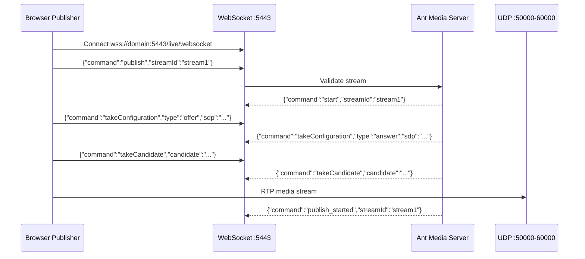

# WebRTC Publishing

WebRTC (Web Real-Time Communication) offers ultra-low latency streaming, making it ideal for applications requiring real-time interaction, such as live events, online gaming, and virtual meetings. Unlike traditional protocols like RTMP or HLS, WebRTC enables direct peer-to-peer communication, reducing delays to approximately 0.5 seconds. This makes it a superior choice for scenarios where immediacy is crucial.

:::info
For WebRTC publishing, please ensure that UDP ports `50000-60000` are open on your firewall or security groups.

For more information on changing the port range, see [here](https://github.com/orgs/ant-media/discussions/4944).
:::

## WebRTC Publishing Flow

## WebRTC Publish Sample Page

Go to this URL for WebRTC publishing: `https://your domain name:5443/live`

If you have Ant Media Server installed on your local machine, you can also go to `http://localhost:5080/live` to publish the WebRTC stream.

## Stream Publishing

- The random streamId is generated by default every time a page is opened, however you can enter your own streamId as well.
- Then click the `Start Publishing` button. After pressing the button, the text `Publishing` should blink.

  

  Congratulations! You're now using WebRTC to publish to Ant Media Server from your browser!

- By clicking on Options on the sample page, you can also change the Max Video Bitrate and Audio/Video Source.

  

- Learn more about playing this stream with WebRTC to complete the loop and stream with ~0.5-second latency. Check out [WebRTC Playback](/play/webrtc).
