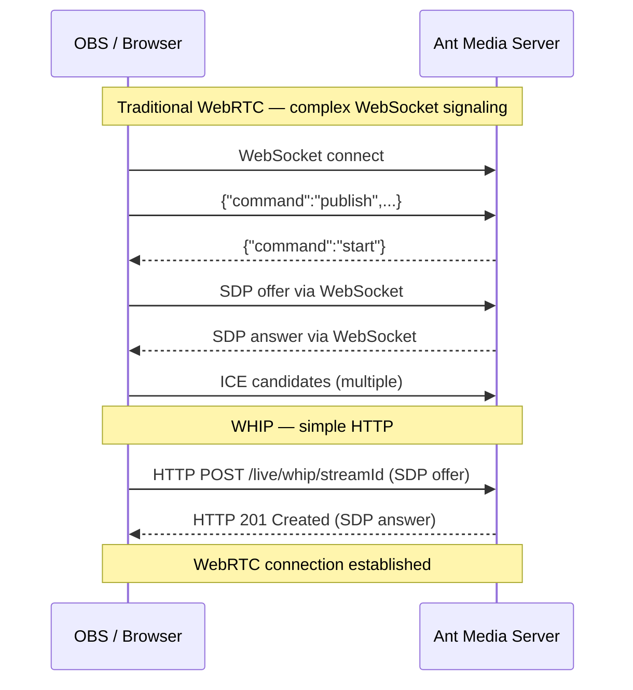

# WHIP (WebRTC-HTTP Ingestion Protocol)

WHIP (WebRTC-HTTP Ingestion Protocol) is a standardized protocol designed to simplify the ingestion of WebRTC streams into media servers. Traditionally, ingesting streams into WebRTC servers required complex signaling procedures involving multiple steps and protocols. WHIP addresses these challenges by leveraging simple HTTP endpoints for media ingestion, reducing complexity, and improving interoperability.

In version 2.10.0, Ant Media Server introduced WHIP support, making it easier than ever to integrate with WebRTC workflows.

## WHIP vs Traditional WebRTC Signaling



## Benefits of WHIP

1. **Simplicity**: WHIP simplifies the signaling process by using HTTP, making it straightforward to implement and integrate.
2. **Interoperability**: By adhering to a standard protocol, WHIP ensures compatibility across different WebRTC implementations and media servers.
3. **Efficiency**: WHIP reduces the overhead associated with traditional WebRTC signaling methods, leading to faster and more efficient stream ingestion.
4. **Ease of Integration**: With WHIP, developers can use familiar HTTP methods, streamlining the development process and reducing the learning curve.

## Streaming to AMS with WHIP using OBS Studio

Open Broadcaster Software (OBS) is a popular open-source tool for live streaming and video recording. Integrating OBS with Ant Media Server via WHIP can enhance your streaming setup by providing a robust and efficient way to deliver WebRTC streams.

### Prerequisites

- Ant Media Server EE v2.10 or later
- OBS Studio v30.0 or later

### Configure OBS for WHIP

- In OBS, go to `Settings` and then `Stream`.
- Select `WHIP` as the service.
- In the `Server` field, enter the WHIP endpoint URL provided by your Ant Media Server. Here is the WHIP endpoint format:

  ```
  https://antmedia.example.com:5443/live/whip/streamId
  ```


From the Output tab of OBS, you can control your streaming parameters like bit rate, key frames, etc. You can use the same settings as shown below in the screenshot or you can modify them as per your requirements.


After your Output and streaming settings are done, you can start publishing your stream from OBS.

When the stream is published, you can play the stream with WebRTC, HLS or Dash. Check out the [stream playback](https://antmedia.io/docs/category/playing-live-streams/) document for more reference.

## Streaming to AMS with WHIP using Sample Web Page

If you directly want to publish the WebRTC stream from your browser using WHIP protocol, you can check the `whip.html` sample page of Ant Media Server for reference.

This sample page uses the [Eyevinn WHIP client](https://www.npmjs.com/package/@eyevinn/whip-endpoint) to publish the stream to the server using the WHIP protocol. You can also directly integrate it into your web application.

To publish the WHIP stream using the sample page, go to:

```
https://AMS-domain:5443/live/whip.html
```

You can also test via this [sample page](https://test.antmedia.io:5443/live/whip.html).

## WHIP Endpoint Format

| Parameter | Value |
|-----------|-------|
| Endpoint | `https://your-server:5443/{appName}/whip/{streamId}` |
| Method | HTTP POST |
| Body | SDP offer (application/sdp) |
| Response | 201 Created with SDP answer |
| Min Version | AMS EE v2.10.0 |
| OBS Version | OBS Studio v30.0+ |
