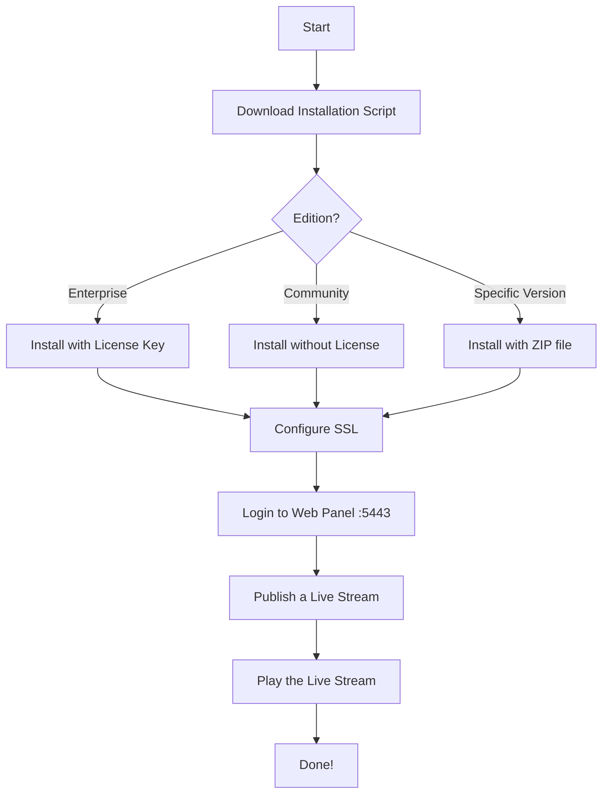
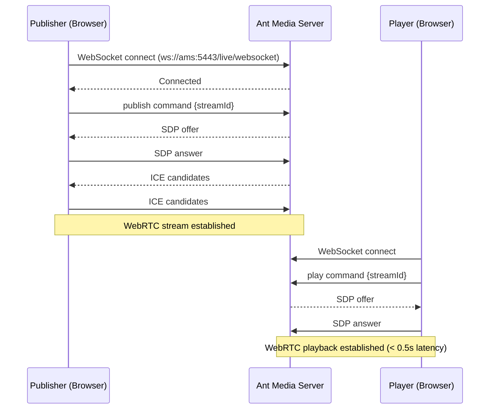

# Quick Start

Get Ant Media Server running in minutes with these simple steps.

## Installation Flow



### 1. Download the Installation Script

```shell
wget https://raw.githubusercontent.com/ant-media/Scripts/master/install_ant-media-server.sh -O install_ant-media-server.sh  && sudo chmod 755 install_ant-media-server.sh
```

### 2. Install Ant Media Server

#### Install the Enterprise Edition

```shell
sudo ./install_ant-media-server.sh -l 'your-license-key'
```

#### Install the Community Edition
```shell
sudo ./install_ant-media-server.sh
```

#### Install a Specific Version
```shell
sudo ./install_ant-media-server.sh -i <ANT_MEDIA_SERVER_ZIP_FILE>
```

**For more installation options check the help:** `./install_ant-media-server.sh -h`

#### Checkout: Fast & Easy Installations on Cloud Marketplaces

<div style={{display: 'flex', justifyContent: 'space-between', textAlign: 'center', fontWeight:'bold', height: 'auto'}}>
  <div  style={{width: '49%', height:'300px'}}>
      <iframe className="border border-rounded m-3" width="100%" height="250" src="https://www.youtube.com/embed/1yQT-D8gPUo?si=CoXX6jXFZQ0j9xI2" title="YouTube video player" frameborder="0" allow="accelerometer; autoplay; clipboard-write; encrypted-media; gyroscope; picture-in-picture; web-share" allowfullscreen></iframe>
      Video tutorial of AWS marketplace installation
  </div>
  <div  style={{width: '49%', height:'300px'}}>
      <iframe className="border border-rounded m-3" width="100%" height="250" src="https://www.youtube.com/embed/uE8uzWhKSBE" title="YouTube video player" frameborder="0" allow="accelerometer; autoplay; clipboard-write; encrypted-media; gyroscope; picture-in-picture; web-share" allowfullscreen></iframe>
      Video tutorial of Azure marketplace installation
  </div>
</div>

### 3. Configure SSL

- After [installing the Ant Media Server](https://antmedia.io/docs/guides/installing-on-linux/installing-ams-on-linux/), login to the web panel and navigate to `SETTINGS > SSL`.


- In the drop-down select box named Type, choose among the various options to enable SSL, like [using your own domain](https://antmedia.io/docs/guides/installing-on-linux/setting-up-ssl/#create-lets-encrypt-certificate-with-http-01-challenge), [free subdomain of antmedia.cloud](https://antmedia.io/docs/guides/installing-on-linux/setting-up-ssl/#get-a-free-subdomain-and-install-ssl-with-lets-encrypt), or [import your own certificate](https://antmedia.io/docs/guides/installing-on-linux/setting-up-ssl/#import-your-custom-certificate) and then click Activate to enable the SSL and restart your server.


- This will start to enable SSL for your Ant Media Server.


- The Ant Media Server instance will restart and the server can now be accessed securely with SSL enabled.


- Check this to learn how to [enable SSL via the terminal](https://antmedia.io/docs/version-2.11.3/guides/installing-on-linux/setting-up-ssl/#option-2-installing-ssl-using-the-terminal).

### 4. Log in to the Web Panel

Navigate to `https://ant-media-server:5443` and create the first user account.


### 5. Publish and Play WebRTC Live Streams

#### Publish a Live Stream

Publish a WebRTC live stream from the sample webrtc publish page, which is available at `https://domain-name:5443/live`


#### Play a Live Stream

Play the live stream with WebRTC using the sample WebRTC player page, which is available at `https://domain-name:5443/live/player.html`


## Publish/Play Sequence



## Sample Tools and Applications

- Access the [sample tools and applications](/get-started/sample-tools-and-applications/) via `https://domain-name:5443/live/samples.html`.

- Experience the sample pages [here](https://test.antmedia.io:5443/live/samples.html) now.

## Port Reference

| Port | Protocol | Purpose |
|------|----------|---------|
| 5080 | HTTP | Web panel (non-SSL) |
| 5443 | HTTPS | Web panel & WebRTC (SSL) |
| 1935 | TCP | RTMP ingest |
| 4200 | UDP | SRT ingest |
| 50000-60000 | UDP | WebRTC media ports |

## Getting Help

If you need any help, feel free to head over to [Github discussions](https://github.com/orgs/ant-media/discussions) or follow our more detailed [AMS Installation Guide](/installation/linux).
