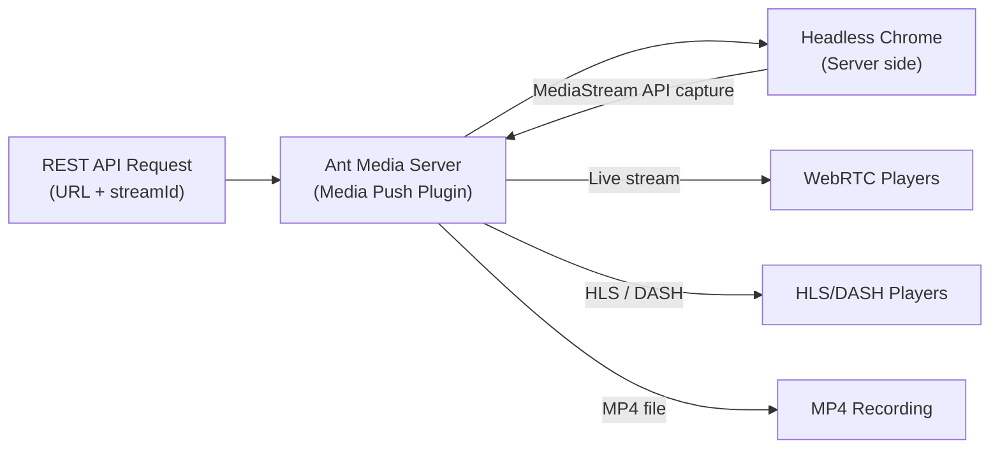

# Media Push Plugin

The Media Push Plugin lets you stream any web page by simply providing a URL. The plugin loads the web page on the server side using Headless Chrome and streams it in real time. You can then record or re-stream the video.

## How Media Push Works



Media Push opens Headless Chrome on the server side. When a REST request arrives with a URL:
1. A new Chrome tab is opened with that URL.
2. As soon as the page loads, the screen is recorded using Media Stream APIs.
3. The recording is re-streamed back to Ant Media Server.
4. You can record the stream or play it back using WebRTC, HLS, or DASH.

## Installation

```bash
# Get the installation script
wget -O install_media-push-plugin.sh https://raw.githubusercontent.com/ant-media/Plugins/master/MediaPushPlugin/src/main/script/install_media-push-plugin.sh && chmod 755 install_media-push-plugin.sh

# Run the installation script
sudo ./install_media-push-plugin.sh

# Fix ownership
sudo chown -R antmedia:antmedia /usr/local/antmedia

# Restart the service
sudo service antmedia restart
```

## REST API Usage

### Start a Broadcast

```bash
curl -i -X POST \
  -H "Accept: Application/json" \
  -H "Content-Type: application/json" \
  "https://ant-media-server-domain:5443/live/rest/v1/media-push/start?streamId=mediapush" \
  -d '{"url": "URL_TO_RECORD", "width": 1280, "height": 720}'
```

**Response:**
```json
{"success":true,"message":null,"dataId":"mediapush","errorId":0}
```

The `dataId` field represents the generated streamId.

### Stop a Broadcast

```bash
curl -i -X POST \
  -H "Accept: Application/json" \
  "https://ant-media-server-domain:5443/live/rest/v1/media-push/stop/{streamId}"
```

### Record the Broadcast

Include the `recordType` option in your start command:

```bash
curl -i -X POST \
  -H "Accept: Application/json" \
  -H "Content-Type: application/json" \
  "https://ant-media-server-domain:5443/live/rest/v1/media-push/start" \
  -d '{"url": "URL_TO_RECORD", "width": 1280, "height": 720, "recordType":"mp4"}'
```

### Add Chrome Switches

Specify extra Chrome switches in the `extraChromeSwitches` field (comma-separated):

```bash
curl -i -X POST \
  -H "Accept: Application/json" \
  -H "Content-Type: application/json" \
  "https://ant-media-server-domain:5443/live/rest/v1/media-push/start" \
  -d '{"url": "URL_TO_RECORD", "width": 1280, "height": 720, "recordType":"mp4", "extraChromeSwitches":"--start-fullscreen,--disable-gpu"}'
```

Common Chrome switches:
- `--start-fullscreen`: Starts Chrome in fullscreen mode.
- `--disable-gpu`: Disables GPU hardware acceleration.

For a complete list, see [Chromium Command Line Switches](https://peter.sh/experiments/chromium-command-line-switches/).

### Run JavaScript in the URL

To execute JavaScript in a specific stream's browser tab:

```bash
curl -i -X POST \
  -H "Accept: Application/json" \
  -H "Content-Type: application/json" \
  "https://ant-media-server-domain:5443/live/rest/v1/media-push/send-command?streamId={streamId}" \
  -d '{"jsCommand": "document.write(\"hello\")"}'
```

## Composite Layout

The composite layout is an HTML page with a canvas where you can place multiple video streams, text, and images together. Media Push can record this HTML page and stream it live.

### Install Composite Layout

```bash
# Download the composite_layout.html file
wget https://github.com/ant-media/Plugins/raw/master/MediaPushPlugin/build/composite_layout.html

# Copy to the application folder
sudo cp composite_layout.html /usr/local/antmedia/webapps/live/composite_layout.html
```

### Start Composite Layout

```bash
curl -i -X POST \
  -H "Accept: Application/json" \
  -H "Content-Type: application/json" \
  "https://ant-media-server-domain:5443/live/rest/v1/media-push/start" \
  -d '{"url": "https://ant-media-server-domain:5443/live/composite_layout.html?roomId=<room-name>&publisherId=<composite-layout-publisher-id>", "width": 1280, "height": 720}'
```

### Update Composite Layout UI

Add streams to the canvas on the fly:

```bash
curl -i -X POST \
  -H "Accept: Application/json" \
  -H "Content-Type: application/json" \
  "https://ant-media-server-domain:5443/live/rest/v2/broadcasts/<composite-layout-publisher-id>/data" \
  -d '{"streamId":"streamId1","layoutOptions":{"canvas":{"width":640,"height":640},"layout":[{"streamId":"<room-participant-id>","region":{"xPos":20,"yPos":0,"zIndex":1,"width":200,"height":200},"fillMode":"fill","placeholderImageUrl":"https://cdn-icons-png.flaticon.com/512/149/149071.png"}]}}'
```

### Stop Composite Layout

```bash
curl -i -X POST \
  -H "Accept: Application/json" \
  "https://ant-media-server-domain:5443/live/rest/v1/media-push/stop/{composite-layout-publisher-id}"
```

## Build from Source Code

```bash
git clone https://github.com/ant-media/Plugins.git
cd Plugins/MediaPushPlugin

# Edit redeploy.sh to set your AMS installation path
# Change: AMS_DIR=/usr/local/antmedia/

chmod +x redeploy.sh
./redeploy.sh

sudo service antmedia restart
```
