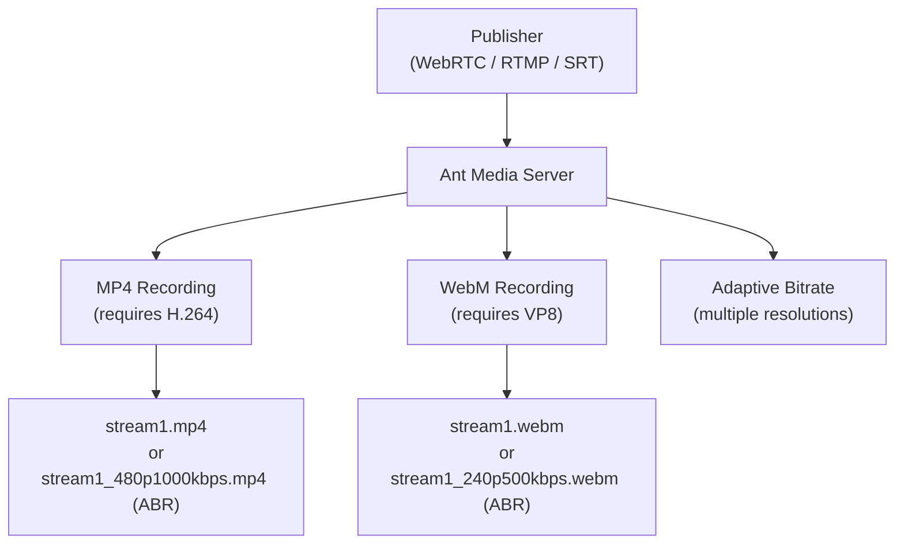

# MP4 & WebM Recording

Ant Media Server supports several types of live stream recording. Recording can be enabled or disabled from the AMS web panel or via the REST API.

There are two options for recording:
- Enable recording by default for all incoming streams.
- Enable recording for a specific streamId.

## Recording Architecture



## MP4 Recording

To record live streams as MP4, the H.264 codec must be enabled (it is the default codec in Ant Media Server).

You can set the H264 codec in the application settings via the web panel, or via SSH:

```bash
# Edit the app properties file
sudo nano /usr/local/antmedia/webapps/<your_app_name>/WEB-INF/red5-web.properties
# Set:
settings.h264Enabled=true
# Restart:
sudo service antmedia restart
```

### Enable MP4 Recording by Default

You can enable MP4 recording from the web panel under application settings. This records every stream published to the server automatically.

### Enable MP4 Recording for a Specific Stream

```bash
# Start MP4 recording for a particular stream
curl -X 'PUT' 'https://domain-or-IP:5443/AppName/rest/v2/broadcasts/streamId/recording/true?recordType=mp4' -H 'accept: application/json'

# Stop MP4 recording
curl -X 'PUT' 'https://domain-or-IP:5443/AppName/rest/v2/broadcasts/streamId/recording/false?recordType=mp4' -H 'accept: application/json'
```

:::info
You can also pass the `?fileName=` parameter to save the file with a custom name:
```bash
curl -X 'PUT' 'https://domain-or-IP:5443/AppName/rest/v2/broadcasts/streamId/recording/true?fileName=test123' -H 'accept: application/json'
```
Even if the streamId is `test`, the file will be saved as `test123.mp4`.
:::

## WebM Recording

To record in WebM format, enable the VP8 codec in Ant Media Server application settings.

Via SSH:
```bash
sudo nano /usr/local/antmedia/webapps/<your_app_name>/WEB-INF/red5-web.properties
# Set:
settings.vp8Enabled=true
# Restart:
sudo service antmedia restart
```

### Enable WebM Recording for a Specific Stream

```bash
# Start WebM recording
curl -X 'PUT' 'https://domain-or-IP:5443/AppName/rest/v2/broadcasts/streamId/recording/true?recordType=webm' -H 'accept: application/json'

# Stop WebM recording
curl -X 'PUT' 'https://domain-or-IP:5443/AppName/rest/v2/broadcasts/streamId/recording/false?recordType=webm' -H 'accept: application/json'
```

## Additional Recording Options

### Enable Date and Time in Recorded File Names

Enable the `Add Date-Time to Record File names` option in the application settings on the web panel. Once the recording is completed, the record file name will be like `streamId9666-2024-04-02_13-18-35.844.mp4`.

### Recording with Different Resolutions and Bitrates

If [Adaptive Bitrate Streaming](https://antmedia.io/docs/guides/adaptive-bitrate/adaptive-bitrate-streaming/) is enabled, the server will record the stream in each resolution:

```
stream1_240p500kbps.mp4
stream1_480p1000kbps.mp4
stream1_240p500kbps.webm
```

### Customize Recording Filename

You can define how the filename appears using these placeholders:

| Placeholder | Description |
|-------------|-------------|
| `Base name` | Default stream name (e.g., "stream1") |
| `%r` | Video resolution (e.g., 720p) |
| `%b` | Video bitrate (e.g., 1500kbps) |
| `{customText}` | Any custom text within curly braces |
| `Timestamp` | Date-time (e.g., 2023-10-15_12-05-30.123) |

**Examples:**
- `fileNameFormat = "%r%b"` → `myVideo_720p1500kbps`
- `fileNameFormat = "{HD}%r%b"` → `stream1_HD480p800kbps`
- `fileNameFormat = "%b%r`, Date-Time ON` → `stream2-2023-10-15_12-05-30.123_1500kbps720p.mp4`

## Store Recordings in Another Directory

AMS stores recordings in the streams directory by default: `usr/local/antmedia/webapps/AppName/streams`

To store recordings in another location, create a symbolic link:

```bash
sudo cp -p -r /usr/local/antmedia/webapps/live/streams/ /backup/
sudo rm -rf /usr/local/antmedia/webapps/live/streams/
sudo ln -s /mnt/vod_storage/folder/ /usr/local/antmedia/live/appname/streams

# Fix permissions
sudo chown -R antmedia:antmedia /usr/local/antmedia
sudo chown -R antmedia:antmedia /mnt/vod_storage/folder
```

## Import Recordings from Another Directory

To link another directory containing MP4 files as a VoD directory:

```bash
# Import/link VODs from another directory
curl -X 'POST' 'https://AMS_URL:5443/AppName/rest/v2/vods/directory?directory=/home/recordings' -H 'accept: application/json'

# Remove/unlink the imported directory
curl -X 'DELETE' 'https://test.antmedia.io:5443/Sandbox/rest/v2/vods/directory?directory=/home/recordings' -H 'accept: application/json'
```
