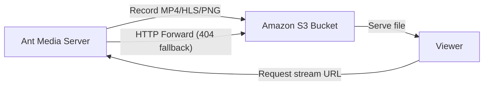
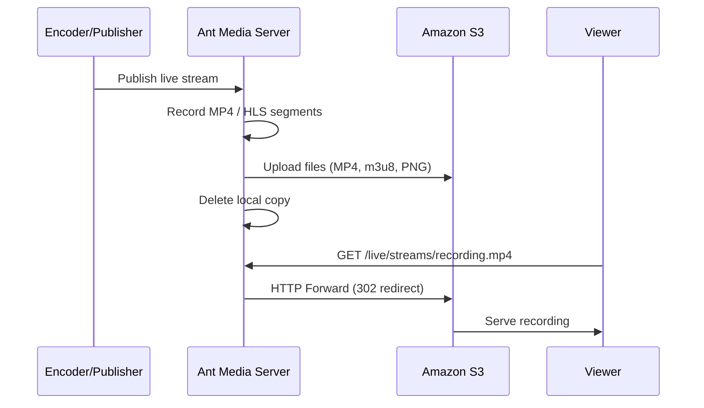

# Record Streams To AWS S3

Ant Media Server supports recording live streams directly to Amazon S3, enabling durable, scalable, and cost-effective storage for your video content.

By recording streams to S3, you can:
- Persist live streams for on-demand playback
- Store recordings securely outside the server lifecycle
- Integrate with downstream workflows such as VOD delivery, archiving, analytics, or processing
- Avoid local disk limitations on the Ant Media Server instance



## Prerequisites: AWS IAM Access for S3

To access Amazon S3 programmatically, you need an Access Key ID and Secret Access Key associated with an IAM user. These credentials are created in the AWS IAM (Identity and Access Management) console by:
- Creating an IAM user without console access, and
- Generating access keys for that user after creation.

The access key and secret key are then used by applications or services to authenticate API requests to Amazon S3.

### Step 1: Create an IAM User

1. In the **IAM → Users → Create user** screen, enter a User name.
2. Do **not** select AWS Management Console access. This user is intended for programmatic access only.
3. Click **Next** to proceed to permissions.
4. In the **Set permissions** step, choose **Attach policies directly**.
5. Attach the **AmazonS3FullAccess** policy (or a more restrictive custom S3 policy if required).
6. Complete the user creation process.

### Step 2: Generate Access Keys

After the user is created:
1. Open the newly created IAM user.
2. Go to the **Security credentials** tab.
3. Under Access keys, click **Create access key**.
4. Select **Application running outside AWS** (or the relevant use case).
5. Copy and securely store the **Access Key ID** and **Secret Access Key**.

### Step 3: Create an S3 Bucket

You must know the AWS region where your S3 bucket is located. If you don't already have a bucket, create one from the Amazon S3 console.

When creating the bucket, configure **Block Public Access** settings according to your access requirements.

## Configure Ant Media Server for S3 Recording

1. Log in to your Ant Media Server panel at `https://your_ams_server:5443`.
2. Navigate to **Applications** and select your app (e.g., `live`).
3. Go to **Settings**.
4. Enable **Record Live Streams as MP4**.
5. Enable **S3 Recording**.
6. Enter the **S3 credentials** you created:
   - Access Key
   - Secret Key
   - Bucket Name
   - Region (e.g., `us-east-1`)
7. Click **Save** to apply the settings.

Your MP4 and Preview files will be uploaded to your **S3 Storage** automatically.

## Enable HTTP Forwarding for Playback

When your MP4 or preview files are uploaded to AWS S3, they will no longer be available on the Ant Media Server local storage. If you try to play them directly from AMS using the usual URL, you may receive a **404 Not Found** error.

To fix this, configure **HTTP Forwarding** so that Ant Media Server automatically forwards requests to the AWS S3 bucket for playback.

### Steps to Enable HTTP Forwarding

1. Log in to the Ant Media Server Management Panel.
2. Navigate to your application and go to **Application Settings → Advanced Settings**.
3. Set the following properties:

   ```properties
   httpForwardingExtension: mp4,m3u8
   httpForwardingBaseURL: https://s3BucketName.s3.awsRegion.amazonaws.com
   ```

   Example:

   ```properties
   httpForwardingExtension: mp4,m3u8
   httpForwardingBaseURL: https://myvideos.s3.us-east-1.amazonaws.com
   ```

4. Save your settings.

Now, when you access:

```
https://your-domain:5443/AppName/streams/recording.mp4
```

Ant Media Server will forward the request to:

```
https://myvideos.s3.us-east-1.amazonaws.com/streams/recording.mp4
```

## Play Streams from AWS S3 Using the Embedded Web Player

If you would like to play the streams stored in an AWS S3 bucket using the embedded player, you need to configure CORS parameters on your S3 bucket permissions.

CORS parameters must be modified so that requests coming from another origin to play the VODs can be processed.

Go to `AWS → Services → S3 → Buckets → "Your Bucket" → Permissions`.

At the bottom of the page there is **Cross-origin resource sharing (CORS)**. Click **Edit** and paste the configuration below:

Replace `https://your-AMS-domain:5443` with your actual AMS domain.

```json
[
    {
        "AllowedHeaders": [
            "*"
        ],
        "AllowedMethods": [
            "HEAD",
            "GET",
            "PUT",
            "POST",
            "DELETE"
        ],
        "AllowedOrigins": [
            "https://your-AMS-domain:5443"
        ],
        "ExposeHeaders": []
    }
]
```

:::tip
Using `*` in the `AllowedOrigins` field accepts requests from all origins and can be used for quick testing. However, for production it is better to restrict to your exact domain (e.g., `https://www.your-domain.com`).
:::

## Architecture Overview


